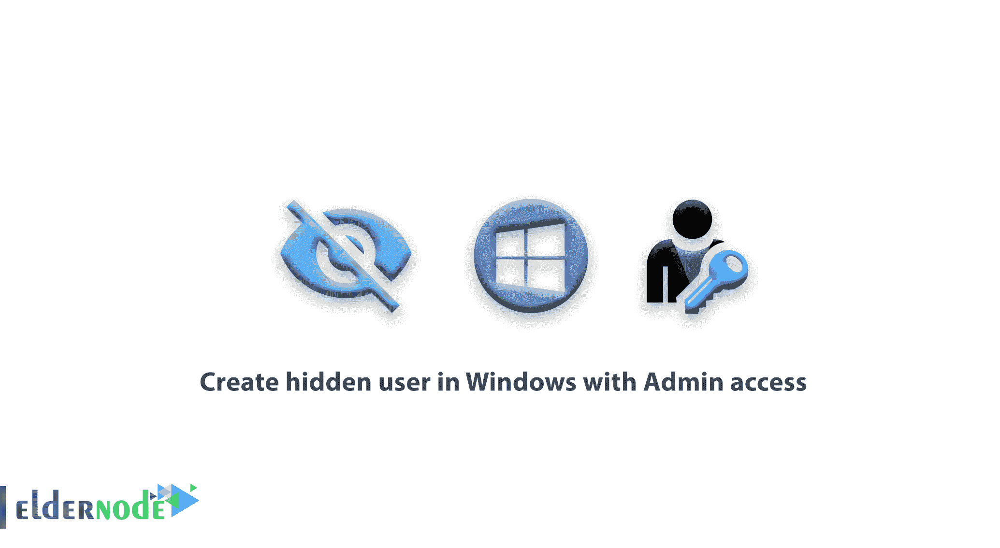

# 在 Windows 中创建具有管理员访问权限的隐藏用户- Eldernode

> 原文：<https://blog.eldernode.com/create-hidden-user-in-windows/>



在 Windows 中创建具有管理员权限的隐藏用户。在本教程中，我们将通过从 [Windows VPS](https://eldernode.com/windows-vps/) 服务器培训系列中创建一个隐藏用户，向您介绍管理员访问。

有许多方法可以在 Windows 中创建隐藏用户。有时它会帮助你避免黑客攻击，但它也可以用于盈利。

我们解释了一个使用隐藏用户的原因的例子，以找出更多关于它的积极方面。

**例如**，你有一个系统，平均几个人一起工作，而且是在网络上。登录时，每个人必须使用自己的用户登录。假设系统中有一个用户名，该用户名仅用于通过网络向该系统传输信息或远程传输信息。

这个用户不断在用户眼前，有时可能会选错。用户可能会意外地在该用户上输入他们的密码，这样该用户会被锁定一段时间，并且不再可用。

现在想象一下，你可以创建一个用户，并在网络和互联网上完全使用它，但它不以任何方式显示在登录菜单和用户开关中。

所以你需要在 Windows 中创建隐藏用户的原因有很多。

**注:** 本教程的说明已经在 Windows 7、8、8.1、10、Windows Server 2008R2、2012 和 Windows Server 2016 上测试过。

## 了解如何在 Windows 中创建隐藏用户

**1-** 首先，进入你的 Windows 环境。

**2-** 以管理员权限打开一个 CMD 或 [powershell](https://docs.microsoft.com/en-us/powershell/) 窗口。

为此，你可以在开始菜单中搜索 CMD 或 Powershell，在**上右击**后，选择以管理员身份运行。

**3-** 然后输入以下命令创建用户。

```
net user Michael 123 /add 
```

> 上面的命令将创建一个名为 **Michael** 的用户，密码为 123。

**4-** 然后输入以下命令，以便**迈克尔**成为管理员组的成员。

```
net localgroup Administrators Michael/add 
```

**5-** 最后，输入下面的命令来完全隐藏**迈克尔**用户。

```
reg add "HKEY_LOCAL_MACHINE\Software\Microsoft\Windows NT\CurrentVersion\Winlogon\SpecialAccounts\Userlist" /v Michael/t REG_DWORD /d 0 /f 
```

现在，您将拥有一个用户**“Michael”**，可以在网络上使用该用户并对系统进行远程控制。
该用户不显示在开始菜单和 Windows 登录页面。

**6-** 如果您需要这个用户显示在 Windows 登录页面上，请输入以下命令。

```
reg add "HKEY_LOCAL_MACHINE\Software\Microsoft\Windows NT\CurrentVersion\Winlogon\SpecialAccounts\Userlist" /v Michael/t REG_DWORD /d 1 /f 
```

**注** :内置用户无论隐藏还是可见，都可以在**本地用户和组**窗口中看到。

**尊敬的用户**，我们希望您能喜欢这个[教程](https://eldernode.com/category/tutorial/)，您可以在评论区提出关于本次培训的问题，或者解决[老年人节点培训](https://eldernode.com/blog/)领域的其他问题，请参考[提问页面](https://eldernode.com/ask)部分，并尽快提出您的问题。腾出时间给其他用户和专家来回答你的问题。

好运。