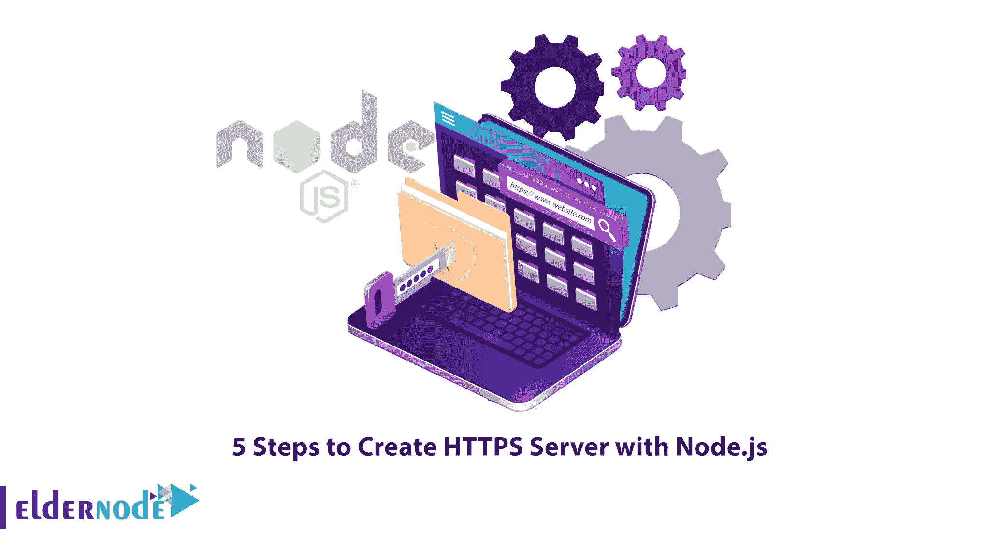
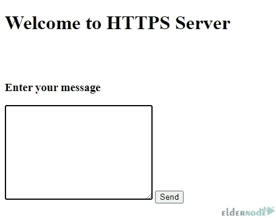

# 用 Node.js 创建 HTTPS 服务器的 5 个步骤

> 原文：<https://blog.eldernode.com/create-https-server-with-node-js/>



如果您要移动任何数据，您应该确保数据和信息是安全的。当数据在服务器和用户之间传输时，保护数据的最有效方法之一是启用 HTTPS，也称为 SSL 证书。每个网站和博客都需要 HTTPS。现在是时候用 Node.js 创建一个 HTTPS 服务器了。这篇文章将教你用 Node.js 创建一个 HTTPS 服务器的 5 个步骤。如果你想买一个 [VPS](https://eldernode.com/vps/) 服务器，查看 [Eldernode](https://eldernode.com/) 网站上提供的软件包。

## **如何用 Node.js 创建 HTTPS 服务器**

HTTP 是一种用于网络间顺畅通信的协议，但它没有加密。HTTPS 代表超文本传输协议安全，是 HTTP 的加密版本；这被认为是用于通过万维网传输数据的主要协议。它在浏览器和服务器之间的传输过程中对数据进行加密，并且是一种受保护的连接，您可以使用它来连接到重要和敏感的站点。

### **1-生成自签名证书**

有两种类型的证书，即由**认证机构**签名的证书和**自签名的证书**。SSL 证书的可信来源是证书颁发机构。如果你使用它，用户会信任你网站的身份。如果您在生产环境中使用 CA 签名的证书，自签名证书就可以了。

首先，打开您的终端，使用下面的命令生成一个签名证书:

```
openssl genrsa -out key.pem 
```

```
openssl req -new -key key.pem -out csr.pem 
```

```
openssl x509 -req -days 9999 -in csr.pem -signkey key.pem -out cert.pem 
```

```
rm csr.pem
```

现在，您将得到一些选项来填充，除了常用名称和电子邮件地址这两个选项，您可以通过输入“.”将其余选项保留为默认值。

它将创建两个文件，它们是:

**–>cert . PEM**:自签名证书文件

**–>key . PEM:**证书的私钥

您应该将这些文件放在与您的 [Node.js](https://blog.eldernode.com/install-node-js-on-windows/) 服务器文件相同的目录中。

### **2-创建表单向服务器发送消息**

在这一步中，编写 index.html 文件。您可以通过创建表单，通过 POST 请求向服务器发送消息:

```
<!DOCTYPE html>  <html lang="en">    <head>      <meta charset="UTF-8">      <meta http-equiv="X-UA-Compatible" content="IE=edge">      <meta name="viewport" content          ="width=device-width, initial-scale=1.0">      <title>HTTPS Server</title>  </head>    <body>      <h1>Welcome to HTTPS Server</h1>      <br><br>      <h3>Enter your message</h3>        <!-- sending post request to "mssg" with           the message from the textarea -->      <form action="mssg" method="post">          <textarea name="message" id=""               cols="30" rows="10"></textarea>          <button type="submit">Send</button>      </form>  </body>    </html>
```

### **3-创建 app.js 文件**

现在使用下面的命令初始化项目:

```
npm init
```

**安装 Express** ，通过运行以下命令来处理服务器请求:

```
npm install express
```

然后**安装 body-parser** ,通过输入下面的命令从 POST 请求中的表单获取输入:

```
npm install body-parser
```

### **4-设置 hello world 示例**

您应该设置一个 hello world 示例，如下所示。请记住，HTTPS 和 HTTP 的最大区别在于选项参数:

```
const https = require('https');  const fs = require('fs');    const options = {    key: fs.readFileSync('key.pem'),    cert: fs.readFileSync('cert.pem')  };    https.createServer(options, function (req, res) {    res.writeHead(200);    res.end("hello world\n");  }).listen(8000);
```

### **5-用 Node.js** 启动 HTTPS 服务器

您可以使用以下命令启动 HTTPS 服务器:

```
node app.js
```

打开浏览器，转到运行服务器地址:

```
curl -k https://localhost:8000
```

您应该会看到一个与 HTTPS 一起运行的网页:



就是这样！

结论

## 在这篇文章中，我们解释了用 Node.js 创建 HTTPS 服务器的 5 个步骤。我希望这篇教程能帮助你用 Node.js 创建 HTTPS 服务器。如果你有任何疑问或问题，可以在评论区联系我们。

In this article, we explained 5 steps to create an HTTPS Server with Node.js. I hope this tutorial helps you to create an HTTPS server with Node.js. If you have any questions or problems, you can contact us in the Comments section.