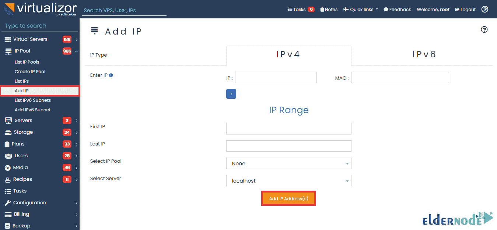

# 如何创建 IP 池并在 Virtualizor - Eldernode 博客上添加 IP

> 原文：<https://blog.eldernode.com/create-ip-pool-and-add-ip-on-virtualizor/>

IP 池是特定网络中用于创建虚拟机的连续 IP 地址范围。可以有多个池配置。创建 IP 池有助于避免虚拟机连接问题。在本文中，您将学习如何在 Virtualizor 上创建 IP 池和添加 IP。IP 池是可用于创建 VP 的 IP 的集合。要订购您认为合适的 **[VPS 服务器](https://eldernode.com/vps/)** ，请访问 [Eldernode](https://eldernode.com/) 并要求我们的技术团队为您提供指导。

## **如何创建 IP 地址池**

首先，让我们看看如何创建一个额外的网络，用于为虚拟机提供额外的内部 IP 地址。但是，您可以在 Virtualizor 中创建一个 IP 池，如下所示:

***注意* :** 在内部 IP 网桥字段，需要指定自己创建的网桥名称。

### **如何在虚拟器上分配互联网 IP**

创建 IP 池后，您就可以分配内部 IP 地址了。您可以在 WHMCS 计费模块中或在 Virtualizor 中创建/编辑虚拟机时指定相同的内容:

当 VPS 启动时，Virtualizor 会将网络 IP 分配给虚拟机。虚拟机将有两个网络接口。一个用于公共 IP 地址，另一个用于内部 IP 网络。

### **如何在虚拟器上添加 IP v4**

现在，您已经了解了如何创建 IP 池，您可以向现有 IP 池添加 IP 了。之前，您已经学习了如何安装 Virtualizor 。现在，要在其上添加 IP 池，请遵循以下路径:

**虚拟管理员** > > **IP 池** > > **创建 IP 池**

您将看到添加 IP 池向导，如下所示。要将 IP 池添加到您的节点，请单击**添加 IP 池**按钮:

***注* :** 您可以定义网络掩码、IP 网关、名称服务器等

### **添加 IP 池需要哪些输入**

在本节中，您将熟悉在上面的屏幕截图中看到的每个必填字段。

**类型**:

池将拥有的 IP 类型。默认情况下，页面加载时会选择一个 **IPv4** 。如果您正在添加一个 **IPv6** 池，请选择 IPv6。

**服务器:**

如果您有从属服务器，您将需要选择可以使用该 IP 的服务器。要更改服务器，请从顶部菜单中更改**活动服务器**。

**名称:**

池的简单名称，以便您可以识别它。

**名称服务器 1:**

这是将在虚拟机中设置的第一个名称服务器，它将从此池中分配一个 IP。

**名称服务器 2:**

这是将在虚拟机中设置的第二台名称服务器，从该池中为其分配了一个 IP。

**第一个 IP 和最后一个 IP:**

如果要添加一系列**新 IP**，可以通过指定该范围的第一个和最后一个 IP 来完成。此外，还有一些其他领域可以说是**高级设置**。让我们看看他们做什么。

**启用 NAT:**

如果此 IP 地址池将用作 NAT 地址池，您需要选中此框。

***注意* :** 您不能将 IP 添加到启用了 NAT **的 IP 池**。

**使用路由网络:**

如果启用，使用该池中 IPs 的虚拟机将创建一个路由文件(*/etc/sys config/network-scripts/route-DEVICE*)。一些数据中心需要这个。

**输入 IP:**

您需要在此输入 IP。点击 ***+*** 按钮，可以添加**多个 IP**。如果您要添加一个范围，则将其留空，并给**第一个 IP** 和**最后一个 IP** 。

### **如何在虚拟器上添加 IPv6**

由于 Virtualizor 可以为虚拟机创建和分配 IPv6 子网，因此您可以将/64 IPv6 子网分成多个/112 子网，并将它们分配给虚拟机。此外，您需要有一个 IPv6 IP 池才能创建 IPv6 子网。

一旦有了 IPv6 IP 池，就可以开始生成子网了。遵循以下路径添加 IPv6 子网。

进入**虚拟化管理面板** > > **IP 池** > > **添加 IPv6 子网**。

然后，您可以填写详细信息。

### **如何给虚拟机分配 IPv6 子网**

现在您已经创建了 [IPv6](https://blog.eldernode.com/ipv6-and-how-to-add-on-centos/) 子网，您可以在编辑或创建新虚拟机时将它们分配给虚拟机。

## 结论

在本文中，您了解了如何在 Virtualizor 上创建 IP 池和添加 IP。您可以使用 list IP Pool API 来列出服务器上的现有 IP 池。这样，根据 ID，就可以在 API 响应中看到所有的 IP 池细节。如果您的网络设置正确，您还可以跨多个节点使用 IP 池。创建 IP 池时，只需相应地选择“所有服务器”或“节点组”。