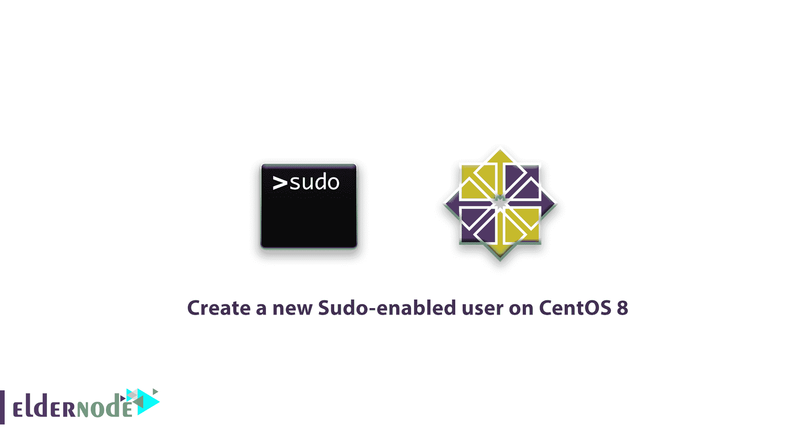

# 如何在 CentOS 8 - Eldernode 上创建支持 Sudo 的新用户

> 原文：<https://blog.eldernode.com/create-new-sudo-user-centos-8/>



作为系统管理员，你可能熟悉 **sudo** 命令。在本文中，您将学习**如何在 CentOS 8** 上创建一个新的支持 Sudo 的用户。它提供了一种授予管理员权限的机制——通常只对普通用户的根用户可用。

在本教程中，我们将向您展示如何在 CentOS 8 上创建一个具有 **sudo** 访问权限的新用户，而无需修改您服务器的 /etc/sudoers 文件。

## 如何在 CentOS 8 上创建启用 Sudo 的新用户

让我们通过以下步骤来完成本指南。如果您考虑配置现有的 [CentOS](https://www.centos.org/) 用户，**跳到**步骤 3。

**阅读更多，如果你有兴趣:**

[初始设置 centos 8](https://eldernode.com/initial-set-up-centos-8/)

### 1-登录您的服务器

首先，作为根用户 SSH 到您的服务器。替换您的服务器的 IP 地址或主机名，而不是下面突出显示的。

```
ssh [[email protected]](/cdn-cgi/l/email-protection)your_server_ip_address 
```

### 2-向系统添加新用户

您可以使用 adduser 命令向您的系统添加一个新用户，并用您想要创建的用户名替换 noodi 。

```
adduser noodi
```

然后，要更新新用户的密码，使用 passwd 命令。

```
passwd noodi
```

**不要**忘记用你刚刚创建的用户替换 noodi 。那么你应该回答两次新密码。

输出

```
Changing password for user noodi.  New password:  Retype new password:  passwd: all authentication tokens updated successfully.
```

[购买 VPS 服务器](https://eldernode.com/vps/)

3-将用户添加到**滚轮**组

### 接下来，将用户添加到**轮盘**组，使用 usermod 命令将用户添加到**轮盘**组:

虽然默认情况下**轮**组的所有成员都拥有完全的 sudo 访问权限，但请确保您已经用您想要授予 sudo 权限的用户名替换了 noodi 。

```
usermod -aG wheel noodi
```

4-测试 须藤 访问

### 在这一步中，您将看到新的 sudo 权限是否有效。但是要从**根用户**切换到新用户帐户，使用 su 命令

尽管您是一个新用户，但是您需要通过将 sudo 添加到您希望以超级用户权限运行的命令前面，来验证您是否可以使用 sudo 。

```
su - noodi
```

此外，您可以列出 /root 目录的内容，通常只有 root 用户可以访问:

```
sudo command_to_run 
```

一旦您开始在会话中使用 sudo ，您将被要求输入该用户帐户的密码。

```
sudo ls -la /root
```

输出

**请注意** :您输入的应该是启用 sudo 的用户密码，而不是 **root** 密码。因为它不是在问你**根密码。**

```
[sudo] password for noodi:
```

**最后**，你会看到你用 sudo 发出的命令将以 **root** 权限运行，以防你的用户在正确的组中并且你输入了正确的密码。

亲爱的用户，我们希望本教程如何在 CentOS 上创建一个新的支持 Sudo 的用户对您有所帮助，如果您有任何问题或想查看我们的用户关于本文的对话，请访问 [提问页面](https://eldernode.com/ask) 。也为了提高自己的见识，准备了这么多有用的教程给 [Eldernode](https://eldernode.com/blog/) 培训。

Dear user, we wish this tutorial how to create a new Sudo-enabled user on CentOS 8would be helpful for you, to ask any question or review the conversation of our users about this article, please visit [Ask page](https://eldernode.com/ask). Also to improve your knowledge, there are so many useful tutorials ready for [Eldernode](https://eldernode.com/blog/) training.