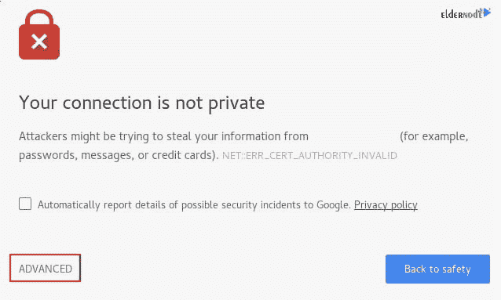
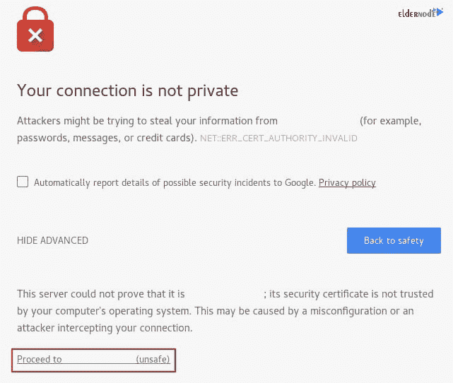

# 教程在 Debian 10 - Eldernode 中为 Apache 创建自签名 SSL 证书

> 原文：<https://blog.eldernode.com/create-ssl-apache-debian-10/>


TLS，即传输层安全性，以及它的前身 [SSL](https://eldernode.com/how-to-install-and-activate-the-ssl-certificate/) ，代表安全套接字层，是用于将正常流量包装在受保护的加密包装中的 web 协议。

使用这种技术，服务器可以在服务器和客户端之间安全地发送流量，而不存在消息被外界截取的可能性。证书系统还帮助用户验证他们正在连接的站点的身份。不要错过最强大的 [Linux 主机](https://eldernode.com/linux-hosting/)来享受与您的研究工作。

为了让本教程更好地发挥作用，请考虑以下**先决条件** :

一个拥有 sudo 权限
的非根用户，按照我们在 Debian 10 上的[初始服务器设置进行设置。](https://eldernode.com/initial-setup-with-debian-10/)
您还需要安装 Apache webserver。要查看细节，你可以按照我们的指南[在 Debian 10](https://eldernode.com/install-lamp-debian-10/) 上设置灯。

**在开始**并遵循本教程的步骤之前，**请注意**自签名证书将加密您的服务器和任何客户端之间的通信。但是，因为它不是由 web 浏览器附带的任何可信证书颁发机构签名的，所以用户不能使用该证书来自动验证服务器的身份。

如果您没有与服务器相关联的域名，并且加密的 web 界面不是面向用户的，那么自签名证书可能是合适的。如果您有域名，在许多情况下最好使用 CA 签名的证书。你可以在这里 的 **[项目中找到如何设置一个免费的可信证书。](https://eldernode.com/secure-apache-debian-10/)**

## 教程在 Debian 10 中为 Apache 创建自签名 SSL 证书

完成先决条件后，您可以浏览本指南，学习如何在 **Debian 10** 中为 **Apache** 创建**自签名 SSL 证书**。

### 1-如何创建 SSL 证书

由于 TLS/SSL 通过使用公共证书和私有密钥的组合来工作，SSL 密钥在服务器上保持秘密，并用于加密发送给客户端的内容。SSL 证书与请求内容的任何人公开共享。它可用于解密由相关 SSL 密钥签名的内容。

因此，使用 OpenSSL 创建自签名密钥和证书对:

```
sudo openssl req -x509 -nodes -days 365 -newkey rsa:2048 -keyout /etc/ssl/private/apache-selfsigned.key -out /etc/ssl/certs/apache-selfsigned.crt
```

由于您将被问及一系列问题，让我们来看看您发出的命令中发生了什么，以帮助您解决这些问题。

**openssl** :这是创建和管理 openssl 证书、密钥和其他文件的基本命令行工具。

**req** :这个子命令指定您想要使用 X.509 证书签名请求(CSR)管理。“X.509”是一种公钥基础设施标准，SSL 和 TLS 遵守这一标准来管理其密钥和证书。您想要创建一个新的 X.509 证书，所以我们使用这个子命令。

**-x509** :这进一步修改了前面的子命令，告诉实用程序您想要生成一个自签名证书，而不是像通常情况下那样生成一个证书签名请求。

**-节点**:这告诉 OpenSSL 跳过用密码短语保护我们的证书的选项。当服务器启动时，您需要 Apache 能够在没有用户干预的情况下读取文件。密码可以防止这种情况发生，因为我们必须在每次重启后输入密码。

**-365 天**:该选项设置证书被认为有效的时间长度。你在这里设定了一年。

**-newkey rsa** :2048:表示你要同时生成新证书和新密钥。在前面的步骤中，您没有创建签名证书所需的密钥，因此您需要在创建证书的同时创建密钥。rsa:2048 部分告诉它生成一个 2048 位长的 rsa 密钥。

**-keyut**:这一行告诉 OpenSSL 将您正在创建的生成的私钥文件放在哪里。

**-out** :这告诉 OpenSSL 在哪里放置您正在创建的证书。

这些选项将创建密钥文件和证书。为了将信息正确地嵌入到证书中，您将被询问一些关于我们的服务器的问题。

尽量适当填写提示。**最重要的一行是请求**通用名称(如服务器 FQDN 或您的名字)**的那一行。您需要输入与您的服务器相关联的域名，或者更有可能是您的服务器的公共 IP 地址。**

全部提示如下输出。

输出

```
Country Name (2 letter code) [AU]:US  State or Province Name (full name) [Some-State]:New York  Locality Name (eg, city) []:New York City  Organization Name (eg, company) [Internet Widgits Pty Ltd]:Bouncy Castles, Inc.  Organizational Unit Name (eg, section) []:Ministry of Water Slides  Common Name (e.g. server FQDN or YOUR name) []:server_IP_address  Email Address []:[[email protected]](/cdn-cgi/l/email-protection)_domain.co
```

**点**:你创建的两个文件都会放在/etc/ssl 下相应的子目录中。

### 2-如何配置 Apache 使用 SSL

当在/etc/ssl 目录下创建了我们的密钥和证书文件后，您只需要修改我们的 Apache 配置就可以利用它们了。

这样，您将对您的配置进行一些调整:

您将创建一个配置片段来指定强默认 SSL 设置。
您将修改包含的 SSL Apache 虚拟主机文件，以指向我们生成的 SSL 证书。
(推荐)您将修改未加密的虚拟主机文件，以自动将请求重定向到加密的虚拟主机。

毕竟，如果 您验证，您将拥有一个安全的 SSL 配置。

### 让我们创建一个具有强加密设置的 Apache 配置片段

为了开始这一步，您将创建一个 Apache 配置片段来定义一些 SSL 设置。这将为 Apache 设置一个强大的 SSL 密码套件，并启用一些有助于保持服务器安全的高级功能。我们将设置的参数可以由任何启用 SSL 的虚拟主机使用。

在/etc/apache2/conf-available 目录中创建一个新的代码片段。我们将该文件命名为 ssl-params.conf，以使其用途更加清晰:

```
sudo nano /etc/apache2/conf-available/ssl-params.conf
```

此外，您还可以完全复制所提供的设置。您只需对此做一个小小的改变，禁用**严格传输安全**报头(HSTS)。

预加载 HSTS 提供了更高的安全性，但如果意外启用或启用不正确，可能会产生深远的后果。在本指南中，我们不会启用这些设置，但是如果您确定理解其含义，您可以修改这些设置。

但是在决定之前，花点时间阅读一下 [HTTP 严格传输安全，或者 HSTS](https://en.wikipedia.org/wiki/HTTP_Strict_Transport_Security) ，特别是关于“预加载”功能。

然后，将以下配置粘贴到您打开的 ssl-params.conf 文件中:

/etc/Apache 2/conf-available/SSL-params . conf

```
SSLCipherSuite EECDH+AESGCM:EDH+AESGCM:AES256+EECDH:AES256+EDH  SSLProtocol All -SSLv2 -SSLv3 -TLSv1 -TLSv1.1  SSLHonorCipherOrder On  Disable preloading HSTS for now.  You can use the commented out header line that includes  the "preload" directive if you understand the implications.  Header always set Strict-Transport-Security "max-age=63072000; includeSubDomains; preload"  Header always set X-Frame-Options DENY  Header always set X-Content-Type-Options nosniff  Requires Apache >= 2.4  SSLCompression off  SSLUseStapling on  SSLStaplingCache "shmcb:logs/stapling-cache(150000)"  Requires Apache >= 2.4.11  SSLSessionTickets Off
```

完成后，您可以保存并关闭文件。

### 让我们修改默认的 Apache SSL 虚拟主机文件

接下来，我们来修改/etc/Apache 2/sites-available/default-SSL . conf，默认的 Apache SSL 虚拟主机文件。如果您使用不同的服务器块文件，请在下面的命令中替换其名称。

在继续之前，让我们备份原始的 SSL 虚拟主机文件:

```
sudo cp /etc/apache2/sites-available/default-ssl.conf /etc/apache2/sites-available/default-ssl.conf.bak
```

接下来，打开 SSL 虚拟主机文件进行调整:

```
sudo nano /etc/apache2/sites-available/default-ssl.conf
```

在内部，删除了大部分注释，虚拟主机块在默认情况下应该是这样的:

/etc/Apache 2/sites-available/default-SSL . conf

```
<IfModule mod_ssl.c>          <VirtualHost _default_:443>                  ServerAdmin [[email protected]](/cdn-cgi/l/email-protection)                    DocumentRoot /var/www/html                    ErrorLog ${APACHE_LOG_DIR}/error.log                  CustomLog ${APACHE_LOG_DIR}/access.log combined                    SSLEngine on                    SSLCertificateFile      /etc/ssl/certs/ssl-cert-snakeoil.pem                  SSLCertificateKeyFile /etc/ssl/private/ssl-cert-snakeoil.key                    <FilesMatch "\.(cgi|shtml|phtml|php)$">                                  SSLOptions +StdEnvVars                  </FilesMatch>                  <Directory /usr/lib/cgi-bin>                                  SSLOptions +StdEnvVars                  </Directory>            </VirtualHost>  </IfModule>
```

你将对文件做一些小的调整。您将在虚拟主机文件中设置您想要调整的正常内容(ServerAdmin 电子邮件地址、ServerName 等。)，并调整 SSL 指令以指向我们的证书和密钥文件。同样，如果你使用不同的文档根，一定要更新 **DocumentRoot** 指令。

当您进行这些更改时，您会看到如下所示的服务器块。

/etc/Apache 2/sites-available/default-SSL . conf

```
<IfModule mod_ssl.c>          <VirtualHost _default_:443>                  ServerAdmin [[email protected]](/cdn-cgi/l/email-protection)                  ServerName server_domain_or_IP                    DocumentRoot /var/www/html                    ErrorLog ${APACHE_LOG_DIR}/error.log                  CustomLog ${APACHE_LOG_DIR}/access.log combined                    SSLEngine on                    SSLCertificateFile      /etc/ssl/certs/apache-selfsigned.crt                  SSLCertificateKeyFile /etc/ssl/private/apache-selfsigned.key                    <FilesMatch "\.(cgi|shtml|phtml|php)$">                                  SSLOptions +StdEnvVars                  </FilesMatch>                  <Directory /usr/lib/cgi-bin>                                  SSLOptions +StdEnvVars                  </Directory>            </VirtualHost>  </IfModule>
```

完成后，您可以保存并关闭文件。

### 如何修改 HTTP 主机文件重定向到 HTTPS(推荐)

如您所见，服务器将提供未加密的 HTTP 和加密的 HTTPS 流量。为了提高安全性，在大多数情况下，建议自动将 HTTP 重定向到 HTTPS。如果您不想要或不需要此功能，可以安全地跳过这一部分。

打开**/etc/Apache 2/sites-available/000-default . conf**文件，调整未加密的虚拟主机文件，将所有流量重定向到 SSL 加密。

```
sudo nano /etc/apache2/sites-available/000-default.conf
```

在内部，在**虚拟主机**配置块中，添加一个**重定向**指令，将所有流量指向站点的 SSL 版本:

/etc/Apache 2/sites-available/000-default . conf

```
<VirtualHost *:80>          . . .            Redirect "/" "https://your_domain_or_IP/"            . . .  </VirtualHost>
```

完成后，您可以保存并关闭文件。

这是您需要对 Apache 进行的所有配置更改。接下来，您将讨论如何使用 **ufw** 更新防火墙规则，以允许加密的 HTTPS 流量进入您的服务器。

### 3-如何调整防火墙

由于我们要求您在先决条件中启用 **ufw** 防火墙，您可能需要调整设置以允许 SSL 流量。幸运的是，当安装在 Debian 10 上时， **ufw** 会加载应用配置文件，你可以用它来调整你的防火墙设置。

要查看可用的概要文件，请使用以下命令:

```
sudo ufw app list
```

输出

```
Available applications:  . . .    WWW    WWW Cache    WWW Full    WWW Secure  . . .
```

键入以下命令查看当前设置。

```
sudo ufw status
```

输出

```
Status: active    To                         Action      From  --                         ------      ----  OpenSSH                    ALLOW       Anywhere  WWW                        ALLOW       Anywhere  OpenSSH (v6)               ALLOW       Anywhere (v6)  WWW (v6)
```

要额外引入 HTTPS 流量，允许“WWW Full”配置文件，然后删除多余的“WWW”配置文件余量:

```
sudo ufw allow 'WWW Full'  sudo ufw delete allow 'WWW'
```

你现在的状态应该是这样的:

```
sudo ufw status
```

输出

```
Status: active    To                         Action      From  --                         ------      ----  OpenSSH                    ALLOW       Anywhere  WWW Full                   ALLOW       Anywhere  OpenSSH (v6)               ALLOW       Anywhere (v6)  WWW Full (v6)              ALLOW       Anywhere (v6)
```

将防火墙配置为允许 HTTPS 流量后，您可以进入下一步，了解如何启用一些模块和配置文件来允许 SSL 正常工作。

### 4-如何启用阿帕奇中的变化

在这一步，您可以在 Apache 中启用 SSL 和 headers 模块，启用我们的 SSL 就绪虚拟主机，然后重启 Apache 以使这些更改生效，因为您已经做出了更改并调整了我们的防火墙。

所以让我们用 **a2enmod** 命令:启用 **mod_ssl** ，Apache ssl 模块和 **mod_headers** ，这是我们的 SSL 片段中的一些设置所需要的

```
sudo a2enmod ssl  sudo a2enmod headers
```

并键入下面的命令来启用带有**a2 en site**的 SSL 虚拟主机

```
sudo a2ensite default-ssl
```

您还需要启用您的 **ssl-params.conf** 文件，以读取您已经设置的值:

```
sudo a2enconf ssl-params
```

由此，站点和必要的模块被启用。此外，您应该检查以确保我们的文件中没有语法错误。通过键入:来完成此操作

```
sudo apache2ctl configtest
```

输出

```
Syntax OK
```

只要您的输出中有**语法 OK** ，那么您的配置文件就没有语法错误，您可以安全地重启 Apache 来实现更改:

```
sudo systemctl restart apache2
```

至此，您的自签名 SSL 证书已经设置完毕。现在，您可以测试您的服务器是否正确地加密了流量。

### 5-如何测试加密

至此，您已经准备好测试您的 SSL 服务器了。

打开网络浏览器，在地址栏中输入 **https://** ，然后输入服务器的域名或 IP:

```
https://server_domain_or_IP
```

因为您创建的证书不是由您的浏览器的可信证书颁发机构签名的，您可能会看到一个看起来很吓人的警告，如下所示:



但是要知道，这是非常意料之中的，也是正常的。您只对我们证书的加密方面感兴趣，对我们主机真实性的第三方验证不感兴趣。点击**高级**，然后点击提供的链接继续访问您的主机:



检查被带到您的站点。如果你查看浏览器的地址栏，你会看到一个锁，上面有一个“x”或另一个类似的“不安全”的通知。在这种情况下，这仅仅意味着证书不能被验证。它仍在加密您的连接。

如果您配置了 **Apache** 将 HTTP 重定向到 HTTPS，您还可以检查重定向功能是否正常:

```
http://server_domain_or_IP
```

通过在同一个图标中接收这些结果，您的重定向工作正常。但是，您之前创建的重定向只是一个临时重定向。如果您想永久重定向到 HTTPS，请继续执行最后一步。

### 6-如何改成永久重定向

一旦您确保重定向正常工作，并且确定只允许加密流量，请再次修改未加密的 Apache 虚拟主机，使重定向永久有效。

再次打开您的服务器块配置文件:

```
sudo nano /etc/apache2/sites-available/000-default.conf
```

现在，找到我们之前添加的**重定向**行。将**永久**添加到该行，这将重定向从 302 临时重定向更改为 301 永久重定向:

/etc/Apache 2/sites-available/000-default . conf

```
<VirtualHost *:80>          . . .            Redirect permanent "/" "https://your_domain_or_IP/"            . . .  </VirtualHost>
```

现在，您可以保存并关闭文件。

使用以下命令检查您的配置是否有语法错误:

```
sudo apache2ctl configtest
```

如果这个命令没有报告任何语法错误，您可以重新启动 Apache:

```
sudo systemctl restart apache2
```

通过这种方式，你可以使重定向永久化，你的网站将只服务于 HTTPS 的流量。

## 结论

在本文中，您学习了如何在 Debian 10 中为 Apache 创建自签名 SSL 证书。当然，您已经将 Apache 服务器配置为对客户端连接使用强加密。这将允许您安全地服务请求，并防止外部方读取您的流量。如果你有兴趣了解更多关于这个主题的内容，请阅读我们的相关文章 [教程在 IIS Web 服务器上安装 SSL 证书](https://blog.eldernode.com/install-ssl-on-iis-web-server/)和[如何在 Debian 10 上安装 Apache Web 服务器](https://blog.eldernode.com/install-apache-web-server-debian/)。