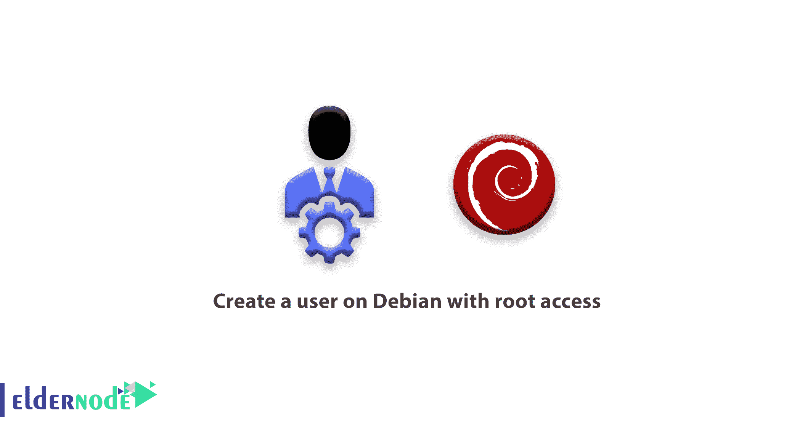

# 如何在 Debian 上创建一个拥有 root 访问权限的用户——elder node

> 原文：<https://blog.eldernode.com/create-user-on-debian-with-root-access/>



安全提示之一是禁止 root 用户登录和使用操作系统。你需要知道如何在 [Debian](https://www.debian.org/) 上创建一个具有 root 访问权限的用户，该用户能够执行系统命令，这与 root 访问用户是一样的，你可以利用这个能力来增加你的 Debian 的安全性。通过使用户以及最终授权访问和设置来完全熟悉它。

## 如何在 Debian 上创建一个 root 用户

### 先决条件

首先，使用您的 Root 权限登录到您的 [debian](https://eldernode.com/tag/debian/) ，并使用以下命令创建一个自定义用户名:

```
useradd -m -c "Admin User" admin
```

创建用户后，输入以下命令为其设置密码。

```
passwd admin
```

注意:该命令中的用户名是 admin，您可以使用您想要的用户名。

### 创建用户后应该做什么？

现在，在创建用户和设置密码之后，输入以下两个命令，以便用户成为 Sudo 组的成员，使用 Sudo 命令访问命令的执行:

```
usermod -aG sudo admin 
```

这样，您将能够创建和配置一个具有 Root 访问权限的用户，现在为了测试它，您可以通过下面的命令切换到这个用户的用户界面来测试您想要的命令。su 管理

**两个重要点:**

首先:确保在禁用 Root 的安全设置之前，务必与新用户一起进行测试，以确保所需命令执行的准确性和可靠性。

第二个:小心在用户界面中用 Root 权限执行命令，必须在所有命令之前使用 Sudo 命令。

亲爱的用户，我们希望你会喜欢这个关于如何在 Debian 上创建 root 用户的教程，你可以在评论区提出关于这个培训的问题，或者解决 [Eldernode 培训](https://eldernode.com/blog/)领域的其他问题，参考[提问页面](https://eldernode.com/ask)部分，尽快提出你的问题。腾出时间给其他用户和专家来回答你的问题。