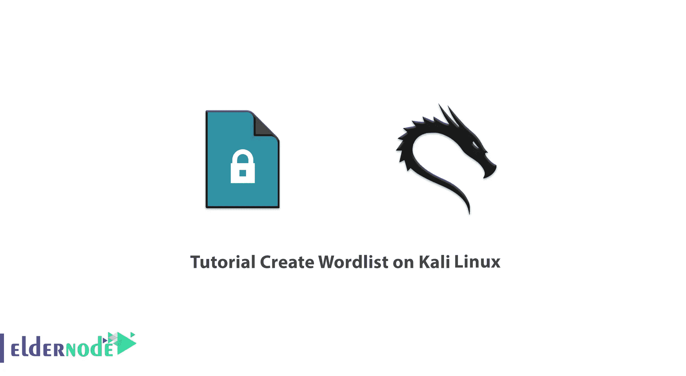
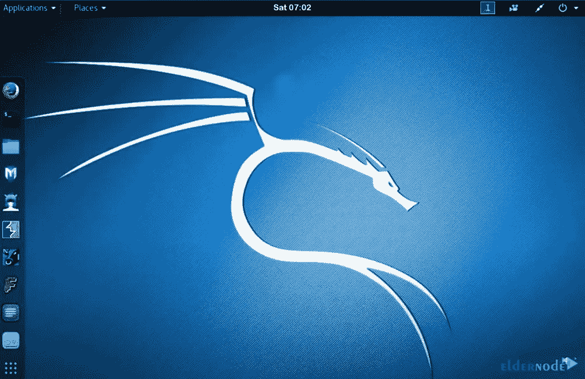
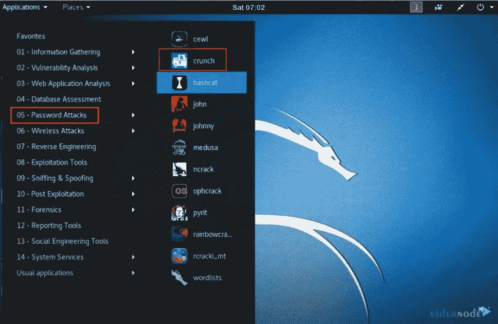

# 教程在 Kali Linux - Eldernode 博客上创建单词表

> 原文：<https://blog.eldernode.com/create-wordlist-on-kali-linux/>



在暴力密码攻击中，攻击者使用脚本反复尝试登录帐户，并继续这样做，直到得到肯定的结果。这些攻击相当明显，可以导致已配置的服务器锁定攻击者。单词表是暴力密码攻击的关键部分。单词表可能非常大，很容易填满整个硬盘。由于暴力攻击是公开的，您可以通过这种方式测试日志系统的安全性。服务器应该阻止攻击者并报告增加的流量。此外，用户应该输入更安全的密码。在这篇文章中，我们将教你如何在 Kali Linux 上创建单词表。需要注意的是，如果你想买一个 [**Linux VPS**](https://eldernode.com/linux-vps/) 服务器，可以在 [Eldernode](https://eldernode.com/) 网站上看到提供的软件包。

## **如何在 Kali Linux VPS 上创建单词表**

### **Kali Linux 简介**

[Kali Linux](https://blog.eldernode.com/tag/kali-linux/) 是基于 Debian 的 Linux 发行版，包括数百个用于各种信息安全任务的工具，如渗透测试、取证和逆向工程。Kali Linux 由进攻性安全公司开发、资助和维护，旨在测试高级渗透和安全审计。需要注意的是，Kali Linux 拥有强大的工具，可以创建任意长度的单词表。这个工具叫做 Crunch，这是一个简单的命令行工具，它有一个简单的语法。你可以根据自己的需要轻松调节。

在下一节中，将教授如何在 Kali Linux 上安装 Crunch 应用程序。请和我们在一起。

### **如何在 Kali Linux 上安装 Crunch 应用**

首先，您应该在 Kali Linux 上打开 Crunch 应用程序。如果您没有 Crunch 应用程序，请按照以下步骤进行安装。

使用以下命令**安装 Crunch 应用程序**:

```
sudo apt-get install crunch
```

您可以使用以下命令**检查安装**:

```
crunch
```

然后您应该会看到确认工具安装的 Crunch 工具。

您可以通过输入以下命令**创建特定数字的单词列表**:

```
cruch 1 2 0123456789
```

上面的命令创建了一个 110 个单词的列表，其中包含一位数和两位数，以及数字 0、1、2、3、4、5、6、7、8、9 的所有组合。你也可以使用字母表中的字母。

运行以下命令**将单词列表保存到文件**中。这个命令将一个包含 110 个单词的列表复制到一个名为 wordlist.txt 的文本文件中，该列表包含一位数和两位数，以及数字 0、1、2、3、4、5、6、7、8、9 的所有组合。

```
crunch 1 2 0123456789 >wordlist.txt
```

借助以下命令，您可以使用-o 选项将单词列表保存到文件中:

```
crunch 1 2 0123456789 -o wordlist.txt
```

输入以下命令**使用 rainbow 字符集文件生成一个文件**。

```
crunch 2 3 -f /usr/share/rainbowcrack/charset.txt
```

上面的命令使用**/usr/share/rainbowcrack/charset . txt**文件中的字符集创建一个单词列表。

现在**通过执行以下命令创建一个具有特定模式的单词列表**:

```
crunch 10 10 -t manav^%%%%
```

***可用来表示一组字符的 4 个字符是:***

***，:**为全部大写字母*

***@:** 为所有小写字母*

***%:** 为所有数字字符*

***为所有特殊字符***

**上述命令的输出包含以 manav 开头的所有单词、一个特殊字符和一个 4 位数。**

**现在你需要**用排列字符串**或字符创建一个单词表。为此，请运行以下命令:**

```
`crunch 1 10 -p Hello Manav`
```

**在上面的命令中，Crunch 忽略了最小和最大尺寸值，并显示了所有可能的排列。**

**就是这样！**

## ****在 Kali Linux 上创建单词表****

**首先，你应该**在 Kali Linux 上打开 Crunch 应用程序**。为此，请转到屏幕顶部左侧的**应用程序**。**

****

**现在选择**密码攻击，**然后选择**嘎吱:****

****

**您可以通过运行以下命令**创建一个密码列表**:**

```
`crunch <min> <max> (options)`
```

**在这一步中，您应该在密码中键入紧缩空间的最小字符数。然后键入**空格**并输入**最大字符数**最后按**回车**。例如:**

```
`crunch 3 4`
```

**现在，单词表将只生成给定范围内的字母字符。**

**如果您想在密码中特别提供字符，可以在上述命令的末尾键入您想要的字符。例如:**

```
`crunch 3 4 123478abcdefgtr`
```

**您可以通过运行以下命令将密码列表保存到一个单独的文本文件中:**

```
`crunch 3 4 123478abcdefgtr -o /root/Desktop/passlist.txt`
```

**记住替换您想要保存文件的位置的状态。**

**最后，您将看到为给定位置生成的密码列表文件。这个密码列表可以在群体强制黑客攻击中使用。**

## **结论**

**单词列表是一个包含用户和密码的文本文件，对于暴力破解非常有用。在本文中，我们教你如何在 Kali Linux 上创建单词表。我希望这篇教程对你有用。如有疑问，可在评论中联系我们。**