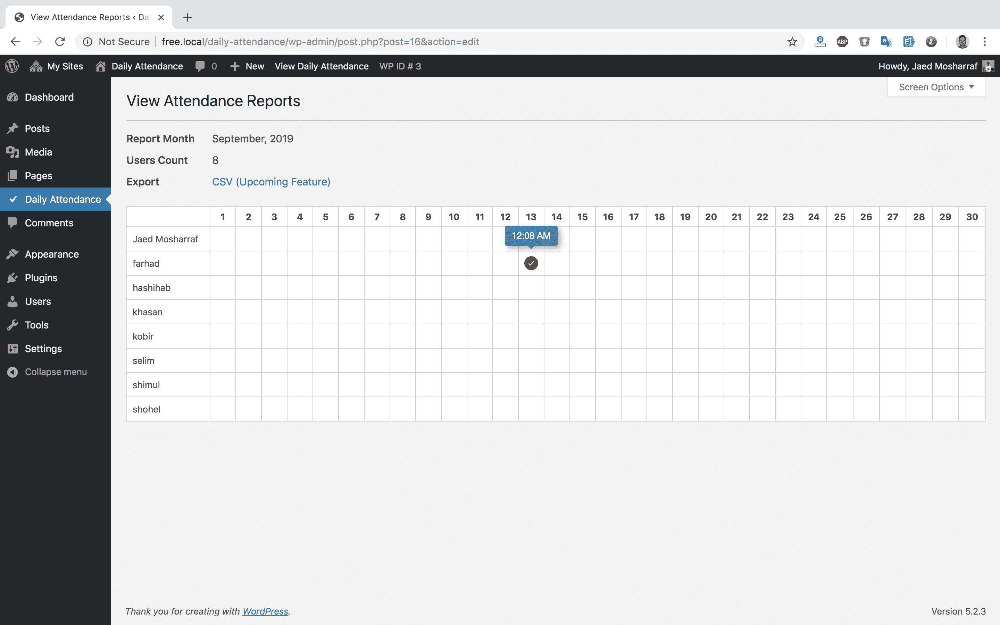
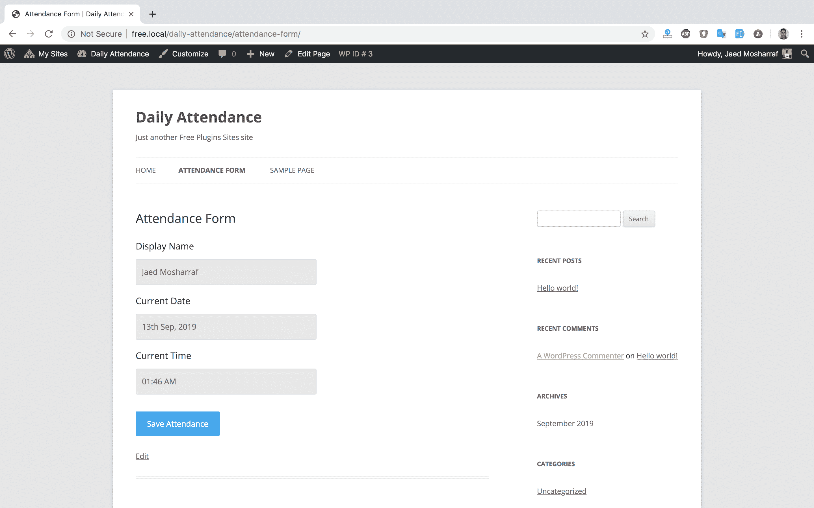

# 每日出勤 Wordpress 插件

> 原文：<https://blog.eldernode.com/daily-attendance-wordpress-plugin/>

**每日考勤 WordPress 插件**，用这个小巧轻便的免费工具管理员工的每日考勤。在这篇文章中，介绍另一个免费插件为你服务。另外，如果你需要购买 [WordPress VPS](https://eldernode.com/wordpress-vps/) ，你可以在 [Eldernode](https://eldernode.com/) 中看到可用的软件包。

## **每日考勤 WordPress 插件**

功能[插件每日出勤](http://eldernode.com/daily-attendance-wordpress-plugin/):

*   易于考勤(短码支持)
*   自动生成的月度报告
*   API 支持进行考勤
*   Google Chrome 扩展支持
*   随时导出报告(即将推出)
*   周末和假期管理(即将推出)
*   IP 限制–本地和网络 IP(即将推出)
*   用户限制(即将推出)
*   结束时间跟踪器(即将推出)
*   包含绝对工时计算的报告(即将推出)
*   更多令人兴奋的功能正在开发中

[插件](https://wordpress.org/plugins/)短代码:

[考勤 _ 表单]

使用这个短代码，你可以在你网站的任何地方显示一个表单，在那里你的用户将能够很容易地给出他们的出席。在尝试点击出席之前，他们必须登录，他们会看到自己的名字只是为了确认。

API 支持:

你可以用它的 API 很容易地将这个插件集成到任何第三方软件/工具中。

整合起来就是这么简单。
端点:https://my site . com/WP-JSON/v1/attendences/submit/
字段参数:
*用户名|类型字符串|必填
*密码|类型字符串|必填

如何安装 WordPress 插件:

1.  安装一个普通的 WordPress 插件
2.  通过 WordPress Dashboard 进入你的插件设置，找到“**每日出勤**”激活它。

如果你对这篇文章有疑问，你可以通过评论让我们知道，我们会给你回复。

[下载插件](https://wordpress.org/plugins/daily-attendance/)