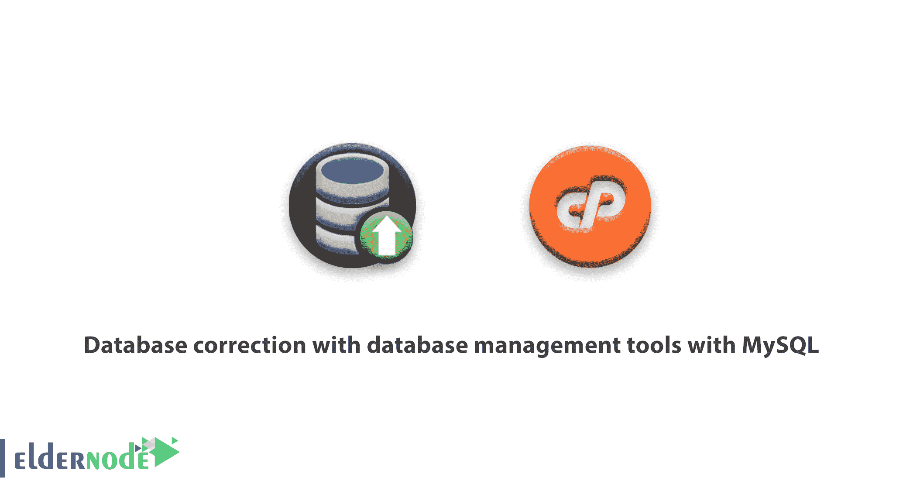

# 使用 MySQL - Eldernode 的数据库管理工具进行数据库校正

> 原文：<https://blog.eldernode.com/database-correction-with-database-management/>

如何**数据库校正**用**数据库管理工具**用[MySQL](https://eldernode.com/tag/mysql/)。

存储在 MySQL 中的数据可能会因为任何原因随着时间的推移而损坏。有时在使用数据库时，我们可能会看到需要纠正的错误。但是在修复数据库之前，我们必须首先找到与被破坏的数据相比显示错误的表和信息。

### 使用数据库管理纠正数据库教程

你可以采取两个重要的步骤来开始调解的准备过程。为此，您需要修改 MySQL 用户界面中的数据库选项。对数据库的修改如下所示:

但是让我们开始重要的第一步

用 MySQL 查数据库数据库管理工具

利用 [CPanel 数据库](https://eldernode.com/tag/cpanel-database/)的这一特性，可以跟踪损坏的数据库表。但是你可以采取一些步骤来开始调解的准备过程。

第一步:

从相应的菜单中选择需要检查的数据库。正如您所看到的，您可以通过 Check Database 下拉菜单来实现这一点。

第二步:

单击检查数据库按钮。

第三步:

CPanel 现在执行一个自动脚本来查找被破坏的表。如果发现损坏的表，将显示其名称，否则您将收到一条消息，说明检查已经完成。

**数据库修复**

第一步:

从下拉菜单中选择包含已销毁信息的数据库。

第二步:

单击修复数据库按钮。

第三步:

CPanel 现在运行一个自动脚本来修复数据或损坏的表，如果信息成功，它将向您发送一条完成该过程的消息。但是如果它不能纠正数据，它将显示一个错误，并显示与之相关的表名。

我们希望你用这个[教程](https://eldernode.com/category/tutorial/)有用。

如有疑问或问题，可向[提问系统](https://eldernode.com/ask/)咨询，提供指导。