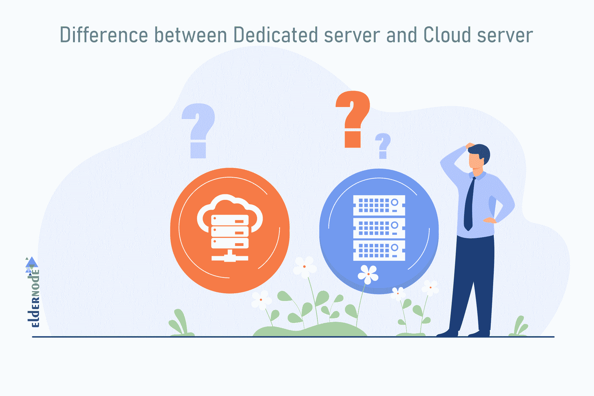

# 介绍专用服务器及其优势- Eldernode 博客

> 原文：<https://blog.eldernode.com/dedicated-server-and-its-benefits/>

专用服务器适用于网站和组织，或者计划在一个服务器上拥有多个虚拟服务器的人。这项服务具有高带宽，可高速连接到网络和互联网。这使得它的执行速度远远高于其他服务。除了大型站点和组织，专用服务器也是 web 和应用程序开发人员以及需要虚拟化的人员的不错选择。因为安装软件和进行更改没有限制。专用服务器的价格也因操作系统的类型、地理区域(位置)和资源而异。在本文中，我们希望向您全面介绍专用服务器及其优势。我们还将向您解释谁需要专用服务器，以及在专用服务器中应该考虑什么。您可以访问 [Eldernode](https://eldernode.com/) 中提供的包，购买一台[专用服务器](https://eldernode.com/dedicated-server/)。

## 最佳专用服务器及其优势

专用服务器是大型机构和组织的有效工具，这些机构和组织由于任何原因不能或不想与其他个人和组织使用共享服务器。因为专用服务器向用户提供服务器的所有硬盘空间和相当大的带宽。

各种功能，如大存储空间，能够创建多个互联网网站，高带宽，完全控制服务器，允许您安装定制软件，备份和管理服务器内容。在本文中，我们试图让您充分了解专用服务器及其优势。我们还将解释谁需要专用服务器。最后，将解释购买专用服务器必须遵循的原则。

## 什么是专用服务器？

专用服务器是物理上存在于数据中心并提供给您的物理服务器。这意味着所有的服务器资源都属于你，你不与任何人共享任何服务器资源，如速度和硬盘空间，带宽，网络和互联网连接速度，CPU 能力等，你一定会有更高的速度和灵活性。

因此，专用服务器通常比虚拟服务器更贵。对于想要购买专用服务器的用户来说，在选择这种类型的计划之前进行必要的研究是很重要的。通过将虚拟专用服务器(VPS)升级为专用服务器，您可以在不限制空间、带宽等的情况下尽可能扩大网站。在本文的以下部分中，我们将讨论购买专用服务器时应该考虑的问题。

**专用服务器**是根据您的需求购买并提供给您的物理服务器。这些服务器各有优势，是提供托管服务的最佳解决方案之一。此类服务器上的所有硬件资源都是为租用它们的用户保留的，不共享。事实上，在这种情况下，用户租用的是一台硬件服务器，上面有所有的硬件功能。如果你购买了专用服务器，你将可以自由地提供任何操作系统和任何类型的服务，只要你愿意。当然，你可以为专用服务器订购一些特殊的服务，如防火墙、不同的配置、购买更多的 IP 地址，这通常需要额外付费。

### 专用服务器和 VPS 服务器的区别

如何管理在专用服务器上提供给用户的服务与 VPS 服务器完全相同。这意味着用户可以使用遥控器连接到服务器操作系统并对其进行管理。但是在硬件资源方面，VPS 和专用服务器有一个主要的区别。与共享 VPS 服务器不同，专用服务器对硬件资源没有限制。以这种方式，服务器被物理地和完全地提供给用户，并且用户可以根据他自己的愿望来管理它。

在专用服务器中，对用户使用资源没有限制，只要服务器硬件有处理能力，用户就可以使用。例如，如果服务器 RAM 是 16GB，则允许用户使用所有 16GB 的 RAM，对他没有任何限制。

**–**专用服务器由于缺乏资源共享，硬件资源有限，硬件能力高于 VPS 服务器。

**–**由于缺少其他用户对专用服务器的访问，信息更加安全。

**–**专用服务器不会因为其他用户的不当使用而出现故障。

**–**没有专用服务器公司的服务限制。

**–**在专用服务器上提供专用互联网带宽。

#### 1。性能

当您的服务面临大量信息和数据以及大量流量时，效率问题就出现了。在这种情况下，专用服务器比 VPS 服务器更加强大和高效。每种服务器都有自己的效率和应用，您应该根据服务的性质选择合适的服务器。

另一方面，具有相同硬件和软件资源和功能的 VPS 服务器和专用服务器不会为您提供相同级别的性能。物理上完全可访问您的站点的服务器将比 VPS 服务器性能更好。如果你的网站需要大量的计算资源，建议购买专用服务器。

#### 2。容量管理

通常，使用专用服务器提供服务与使用最大量的服务器资源无关，这将有助于您和您的服务提供商始终能够提供更高质量的服务。另一方面，由于处理能力比专用服务器差，使用虚拟服务器有时会使用所有资源并中断高流量服务。因此，专用服务器比 VPS 服务器具有更大的容量。

#### 3。安全性

在 VPS 服务器和专用服务器中，安全管理都有其自身的挑战。在 VPS 服务器上，您可以在操作系统上设置单独的防火墙。另外，主服务器本身有防火墙层。您也可以设置独立于其他 VPS 服务器的自己的安全设置。但在专用服务器中，安全和防火墙设置必须在服务器本身完成，没有其他安全层。一般来说，一般来说，为了在专用服务器上获得更高的安全性，您应该使用数据中心防火墙或咨询安全专家。

### 专用服务器和云服务器的区别

专用服务器和云计算托管是对处理和性能要求较高的网站需要的两种类型的托管解决方案。这完全取决于你的需要，你使用这些服务。这些服务各有利弊。云服务的最大优势是其可扩展性，与专用托管服务相比，成本相对较低。

云服务器和专用服务器的区别在于它们的性能、可扩展性、管理、价格和估价。对于希望快速处理和检索信息的公司来说，专用服务器通常是最佳选择。

专用服务器上的数据处理速度非常快。正因如此，这个问题造成了它的流行和效率。在电子商务等行业中，性能和信息处理速度尤为重要。

#### 1。硬件资源消耗

计算服务器资源的消耗量对您的用户和服务非常重要。在专用服务器上，您将拥有从一开始就购买的资源，升级它们可能需要切换服务器并迁移到另一台服务器。
但是在云服务器上，你只需要请求增加资源，服务提供商就会为你提供

#### 2。将服务器转移到专用服务器和云服务器

专用服务器和云服务器都可以移动。迁移到专用服务器需要更多的规划。为了实现综合移动性，必须为现在和未来找到解决方案。为此，应该考虑一个伟大的计划。在大多数情况下，新旧解决方案必须同时使用。另一方面，你应该保留旧服务器作为备份。

#### 3。服务器管理和性能

云服务由提供商提供和管理。但是在专用服务器中，你负责管理整个服务器，更新，提供安全等。有时，一些没有经验的人不得不使用专家来管理他们的服务器。但是您知道拥有专用的服务器、处理资源和空间都由您支配，您不必担心任何事情。

#### 4。比较云服务器和专用服务器的价格

云服务器的访问成本通常低于专用服务器。但是，云服务器需要更多的资源。其中一个功能是通过专用网络接口实现云服务器，这是非常昂贵的。但另一方面，专用服务器的优势之一是可升级性，提高了内存、网卡和非易失性内存的磁盘。

### 专用服务器和共享主机的区别

专用服务器的另一个用途是将专用服务器设置和配置为 web 主机或应用程序主机。当你有一个网站或应用程序，你需要一个主机，你有两种不同的方式来使用和设置。
使用专用服务器作为主机或使用共享主机。

共享主机是一种 web 主机，其中一台服务器由多个用户共享(取决于服务器硬件和带宽),用户同时使用该服务器。在共享主机中，提供给用户的设备由主机控制面板管理，用户不能直接访问服务器操作系统。因此，这种类型的托管比其他托管服务有更多的限制。

#### 主机和服务器的区别

为了能够检查共享主机和专用服务器之间的差异，我们必须首先了解主机和服务器之间的差异。就硬件而言，专用服务器是一台强大的超级计算机，它一周 7 天、一天 24 小时工作，并使网站始终对观众可用。服务器用于托管站点并控制和管理它们。当一个站点的用户进入你的网站时，是服务器接收用户的请求并发送他们需要显示的信息。

#### 共享主机和专用服务器的比较

现在你已经熟悉了主机和服务器的定义，并且了解了它和服务器的区别，我们可以研究共享主机和专用服务器的区别了。他们都负责存储和维护您网站上的信息，他们的工作类型是相同的。但是他们每个人都有自己的特点，使他们不同。

共享主机和专用服务器的主要区别在于服务器上网站信息的存储类型。在共享主机中，一台服务器被分成几个特定的部分，每个部分负责托管一个单独的网站。但是在专用服务器上，用户接收服务器上所有可用的空间。

现在，它们每一个都有优点和缺点，我们将在下面进行研究。如果你能理解共享主机和专用服务器的区别，你就能为你的网站做出最好的选择。

#### 专用服务器 VS 共享主机

**1-** 在专用服务器中，整个服务器被分配给一个用户，服务器资源完全可供他使用。因此，该网站有更多的速度和权力。由于这个原因，它是一个非常适合高流量网站的选项。

**2-** 共享托管因为分成几个独立的部分，所以价格较低。

**3-** 在专用服务器上，用户将管理服务器。因此，他们可以定制服务器，并根据需要对服务器进行更改。

**4-** 维护共享主机并解决其问题不是你的责任。

**5-** 在共享主机中，由于服务器共享和安全问题，SSH 访问对共享主机用户不可用。

**6-** 为了提供共享托管，主机服务器被分成几个独立的部分。所以提供的资源是共享的。例如，由于位于服务器上的网站的高流量，速度以相同的比例下降。一些划分不合理的主机导致了用户的缓慢和烦恼。

**7-** 位于共享服务器上的网站管理员将无法管理该服务器并对其进行更改。

## 专用服务器及其优势

到目前为止，您已经熟悉了专用服务器及其与其他类似服务(如共享主机、虚拟服务器和云服务器)的比较。
我们现在将全面解释专用服务器的优势。

专用服务器可能是托管高流量网站的最佳选择。以下是专用服务器的一些特性和优势:

### 1)高级技术支持

专用服务器允许您使用专业顾问的技术和高级知识。顾问和专家都受过专业培训，如果出现问题，他们可以识别并解决问题。

### 2)专用 IP 地址

专用服务器有专用 IP。因此，所有进入你的网站或应用程序的流量都将流向一个唯一的 IP 地址。在专用主机中，你有一个专用的服务器，它有你唯一的 IP 地址。如果你有一个大型的电子商务网站，你需要 SSL 来处理你的信用卡。所以有一个独一无二的 IP 很重要。

### 3)私人安全空间

在专用服务器上，以完全专用的方式向用户提供访问。因此，提供了服务器安全性。此外，由于服务器不与其他用户共享，因此无需担心垃圾邮件和恶意内容。

### 4)速度保证

从专用服务器上传和接收信息的速度优于共享主机。因为在专用服务器上，资源也在其他订户之间共享。

### 5)控制和管理服务器的能力

在专用服务器上，用户不仅可以安装自定义操作系统，还可以安装自定义应用程序。这将使您更容易管理服务器，并防止可能影响您的网站的问题。

### 6)安装不同的控制面板

设置和安装控制面板，如 [DirectAdmin](https://blog.eldernode.com/tag/direct-admin/) 、 [Cpanel](https://blog.eldernode.com/tag/cpanel/) 、 [Plesk](https://blog.eldernode.com/tag/plesk/) 、Vesta cp，可以快速方便地管理网站的基本任务。您可以创建和管理电子邮件、域管理、设置强大的垃圾邮件过滤器、管理数据库和基于网络的应用程序，如 WordPress 博客和文件管理等等。

### 7)灵活性

专用服务器允许用户根据独特需求定制服务器。例如，您可以根据自己的喜好定制 CPU、RAM、磁盘空间和软件。因此，专用服务器的灵活性让用户可以自由定制。

专用服务器允许您拥有可定制的服务器环境来满足您的需求。有了专用服务器，用户可以选择自己需要的平台和软件。这为如何配置专用服务器提供了更多的控制。

### 8)先进的性能和安全性

选择专用主机可以确保您的网站是最新的。如果你的网站流量很大，专用服务器比共享主机更稳定可靠。通过拥有专用服务器，用户可以确保他们不会与恶意网站或垃圾邮件发送者共享空间。专用服务器提高了信息安全性。这对于通过 FTP 或 SSL 处理敏感交易的公司尤其重要。

### 9)专用虚拟化

专用服务器最重要的优势之一是能够设置虚拟化。
借助虚拟化，您将能够通过虚拟化操作系统(如 KVM 或 VMware vSphere)在专用服务器上为您的企业设置多个虚拟服务器，并为每个虚拟服务器提供单独的专用 IP。拥有更强大的性能和效率

## 谁需要专用服务器？

由于以下原因之一而不能或不想使用共享服务器服务的所有人和大型私人和公共组织将能够享受拥有专用服务器的好处:

**–**提供所需的带宽

**–**完全控制服务器内容

**–**需要永久备份信息和数据

**–**需要大量网络空间(例如超过 100 GB)

**–**在多个地理位置与组织的不同部门进行沟通

**–**需要非常高的月流量(例如超过 100 GB)

**–**在一个位置设置多个虚拟服务器，并进行专门管理

在确定哪种服务适合托管个人、公司和商业服务时，涉及到几个因素。以下是一些因素:

### **1。根据工作需要选择托管服务**

专用和共享主机都可以是应用程序或网站的主机，但需要个人或公司使用服务器的最大能力、高带宽、强大的处理能力等。依靠使用专用服务器和主机共享无法很好地服务于高流量网站。

### **2。**确定所需流量

应该在高流量的情况下选择专用服务。否则，对于低流量，共享服务就足够了。

### **3。预算金额**

如果您有合适的预算，我们建议您选择专用服务器，这样您就可以使用它的所有资源。应该注意的是，专用服务器比共享主机更昂贵。

### **4。员工技能等级**

任何级别的所有用户都可以轻松使用共享托管服务。但是要使用专用的主机服务，你必须是服务器管理员。

### **5。在多个虚拟服务器上集成多种服务**

您可能希望在不同的虚拟服务器上分别设置几个站点或服务，并且您需要有完整的服务器管理，以便能够将专用服务器的最大能力用于您的服务。在这种情况下，专用服务器可能是明智且经济高效的选择。

在查看了上述项目后，您应该根据自己的需求决定选择哪种服务类型。所以你必须非常小心。

## 使用专用服务器的 10 大理由

当组织或团体担心其信息的安全性，或者当对组织或业务站点有大量请求和访问时，就需要专用服务器。在本节中，我们将解释选择专用服务器的 10 个理由:

### 1)卓越的性能

在专用服务器环境中，客户端可以完全访问所有服务器资源，无论是 RAM、CPU、带宽还是内存。因此，即使需求和流量增加，他们的网站或应用程序也能提供高水平的速度和性能。

### 2)服务改进

拥有专用资源并完全控制服务器的专用服务器允许用户进行最佳和最快的交易，以提高服务质量并增加客户。例如，高流量网站在使用专用服务器时，由于数据库和网站后端之间的处理速度更快，因此可以提供更好的性能速度，除了用户满意度之外，还会提高其 SEO 结果。

### 3)专用 IP 地址

专用服务器提供商将为您提供一个专用的 IP 地址，您可以使用该地址来控制和管理服务器以及设置它。这个唯一的 IP 地址，如果你使用你的服务器作为虚拟主机，将会提高搜索引擎优化的质量和效率，同时减少垃圾邮件。此外，如果需要更多 IP 地址，您可以订购几个其他专用 IP 地址来使用。

### 4)定制

专用服务器托管提供对服务器的根访问。通过 root 访问，可以根据客户的需求配置服务器硬件和软件。因此，您可以添加更多的 RAM，要求更多的磁盘空间，并为您的服务器选择高级处理器。您也可以选择所需的操作系统(OS)。

### 5)安全性

在专用服务器主机中，不要与其他帐户共享服务器资源。因此，您的网站可以抵御恶意和不需要的网站。相比之下，在共享主机中，你的网站可以抵御易受攻击网站的威胁。

在专用服务器上，您负责服务器的日常维护。这意味着您必须自己执行软件安装和安全更新等任务。由于您负责网站的安全，因此可以根据需要调整安全设置。该功能对于处理敏感信息(如财务数据中心或客户信息)的网站尤其有用。

### 6)物有所值

虽然专用服务器乍一看似乎很昂贵，但从长远来看，这是一个很有价值的省钱解决方案。专用服务器提供对物理服务器的一整套资源的访问，从而提供卓越和持续的性能。

### 7)灵活性

虽然专用服务器主要用于虚拟主机，但它同样适用于其他应用程序。专用服务器可用于备份网站、托管多人游戏、虚拟化、托管个人云空间和观看直播电影。因此，专用服务器具有通用性和灵活性。

### 8)更快的数据处理能力

当然，在服务器上有一个专用处理器，这是在专用服务器上实现的，数据处理要快得多。专用服务器及其资源完全由您支配，您不必担心被其他主机或其他 VP 滥用资源。
例如，如果你使用自己的服务器托管你的网站，你可以确定所有的处理都将容易地、尽可能快地发生，或者带宽将不属于你的网站之外的任何服务或个人。

### 9)专用和定制管理

专门的服务器管理由您支配，您可以拥有定制的操作系统、定制的服务，甚至是特殊的配置。除了这些好处之外，您还可以在服务之间分割服务器的专用资源，以获得最佳性能。

### 10)优化服务器负载

优化服务器性能是服务交付中最重要的一点。专用服务器由于其专用资源，为服务管理者提供了轻松优化其服务器和服务的能力，并根据需要在服务之间划分服务器资源。

## 如何购买专用服务器

专用服务器的主要特征是它的处理器速度和专用资源。因此，速度是引入托管服务公司提供的各种包的关键因素。但是 CPU 速度比内存、磁盘空间、带宽或其他需要考虑的服务器规格更重要。如果 CPU 更强大，服务器执行并发操作会更好。

静态站点适用于中低 CPU，但动态站点、数据管理应用程序和游戏服务器需要更强大的 CPU。

如果你想将你的主机服务升级到专用服务器，你必须记住，不是所有的专用服务器都是一样的，每个虚拟主机公司为购买专用服务器提供不同的功能和解决方案。

### 1-选择操作系统的类型

选择专用服务器的最重要因素之一是您选择操作系统的自由。您业务所需的程序可能需要 Windows 或 Linux 发行版，甚至虚拟化。

在某些情况下，您的软件可能只与一个版本的操作系统兼容。您需要确保您的提供商能够运行您需要的操作系统。

### 双服务器配置

非常重要的一点是，您必须以表单的形式连接到服务器，并进行所需的配置。例如，您需要使用 SSH 或 RDP 协议连接到服务器。因此，通过选择操作系统和连接到该系统的服务器的初始配置，您已经完成了很多步骤。

### 3-硬件选择

因为购买专用服务器比其他服务更昂贵，所以在选择之前，您应该确保您考虑的主机提供优质和全面的硬件。这样，您就可以做出正确的选择，从拥有您想要的功能的服务器购买产品。

换句话说，您必须考虑广泛的选项，包括 CPU 型号、内核数量和速度、RAM 大小、RAM 类型、硬盘容量、硬盘类型(HDD 或 SSD)、带宽和 RAID。

### 4-选择控制面板

如果您需要一台专用服务器来进行虚拟主机托管，您应该考虑在您的专用服务器旁边订购一个 web 管理面板(如果需要)。控制面板通过一个简单的图形界面做很多事情，比如控制邮箱、FTP 账户、数据库、网页统计等等。

主机控制面板具有几乎相同的功能，但每个面板都有自己的自定义功能。因此，哪种控制面板适合您取决于您的偏好。

记住，Cpanel 只能安装在 Linux 上，但是你可以使用 Plesk，它有 Linux 和 Windows 两个版本。

### 5-安全

在选择一个专门的主机提供商时，安全性应该是一个决定性因素。您需要考虑从数据中心的地理位置和物理安全性到您的主机在您的包或服务中提供的安全功能的所有方面。

您需要考虑防火墙、入侵防御、web 应用程序安全性、DDoS 保护以及病毒和恶意软件攻击，以维护服务器上必要的安全性。服务提供商还必须提供 SSL 证书、专用 IP 地址和垃圾邮件过滤。

### 6-高可用性

如果你的专用服务器正在运行重要的服务，你不应该让它离线。因为后果可能是灾难性的。这就是为什么选择能够确保高可用性的主机非常重要。

### 7-服务器位置

选择专用服务器的位置取决于几个关键因素。选择专用服务器位置的最重要因素是您和将从您那里获得服务的用户。当然，服务器离服务地点越近，服务在互联网上的速度就越快。
选择地点的下一个要点是选择功能强大的数据中心，该数据中心以最佳方式提供专用服务器服务，并具有可靠的高质量带宽。
而地理区域的尽头是服务器的所在地，如果你需要一台专用的服务器来服务于世界各地，那么你必须选择拥有完善基础设施的地理区域来为世界各地提供带宽。

### 购买专用服务器的建议

现在，通过阅读本文，您已经获得了关于专用服务器的必要且充分的信息。你可以很容易地买到你想要的专用服务器。Eldernode 提供来自[美国](https://eldernode.com/dedicated-server/usa/)、[法国](https://eldernode.com/dedicated-server/france/)、[荷兰](https://eldernode.com/dedicated-server/netherlands/)、[德国](https://eldernode.com/dedicated-server/germany/)、[英国](https://eldernode.com/dedicated-server/uk/)、[日本](https://eldernode.com/dedicated-server/japan/)和[新加坡](https://eldernode.com/dedicated-server/singapore/)的专用服务器。您可以从这些地方选择购买您需要的专用服务器。

如果您的首选位置不在这些选项中，请联系 Eldernode 实时聊天来指导您完成此操作。

## 结论

您可以为各种应用程序使用专用服务器，尤其是托管非常大的站点。由于它们的高度灵活性，这些服务器可以响应安装在它们上面的各种软件。在本文中，我们试图首先向您介绍一个专用服务器。然后我们解释了专用服务器与 VPS 服务器、云服务器和共享主机的区别。然后，我们解释了专用服务器的优势以及谁需要专用服务器。如果你愿意，可以阅读文章[VPS 的优缺点](https://blog.eldernode.com/advantages-and-disadvantages-of-vps/)。