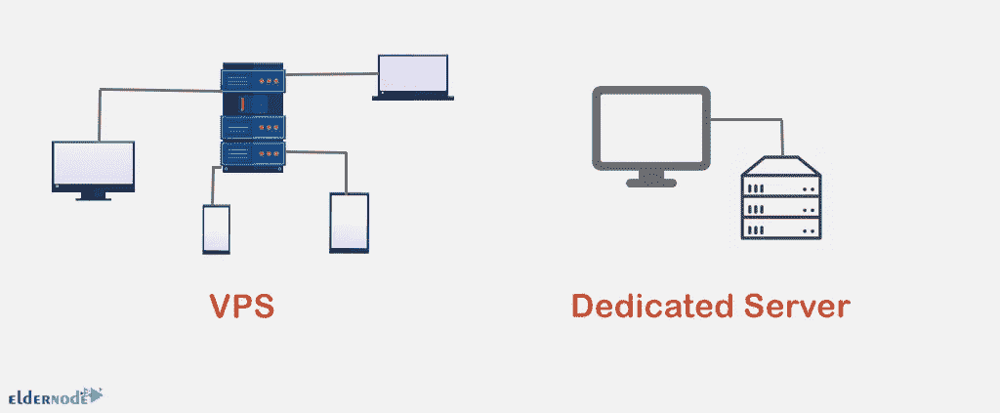

# 专用服务器与 VPS[性能、质量和价格]

> 原文：<https://blog.eldernode.com/dedicated-server-vs-vps/>

![Dedicated Server vs VPS [Performance, Quality and Price]](img/bda60f67388c59851196b1704db86c06.png)

现在有许多类型的虚拟主机服务，但最受欢迎的是 VPS 主机，共享主机和专用服务器。虚拟主机服务在性能、质量、水平和价格等问题上有所不同。共享服务是托管网站最简单的方式，因此主要用于个人博客或小型网站。在本文中，我们将从性能、质量和价格方面比较 **[专用服务器](https://eldernode.com/dedicated-server/)与 [VPS](https://eldernode.com/vps/)** 。

## **专用服务器简介&VPS**

## **什么是专用服务器？**

专用服务器是在数据中心 24 小时开启的计算机服务器的专用服务器，并连接到万维网。该计算机具有更强大和最新的硬件，并且由于服务器通常必须长时间可用，并且硬件稳定性在其中非常重要，所以使用特殊技术来增加服务器组件的使用寿命。由于专用服务器的敏感性，它应该由专家管理员管理，以便服务器上的网站和文件在安全性和质量方面处于适当的水平。

## **什么是 VPS？**

[VPS](https://blog.eldernode.com/what-is-vps-complete-guide/) 代表虚拟专用服务器，实际上是专用服务器的一部分资源，通过虚拟化技术和虚拟化软件分离出来。事实上，VPS 正在使用虚拟化技术划分成几个虚拟服务器。这些部分在硬件使用上是一样的，有趣的是一个虚拟服务器的价格比其他服务器便宜。每个 VPS 完全独立运行，因此一台服务器上的 VPS 可以使用不同的操作系统和不同的版本，以及它们自己的软件。

## 专用服务器和 VPS 服务器特性

在本文的后续部分，我们想为您介绍一下专用服务器和 VPS 服务器的一些最重要的特性。

### **专用服务器功能**

->服务器管理

->可扩展性

->安全

->高可用性

->管理访问和服务器配置

->操作系统选择

->硬件选择

->控制面板选项

->顶级技术支持

### **VPS 特性**

->低成本

->托管

->备份和恢复能力

->安全性高

## **专用服务器与 VPS 的区别**

在上一节中，我们讨论了每种服务的特性。在本文中，我们将讨论专用服务器和 VPS 服务器之间的 4 个最基本的区别。

### **表现**

在网络世界里，好的性能意味着你的网站能够多快地加载页面并为用户运行。专用服务器和 VPS 性能是指网站可以加载的速度和同时可以处理的流量。

VPS 使用一个虚拟机管理程序，该程序从邻居网站借用资源，如果网站流量增加，就会降低网站速度。如今有很多令人印象深刻的 VPS 包会影响性能。

专用服务器可以提供最佳的速度，管理大量的流量而不会崩溃。事实上，专用服务器将其所有带宽集中在一个帐户上。在专用服务器上注册时，对您的性能没有任何限制，您可以选择任意多的 CPU 和内存。

### **价格**

专用服务器比 VPS 贵很多，因为是专用的。VPS 为您提供了一个合理的价格范围，以及不同限制和不同价格的不同级别的计划。当然，在专用服务器上，您将拥有更多资源、更高的安全性和更好的性能，但所有这些都需要付出很高的代价。VPS 服务器的容量对于大多数站点来说都是可以接受的，并且可以向公众开放。

**VPS 和专用服务器服务的安全性可以比作住在私有财产或多单元公寓中。如果有人让大楼敞开着，整个大楼的安全就会受到威胁。VPS 非常安全。托管公司尽一切可能保护他们的客户，然而，你的网站与其他网站共享一个服务器。**

**购买专用服务器就像拥有一个个人的家。有人进入你家的可能性完全取决于你，你不会因为别人的粗心而惹上麻烦。虽然 VPS 非常安全，但它无法与专用服务器提供的完全控制相比。此外，它们都允许您安装定制的安全软件。**

### ****扩展性****

**任何业务中最重要的事情之一就是预测网站的增长。可扩展性也意味着当你的网站增长时，你的主机会增长多少。专用服务器需要强大的主机来处理流量，并从一开始就拥有其能力范围内的所有资源、安全性和性能。**

**VPS 可以随着 web 服务器的增长而增长，您可以升级增加存储和带宽的计划，或者您可以通过增加流量来提高 VPS 的托管能力。**

## ****哪个比较好？专用服务器或 VPS****

****

**专用服务器和虚拟专用服务器的规模和业务类型各不相同，都是企业的绝佳选择。VPS 价格更低，可扩展性更强，适合预算较少的小型成长型企业。**

****专用服务器**扩展性差，价格贵；但在安全性和性能方面更好、更可定制，使它们成为为大型或受欢迎的网站寻找高级托管选项的企业的理想选择。**

## **结论**

**本文讨论了专用服务器和 VPS 在性能、质量和价格方面的异同。VPS 和专用服务器之间的区别是用户在为他们的网站或其他目的购买托管服务时遇到的一个问题。我希望这篇文章能帮助你选择最好的服务器。**