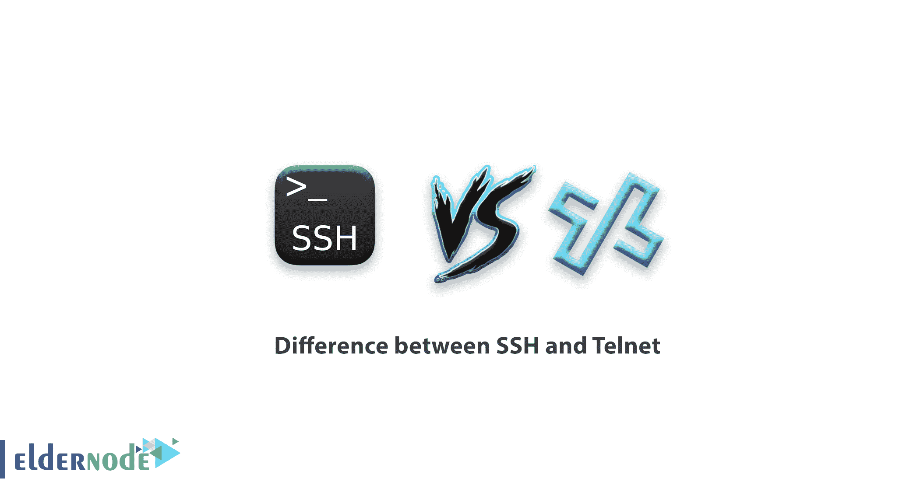

# SSH 和 telnet 的区别是什么——SSH 和 Telnet 的比较

> 原文：<https://blog.eldernode.com/difference-between-ssh-and-telnet/>

## SSH 和 Telnet 的区别

‏ SSH 被称为安全销售，Telnet 被称为远程网络。这两种协议都用于管理服务器和网络组件，如路由器、交换机等。远程的。SSH 和 Telnet 之间的主要区别在于安全性，这种安全性默认存在于 SSH 上，但不存在于 Telnet 上。
Telnet 于 1969 年首次推出，主要用于不需要太多加密的专用网络。但是 SSH 将用于迫切需要保护信息和数据的公共网络。

### SSH 和 Telnet 的安全性比较

‏generally，数据以明文形式通过 Telnet 发送。因此，很自然地，如果这是在像互联网这样的不安全网络上完成的，它会导致安全问题，任何人都可以嗅探指令，甚至窃取用户名和密码等身份信息。但是 SSH 协议使用特殊的加密技术来传输命令和信息，这使得它很难被监听。
telnet 的‏The 要点是可识别的，但这一点没有做到，因为不会检查数据传输的时间来验证源点是否与预期的相同。这允许其他人中断连接并输入他们想要的命令。而在 SSH 中，我们有一个公钥来执行识别每个包中的数据源的任务。
‏

### 安全外壳和远程登录的开销和带宽

出于同样的安全原因，人们需要在公共场合使用 SSH，以便为出于安全数据目的而传输的任何包考虑一些空间。相应地，现在使用 SSH 的人需要更多的带宽，这被称为开销，如果网速太低，就很难使用 SSH。但是 Telnet 可以使用最低的带宽。

### ‏
为什么 Telnet 仍然有用？

因此，Telnet 安全问题导致今天许多人转而使用安全 shell。但是你可能想知道，为什么还有 Telnet？

‏Telnet 是为特定目的设计的，这些目的仍然适用。比如在考试条件和调试中还在用。当然，为 Telnet 开发的几个补丁和安全工具仍然不能提供 SSH 安全性，并且在所有环境和公共网络中使用。

telnet 和 SSH 有什么区别？

### ‏Let's 知道 SSH 和 Telnet 的区别和相似之处:

‏SSH 和 Telnet 都用于相同的目的。‏SSH 比 Telnet 安全得多。
SSH 加密数据，而 Telnet 以纯文本形式发送数据。
‏SSH 使用公钥来识别。而 Telnet 没有身份。
由于传输数据包中的数据加密信息，‏SSH 稍微增加了总开销。

‏Anything:你可以用 TELNET 来做，也可以用 SSH 来做。但是今天，SSH 被用户用来获得更高的安全性。‏
我们希望你喜欢 SSH 和 Telnet 的概要

‏Dear 用户，您可以在评论区提出关于本次培训的问题，并获得您的回答，或者要解决 [Eldernode](https://eldernode.com/) 培训领域的其他问题，请参考 [**提问页面**](https://eldernode.com/ask/) 部分，并尽快在其中提出您的问题。腾出时间给其他用户和专家来回答你的问题。