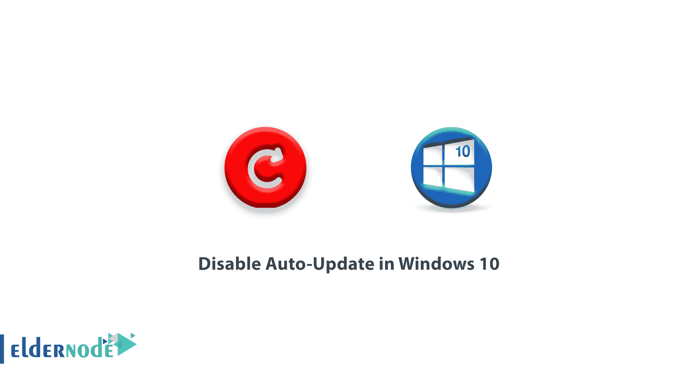
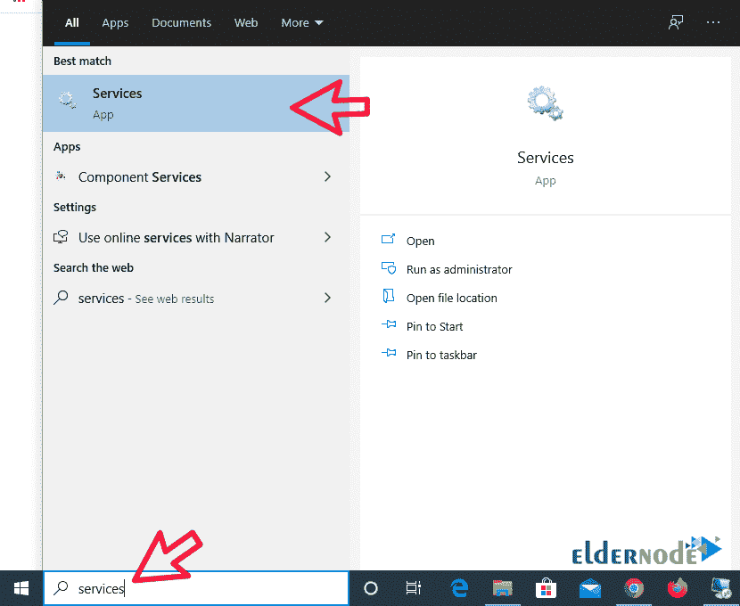
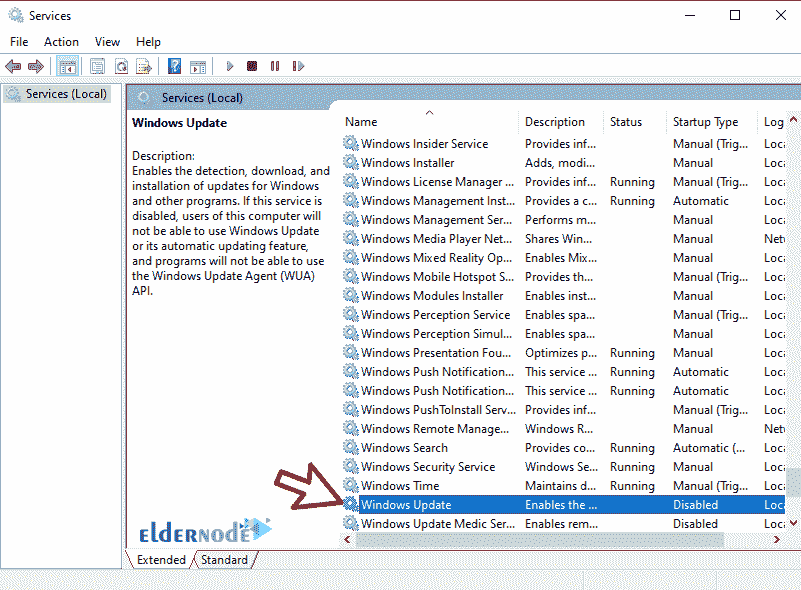
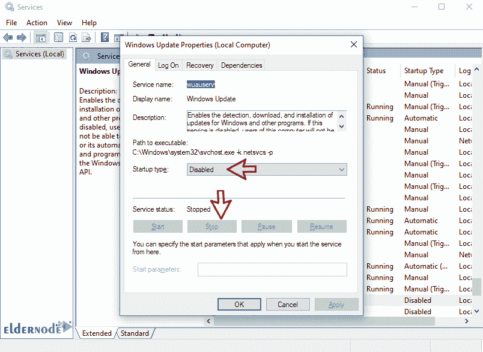
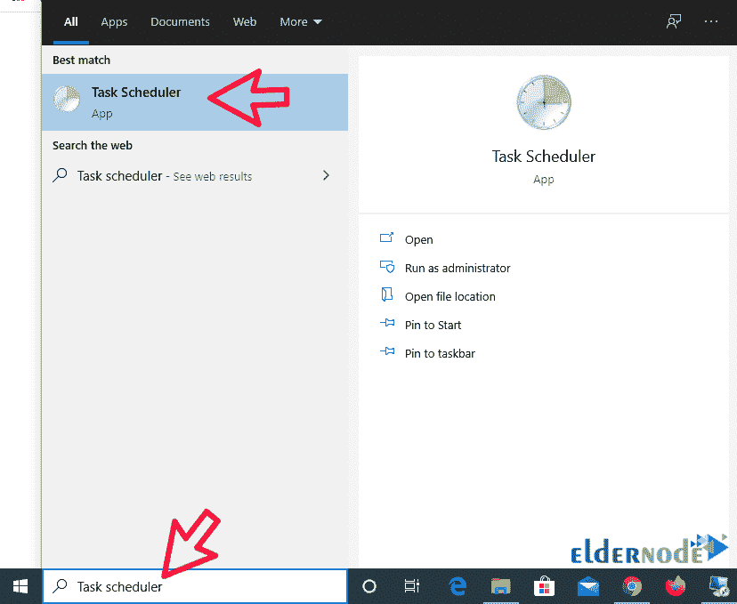
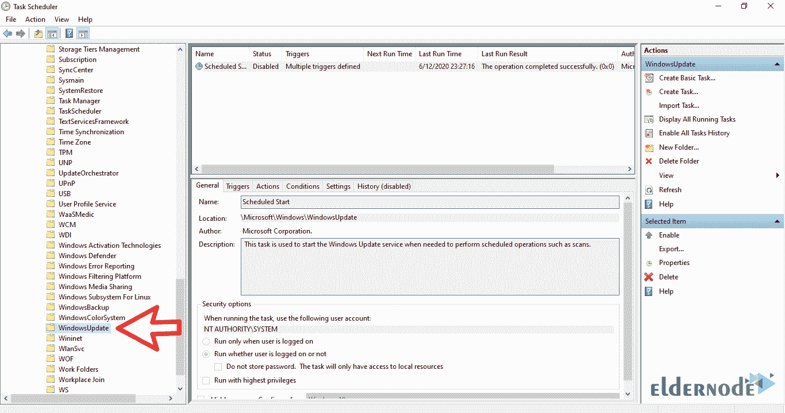
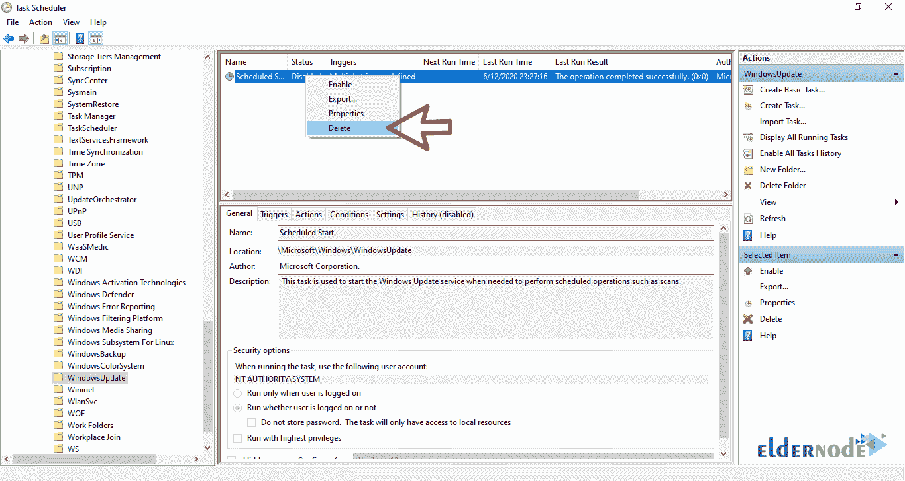

# 如何在 Windows 10 - Windows VPS 服务器中禁用自动更新

> 原文：<https://blog.eldernode.com/disable-auto-update-in-windows/>

如何在 Windows 10 中禁用自动更新？在 Windows 10 中禁用自动更新要比其他窗口复杂一点。这种复杂性的原因是为在以前的窗口中拥有更新类型的用户删除了更新类型选项。

有几种方法可以阻止 Windows 10 更新。在本文中，我们将教你一个肯定能回答你的方法。

**注意:** 我们建议您不要因为安全问题停止 Windows update 以及接收安全更新。如果关闭了，要时不时手动更新，避免可能的危险。

[**在 Eldernode**](https://eldernode.com/windows-vps/) 选择您的完美 Windows 虚拟专用服务器包

## 禁用 Windows 10 自动更新

**1。**第一步，在你的开始栏中搜索服务并打开。

**2。**在**服务**窗口中，找到 Windows Update 服务，双击将其打开。

**3。**在此部分，将启动类型选项设置为禁用，点击应用。

应用服务后停止。

完成此步骤后，您的 Windows Update 服务将被**禁用**。

现在你必须阻止这个服务重启并更新它。

**4。**从开始菜单，搜索 [任务调度器](https://docs.microsoft.com/en-us/windows/win32/taskschd/task-scheduler-start-page) ，找到后打开它。

**5。**在本节中，按照以下顺序转到 Windows Update 目录:

微软**>**Windows**>**Windows更新

**6。**选择本节定义的所有任务，删除。

这样，您可以阻止 Windows update，并且不再需要设置另一个部分。

**亦作，见:**

[如何在 Windows 10 中添加文件启动](https://eldernode.com/add-files-to-startup/)

**尊敬的用户**，我们希望您能喜欢这个[教程](https://eldernode.com/category/tutorial/)，您可以在评论区提出关于本次培训的问题，或者想解决[老年人节点培训](https://eldernode.com/blog/)领域的其他问题，请参考[提问页面](https://eldernode.com/ask)部分，并尽快提出您的问题。腾出时间给其他用户和专家来回答你的问题。

好运。