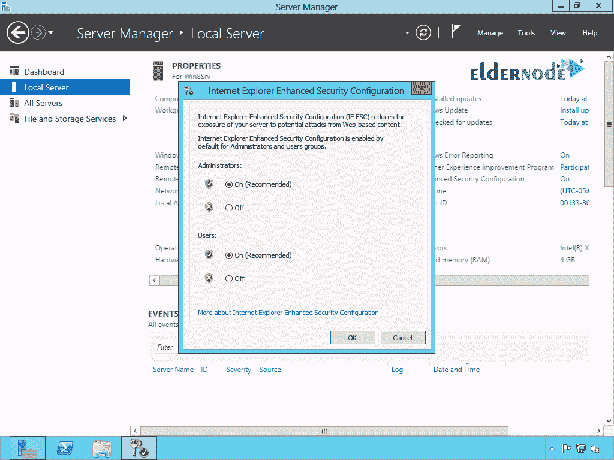

# 如何禁用 IE - ElderNode 博客中的安全问题

> 原文：<https://blog.eldernode.com/disable-security-questions-in-ie/>

[更新:添加视频|创建视频作者:迈克尔·摩根]如何**禁用 [IE](https://en.wikipedia.org/wiki/Internet_Explorer)** 中的安全问题。尽管今天的[ie 浏览器](https://www.microsoft.com/en-us/download/internet-explorer.aspx)是一个相对令人讨厌的浏览器，但出于安全原因，它也被用在许多服务器上。许多服务器管理员不安装其他浏览器，而更喜欢用 Internet Explorer 进行网上冲浪，并且不安装其他浏览器软件，以免他们的服务器被感染。在这篇文章中，我们将向您展示一个解决方案，以便您可以轻松地**禁用** Internet Explorer 安全问题，并像使用 Windows 10 Internet Explorer 浏览器一样使用它。如果你愿意，你可以访问 [ElderNode](https://eldernode.com/) 中托管包的 [VPS。](https://eldernode.com/vps-hosting/)

## 教程如何在 IE 中禁用安全问题

你可能已经注意到，在使用服务器上的 Explorer 浏览器时，[微软](https://www.microsoft.com/)增加了这款浏览器的安全性，并配备了一个名为 **IE 增强安全性**的系统，以增加安全性并且也不加载脚本。所以当你打开一个站点的时候，你会遇到无数的消息来确认并添加到安全的 web 点。这些消息会很烦人，以至于你会愿意安装任何其他浏览器而不是 Explorer。该安全系统向您显示单个 web 应用程序请求，并允许您在 Internet Explorer 中打开它，如果您批准并**将其添加**到安全网站列表中。这个系统是如此的特别和安全，以至于你在打开微软网站时会遇到一些信息，或者打开一个简单的网站，比如谷歌，你会遇到一些如下图所示的信息:

***注:*** 本教程已在 Windows Server 2012 或更高版本上测试。

### 了解如何禁用 IE 安全问题

**1。**首先，打开你的**服务器管理器**。

**2。在服务器管理器窗口中，点击**本地服务器**。**

**3。**下一步，如下图所示，点击 **IE 增强安全配置**打开其设置:

**4。在打开的**窗口中，将**两个选项**设为 **off** 和 **Ok** it。

***注:*** 该窗口中的选项为管理员和其他用户的**安全设置**。**第一个选项**用于**管理员**，而**第二个选项**用于其他用户。如果您只是想避免向管理员询问这些问题，您只需**关闭**第一个选项。

**搞定！**从现在开始，您的 Internet Explorer 浏览器将在没有安全服务的情况下工作，并且不会询问您有关确认打开或访问 web 服务的问题。

此外，你可以在 Eldernode Youtube 频道上看到该视频。

结论

在这篇文章中，我们试图教你如何在服务器管理器中禁用 IE 中的安全问题。阅读其他浏览器的相关文章，参见[如何在 Google Chrome 中安装根证书](https://blog.eldernode.com/install-root-certificate-in-chrome/)和[如何在 Firefox 中安装根证书](https://blog.eldernode.com/install-root-certificate-in-firefox/)。

## Conclusion

In this article, we tried to teach you How to disable security questions in IE in Server Manager. To read related articles about other browsers, see [How to install Root Certificate in Google Chrome](https://blog.eldernode.com/install-root-certificate-in-chrome/) and [How to install Root Certificate in Firefox](https://blog.eldernode.com/install-root-certificate-in-firefox/).