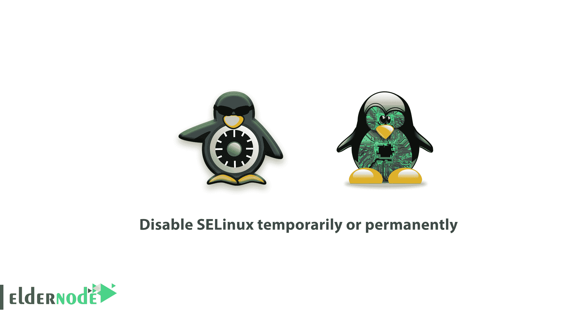
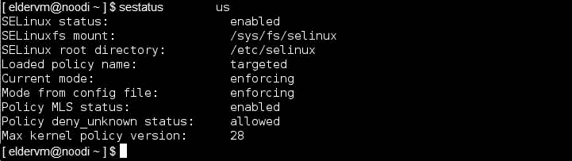
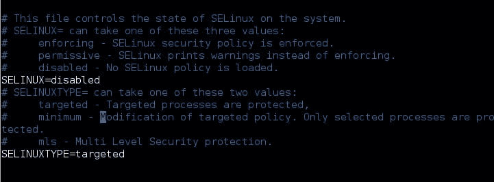
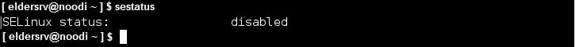

# 如何暂时或永久禁用 SELinux-elder node

> 原文：<https://blog.eldernode.com/disable-selinux-temporarily-permanently/>



一个 Linux 系统管理员需要知道一些 Linux 技巧。在本文中，您将学习如何暂时或永久禁用 SELinux。Linux，作为最安全的操作系统，您可以使用它卓越的安全实现特性。加入我们来检查一下 **SELinux** 的状态，同时禁用 **CentOS/RHEL** 中的 **SELinux** 和 **Fedora** ，以防其被启用。

## 如何暂时或永久禁用 SELinux

SELinux 被描述为 **MAC** ( [强制访问控制](https://en.wikipedia.org/wiki/Mandatory_access_control#:~:text=In%20computer%20security%2C%20mandatory%20access,on%20an%20object%20or%20target.) )在内核中执行的安全结构。SELinux 提供了一些安全策略，否则系统管理员无法有效地实现这些策略。

在安装 **RHEL/CentOS** 或其衍生产品时，默认情况下会启用 **SELinux** 功能或服务，因此您系统上的某些应用程序实际上可能不支持这种安全机制。因此，你必须禁用或关闭 **SELinux** 才能让这类应用程序正常运行。

**请注意** :注意本教程对文件和服务实施一些强制访问控制才能正常运行，如果你不想禁用 SELinux 的话。

**不要错过**

[教程在 RHEL 8 / CentOS 8 上安装 Python 3](https://eldernode.com/python-3-on-rhel-8-centos-8/)

### 如何在 Linux 中禁用 SELinux

首先，通过运行以下命令，检查系统上 **SELinux** 的状态:

```
sestatus  
```

根据您想要实现的目标，您可以在系统上禁用 SELinux 之后临时或永久地这样做。

### 

[购买 Linux 虚拟私有服务器](https://eldernode.com/linux-vps/)

### 暂时禁用 SELinux

运行以下命令暂时禁用 **SELinux** 。

```
echo 0 > /selinux/enforce
```

另外，您也可以使用 setenforce 工具。

```
setenforce 0
```

或者，代替 **0，**你可以使用**许可**选项。

```
setenforce Permissive
```

**注意** :你读到这里的方法，会一直工作到下一次**重启**，因此要永久禁用 SELinux，移到下一节。

### 永久禁用 SELinux

你需要打开文件 /etc/sysconfig/selinux，到 永久禁用 selinux。

```
vi /etc/sysconfig/selinux
```


现在，您应该将指令 SELinux=enforcing 改为 SELinux=disabled 。

```
SELINUX=disabled    
```

接下来，保存并退出文件，让更改生效。为此，**重启**您的系统，或者使用 **sestatus** 命令检查 SELinux 的状态。

```
sestatus  
```

#### **总之**，

你学会了如何在 **CentOS/RHEL** 和 **Fedora 上禁用 **SELinux** 。**

亲爱的用户，我们希望你能喜欢这个教程，你可以在评论区提出关于这个培训的问题，或者解决其他关于 [Eldernode 培训](https://eldernode.com/blog/) 领域的问题，请参考 [提问页面](https://eldernode.com/ask) 部分并提出你的问题。