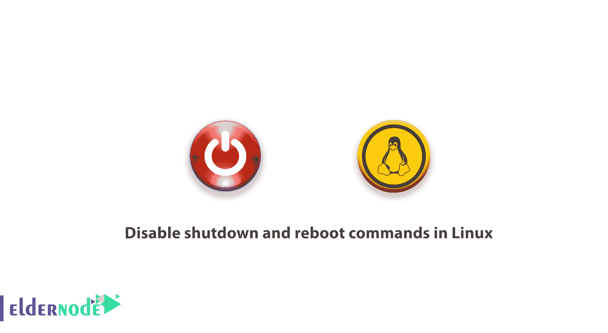

# 如何在 Linux - Eldernode 中禁用关机和重启命令

> 原文：<https://blog.eldernode.com/disable-shutdown-reboot-linux/>



一个 Linux 系统管理员需要知道一些 Linux 技巧。在本文中，您将学习如何在 Linux 中禁用关机和重启命令。

要关闭 Linux 系统，您需要使用 **shutdown** 命令来安排时间。而 [Linux](https://www.linux.org/) 发行版如 Ubuntu、Linux Mint、Mandriva，默认情况下可以作为普通用户重启/暂停/关闭系统。这不是一个理想的设置，尤其是在服务器上。最重要的是，这肯定是需要担心的事情，尤其是对于系统管理员来说。

为了解决这个问题，我们将展示如何为 Linux 中的普通用户禁用**关机**和**重启**命令。

[购买 Linux 虚拟私有服务器](https://eldernode.com/linux-vps/)

## 如何在 Linux 中禁用关机和重启命令

让我们回顾一下使用 **/etc/sudoers** 文件来关闭和**重启**命令的最简单方法之一。

```
vi /etc/sudoers 
```

将这些行添加到**命令别名**部分。

```
Cmnd_Alias     SHUTDOWN = /sbin/shutdown,/sbin/reboot,/sbin/halt,/sbin/poweroff    User privilege specification  **eldernode**   ALL=(ALL:ALL) ALL, **!SHUTDOWN**    Allow members of group sudo to execute any command  **%developers**  ALL=(ALL:ALL) ALL,  **!SHUTDOWN**
```

尝试以普通用户身份执行**关机**和**重启**命令。

```
chmod o-x /sbin/shutdown  chmod o-x /sbin/reboot
```

**请注意** :在 systemd 下，这些文件(/sbin/shutdown，/sbin/reboot，/sbin/halt，/sbin/poweroff)只是/bin/systemctl 的符号链接:

```
ls -l /sbin/shutdown  ls -l /sbin/reboot  ls -l /sbin/halt  ls -l /sbin/poweroff
```

总之，您可以如上所述删除执行权限，以防止其他用户运行这些命令。因为在系统下是无效的。，您可以删除对 **/bin/systemctl** 的执行权限，这意味着除 root 之外的所有其他用户将只运行 systemctl。

```
chmod  o-x /bin/systemctl
```

**好样的** ！您已经完成了教程，达到了我们指南的目的。如果你知道其他方法，请在评论中与我们分享。

亲爱的用户，我们希望你喜欢这个教程，你可以在评论区提出关于这个培训的问题，或者解决 [Eldernode](https://eldernode.com/) 培训领域的其他问题，请参考 [提问页面](https://eldernode.com/ask) 部分并在其中提出你的问题。

**您可以在:** 中找到更多相关文章

[在 Ubuntu 20.04](https://eldernode.com/enable-root-login-via-ssh-in-ubuntu-20/) 中通过 SSH 启用 Root 登录