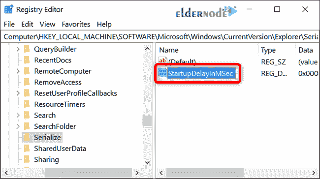

# 如何在 Windows 10 - ElderNode 博客中禁用启动延迟

> 原文：<https://blog.eldernode.com/disable-startup-delay-in-windows-10/>


如何禁用 [Windows 10](https://eldernode.com/tag/windows-10/) 中的启动延迟？你可能想知道什么是启动程序。当您打开系统时，系统中的某些部分会在 Windows 启动的同时运行一系列程序和文件。这会让你的系统运行的时间长一点。

当你的窗口启动时，你会看到一些启动程序，其中一系列会显示在窗口栏的右下角和图标区。这将**延迟**Windows 的执行及其完全启动。

在本文中，我们将教你如何在 Windows 10 中禁用启动延迟。

[***在 Eldernode***](https://eldernode.com/windows-vps/) 选择您的完美 Windows 虚拟专用服务器包

### 教程禁用 Windows 10 中的启动延迟

要禁用Windows 10启动延迟，你只需要在 [Windows 注册表](https://en.wikipedia.org/wiki/Windows_Registry)中做一些编辑。

**注意:** 注册表编辑器是一个强大的工具，误用它会使你的系统不稳定甚至无法运行。这是一个非常简单的方法，只要你按照说明去做，就不会有任何问题。

**1。** 点击开始并输入 regedit 打开**注册表编辑器**。

**2。**T3 按**回车**打开注册表编辑器。

**3。** **允许** it 对您的 PC 进行更改。


在注册表编辑器中，使用左侧边栏导航到以下键。您可以将其复制并粘贴到注册表编辑器地址栏中:

```
HKEY_LOCAL_MACHINE\SOFTWARE\Microsoft\Windows\CurrentVersion\Explorer\Serialize
```


如果 Serialize 键不存在，您需要创建它。

**在父键(Explorer)上右键**，选择新建 > > 键。

命名为连载。


现在，**右击**序列化键，选择新建>>DWORD(32 位)值。

将新值命名为 StartupDelayInMSec 。



接下来，您将修改该值。

**双击**新的 `StartupDelayInMSec` 值，确保值数据框中的值设置为 0。


点击 OK 然后**退出**T4【注册表编辑器】T5。

为了让更改生效，你需要重启你的电脑。

你不应该再经历 Windows 强加给你的延迟。

如果您曾经因为您的启动程序在登录时需要太多资源而想要重新启用这种延迟，请回到注册表编辑器，通过**右键单击**然后单击**删除**来删除startupdelayimsec值。


**亦作，见:**

[如何在 Windows 10 中添加文件启动](https://eldernode.com/add-files-to-startup/)

**尊敬的用户**，我们希望您能喜欢这个[教程](https://eldernode.com/category/tutorial/)，您可以在评论区提出关于本次培训的问题，或者想解决[老年人节点培训](https://eldernode.com/blog/)领域的其他问题，请参考[提问页面](https://eldernode.com/ask)部分，并尽快提出您的问题。腾出时间给其他用户和专家来回答你的问题。

好运。