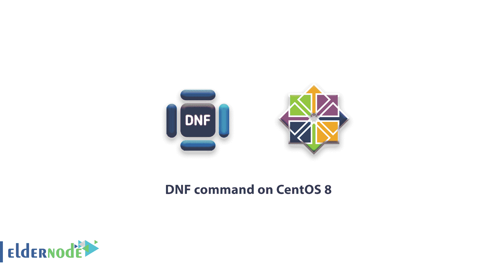

# CentOS 8 上的 DNF 指挥-什么是 DNF 指挥- DNF 教程

> 原文：<https://blog.eldernode.com/dnf-command-on-centos-8/>



在本教程中，我们回顾 CentOS 8 上的 **DNF 命令。DNF 代表 Dandified YUM，是一个基于 RPM 的 [Linux](https://eldernode.com/tag/linux/) 发行版的软件包管理员。它用于在 [CentOS](https://eldernode.com/tag/centos/) 操作系统中安装、更新和移除软件包。**

它是 CentOS8 的默认包管理器。DNF 是百胜的下一代版本，旨在取代百胜基于 RPM 的系统。DNF 是强大的，比你在百胜找到的功能更强大。DNF 使得维护包组变得容易，并且能够自动解决依赖性问题。

## DNF 在 CentOS 8 上的命令

**点** :本教程需要拥有 root 权限的 CentOS 8。

### 安装 DNF

默认情况下， [DNF](https://eldernode.com/tag/dnf-tutorial/) 命令预装在 CentOS 8 中。如果尚未安装，您可以通过运行以下命令来安装它:

```
yum install -y dnf
```

接下来，您可以使用以下命令在 CentOS 8 上检查 **DNF 命令的版本:**

```
dnf --version
```

键入 version 命令后，您会看到如下输出:

```
4.0.9    Installed: dnf-0:4.0.9.2-5.el8.noarch at Friday 04 October 2019 05:27:09 AM GMT    Built    : CentOS Buildsys <[[email protected]](/cdn-cgi/l/email-protection)> at Monday 13 May 2019 07:35:13 PM GMT    Installed: rpm-0:4.14.2-9.el8.x86_64 at Friday 04 October 2019 05:20:17 AM GMT    Built    : CentOS Buildsys <[[email protected]](/cdn-cgi/l/email-protection)> at Saturday 11 May 2019 02:04:19 AM GMT 
```

### 用 DNF 列出已安装和可用的软件包

CentOS 8 上的 [DNF 命令](https://eldernode.com/tag/dnf-command/)有一些好处，您可以使用以下命令列出系统上所有已安装的软件包:

```
dnf list installed
```

键入 list 命令后，您应该会在以下输出中看到所有已安装的软件包:

```
Installed Packages  NetworkManager.x86_64                 1:1.14.0-14.el8                                        @anaconda  NetworkManager-config-server.noarch   1:1.14.0-14.el8                                        @anaconda  NetworkManager-libnm.x86_64           1:1.14.0-14.el8                                        @anaconda  NetworkManager-team.x86_64            1:1.14.0-14.el8                                        @anaconda  NetworkManager-tui.x86_64             1:1.14.0-14.el8                                        @anaconda  PackageKit.x86_64                     1.1.12-2.el8                                           @AppStream  PackageKit-glib.x86_64                1.1.12-2.el8                                           @AppStream  acl.x86_64                            2.2.53-1.el8                                           @anaconda  adcli.x86_64                          0.8.2-2.el8                                            @anaconda  at.x86_64                             3.1.20-11.el8                                          @anaconda  attr.x86_64                           2.4.48-3.el8                                           @anaconda  audit.x86_64                          3.0-0.10.20180831git0047a6c.el8                        @anaconda  audit-libs.x86_64                     3.0-0.10.20180831git0047a6c.el8                        @anaconda  authselect.x86_64                     1.0-13.el8                                             @anaconda  authselect-compat.x86_64              1.0-13.el8                                             @AppStream  authselect-libs.x86_64                1.0-13.el8                                             @anaconda  avahi-libs.x86_64                     0.7-19.el8                                             @anaconda  basesystem.noarch                     11-5.el8                                               @anaconda
```

您还可以使用以下命令列出所有已安装和可用的软件包:

```
dnf list
```

### 用 DNF 命令搜索并安装包

您可以使用以下命令搜索要安装的任何软件包:

```
dnf search httpd
```

现在，您可以使用以下命令安装 httpd 包:

```
dnf install httpd
```

要重新安装 httpd 包，请运行以下命令:

```
dnf reinstall httpd
```

您还可以使用以下命令查看包 httpd 的详细信息:

```
dnf info httpd
```

在某些情况下，您可能需要下载软件包而不安装它们。您可以使用以下命令下载特定的软件包:

```
dnf download httpd
```

### 用 DNF 更新系统包

您可以使用以下命令检查系统上所有系统软件包的更新:

```
dnf check-update
```

现在，您可以使用以下命令更新系统中安装的所有软件包:

```
dnf update
```

或者，如果您需要更新特定的软件包，您可以使用以下命令:

```
dnf update httpd
```

#### 列出 DNF 知识库

```
dnf repolist all
```

现在，使用以下命令仅列出系统上已启用的存储库:

```
dnf repolist
```

#### 用 DNF 命令取出包裹

您可以使用以下命令从系统中删除任何不需要的软件包:

```
dnf remove httpd
```

接下来，通过运行以下命令删除随 httpd 软件包安装的不需要的依赖项:

```
dnf autoremove
```

您可以使用以下命令清理所有缓存的包:

```
dnf clean all
```

您也可以使用以下命令删除组包:

```
dnf groupremove 'System Tools'
```

##### 结论

在上面的教程中，我们学习了如何在 CentOS 8 操作系统上使用 **DNF 命令管理软件包。如果你需要任何关于 **[centos 8](https://eldernode.com/centos-vps/)** 的信息，可以使用[对比 CentOS 7 和 CentOS 8](https://eldernode.com/compare-centos-8-vs-centos-7/) 的文章。**