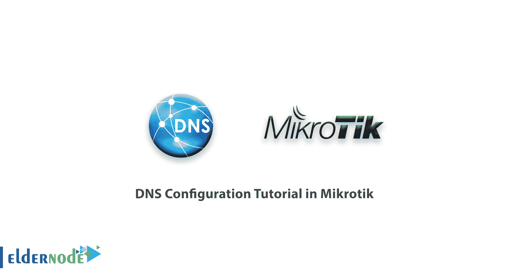
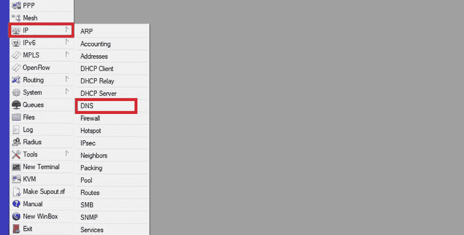
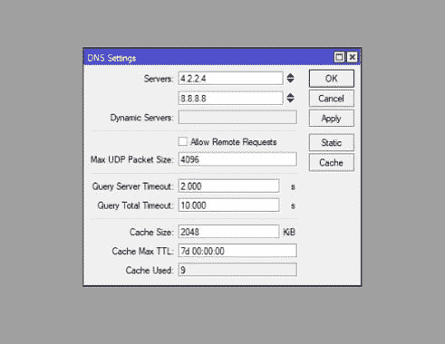

# Mikrotik - Mikrotik | ElderNode 博客中的 DNS 配置教程

> 原文：<https://blog.eldernode.com/dns-configuration-tutorial-in-mikrotik/>



DNS 是网络上的重要服务之一，其任务是将域名重置为 IP 地址或相反。在这一系列 [mikrotik 教程](https://blog.eldernode.com/tag/mikrotik/)中，我们将为您介绍 mikrotik 中的 DNS 配置教程，让您可以轻松地进行配置和配置。如果你需要购买 [Mikrotik VPS](https://eldernode.com/mikrotik-vps-server/) ，你可以在 [Eldernode](https://eldernode.com/) 看到可用的包。

加入我们，学习如何通过 WinBox 和 mikrotik 命令在 mikrotik 中设置 DNS。

## **DNS 配置教程在[mikro tik](https://eldernode.com/mikrotik-vps-server/)**

1-首先通过 Winbox 连接到你的 [mikrotik](https://mikrotik.com/) 。

2-然后点击 IP 菜单中的 DNS 选项。



3.现在，在这一部分中，您将能够将 DNS 设置调整为以下任一选项:

**服务器** **:** 在此部分输入互联网或您的网络上的 DNS 服务的 IP 地址。

**动态服务器:** 如果使用动态服务器，这里会命名为。

**允许远程请求:** 选择此选项将允许您将 mikrotik 作为 DNS 服务器提供服务并响应用户。

**最大 UDP 数据包大小:** 最终的 UDP 数据包大小在本节中指定。

**查询服务器超时:**mikro tik 等待服务器响应其请求的时间量将在该字段中指定。

**查询总超时:** 输入等待 DNS 响应的总时间。

**缓存大小:** 输入 DNS 记录的缓存空间和缓存量。

**C-Size TTL:**TTL 结束时间定义了该段的一条 DNS 记录。

**使用的缓存:** 该值将由 mikrotik 路由器根据其他设置进行设置。

举例:



### **通过终端** 在 mikrotik 中配置 DNS

1.首先通过 SSH 或控制台连接到您的 mikrotik。

2-然后输入以下命令来启用和配置 DNS。

```
ip dns set servers=8.8.8.8,8.8.4.4 allow-remote-requests=yes max-udp-packet-size=4096 query-server-timeout=2.000 query-total-timeout=10.000 cache-size=2048 cache-max-ttl=7d
```

这样你就可以在 mikrotik 中通过 WinBox 和终端来配置 DNS。

如果您需要一台 [mikrotik vps 服务器](https://eldernode.com/mikrotik-vps-server/)，您可以从 mikrotik 页面订购。