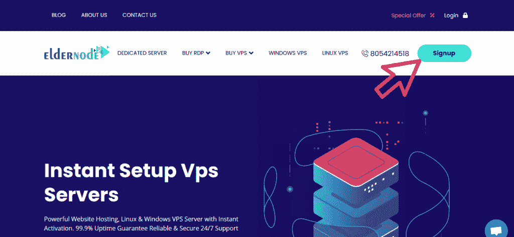
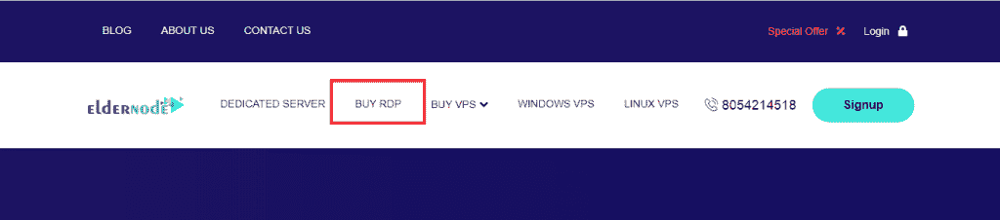
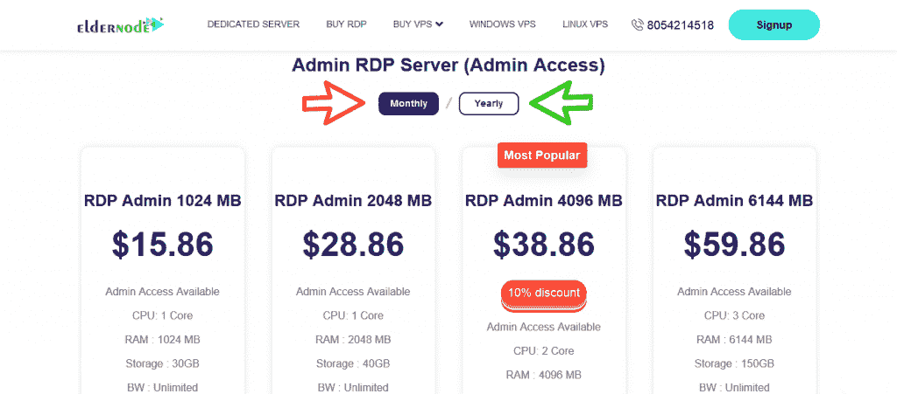
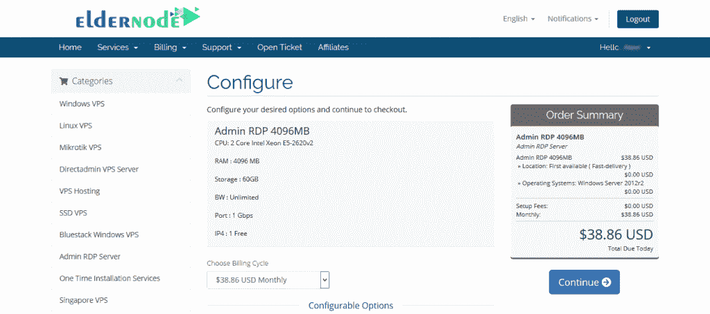
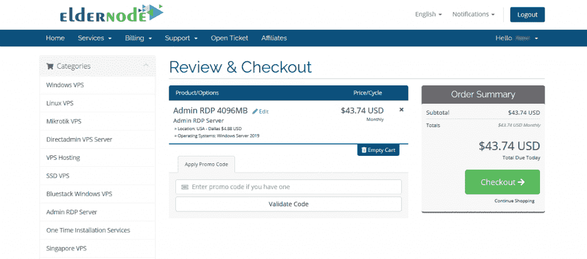

# 介绍 Dogecoin 和用 Dogecoin - Eldernode 购买 RDP

> 原文：<https://blog.eldernode.com/dogecoin-and-buy-rdp-with-dogecoin/>

Dogecoin 是一种总部位于区块链的数字货币，最初是为了好玩而制作的，但现在已经拥有数亿美元的市场价值。数字货币用户对 Dogecoin 非常感兴趣。这种兴趣可以归因于这种数字货币在数字货币市场上几乎不错的排名，以及它非常低的价格，这使得许多人投资于致富的梦想。但这不全是投资。在这篇文章中，我们要向您介绍 Dogecoin 和 **[用 Dogecoin 在](https://eldernode.com/buy-rdp/) [Eldernode](https://eldernode.com/) 购买 RDP 。**在本文的其余部分关注我们。

## **向狗狗介绍**

Dogecoin (DOGE)是一种对等和开源等加密货币，被称为 Altcoin(意为替代硬币)。DOGE 是为娱乐而创建的，是一个分散的平台，允许用户轻松地在线转账。它的名字来源于 Doge 互联网模因(受互联网欢迎的想法)。Dogecoin 的价值增长缓慢，在成千上万的用户中变得流行，并被用作在线社区的货币。

Dogecoin 可用于投资和交易，以期获利。大多数 Dogecoin 粉丝使用这种 altcoin 作为货币，利用非常低的交易费用，令人印象深刻的交易速度，以及易于使用的平台。

虽然 Dogecoin 是基于 LightCoin 脚本，但它的区块链速度是一分钟。而 LightCoin 阻止的速度为 2.5 分钟，确认比特币交易的速度平均为 10 分钟。这意味着 Dogecoin 交易和验证更快。除了上面提到的快速交易速度，Dogecoin 交易费用可以忽略不计，为 0.01 美元；因此，它对用户更有吸引力。

### **什么是 RDP？购买 RDP 服务器的理由**

RDP 代表远程桌面协议，由微软开发。该协议允许两台计算机之间的安全通信，并使用户能够通过完全的图形支持来控制另一台计算机。需要注意的是，RDP 服务在 Windows 系统上是本地支持的，运行在 TCP/UDP 端口 3389 上。另一方面，微软现在将其官方 RDP 客户端软件命名为远程桌面连接。

RDP 服务器的功能包括:

–使用 H.264/AVC 进行自动缩放和图形压缩

–128 位加密

–使用 RC4 加密算法进行保护

–SSL 支持

–能够在本地计算机上运行的程序和远程桌面会话中运行的程序之间复制、粘贴和删除数据。

下一节将介绍购买 RDP 服务器的地点。然后我们会一步步教你如何用 Dogecoin 买 RDP。请加入我们。

## **RDP 管理位置在**的长辈节点上

有趣的是，你可以根据使用类型和你的客户选择你想要的位置。您还应该考虑您的服务在哪个地理区域拥有最多的用户，或者您使用什么服务。在接下来的章节中，我们将向您介绍位于 Eldernode 的 **RDP 管理位置**。但是，如果您想要的位置不在选项中，请通过在线聊天或机票免费联系我们的顾问为您提供指导。

### **RDP 管理地点:**

美国、加拿大、法国、荷兰、英国、俄罗斯、德国、新加坡、香港、土耳其、日本、印度和…

## **如何用 Dogecoin** 买 RDP 

在本文中，我们要一步步讨论如何在 Eldernode 中购买带有 **Dogecoin** 的服务器。应该注意的是，购买 RDP 服务器的第一步是找到一个真正提供最佳价格、24/7 支持、各种主机包和各种主机选项的供应商。Eldernode 公司声称为其尊贵的客户提供灵活的服务、全面的监控和支持，以及快速简便的起步。

第一步:你需要访问主页 [Eldernode](https://eldernode.com/) 。然后你必须点击**注册**，如下图所示，在网站上**注册**:

在网站上完成注册过程后，您必须返回到第一页。在主菜单第一页，点击 [**购买 RDP**](https://eldernode.com/buy-rdp/) 。

在“购买 RDP”页面上，您可以看到不同的包装。根据您的需求，在审核完这些套餐后，您可以点击**立即订购**选择其中一个套餐。

***注:*** 通过点击滑块按钮，可以选择您想要的套餐是**包月**还是**包年**。

在配置步骤中，您可以看到所选软件包的规格。您必须在此页面上指定**位置**和**操作系统**选项。还可以选择**全托管支持**和 **VIP 支持**。

完成这些步骤后，右键点击**继续**。

下一步是**审核&结账**。在这里，您可以将**折扣代码**放入**申请促销代码**部分，并点击**验证码**进行申请。然后点击右栏中的**结帐**。

现在是确定付款方式的时候了。在**支付详情**部分，您必须选择**比特币、以太坊、USDT 和所有加密货币**。然后点击**完成订单**。

在右栏中，从显示的数字货币中选择 **DogeCoin** 。最后，点击**完成结账**，你可以看到支付的必要细节。

***注:*** 您可以通过复制钱包中 DogeCoin 取款部分为您显示的地址进行支付。

*

成功完成这些步骤后，我们将在最短的时间内为您激活所需的服务。

## 结论

在本文中，我们试图在第一部分向您介绍 DogeCoin 及其历史。然后我们在 Eldernode 网站上一步步教你如何用 Dogecoin 买 RDP。如上所述，如果您的位置不在可用选项中，请通过在线聊天联系支持团队为您提供指导。

[yasr _ visitor _ votes size = " medium "]