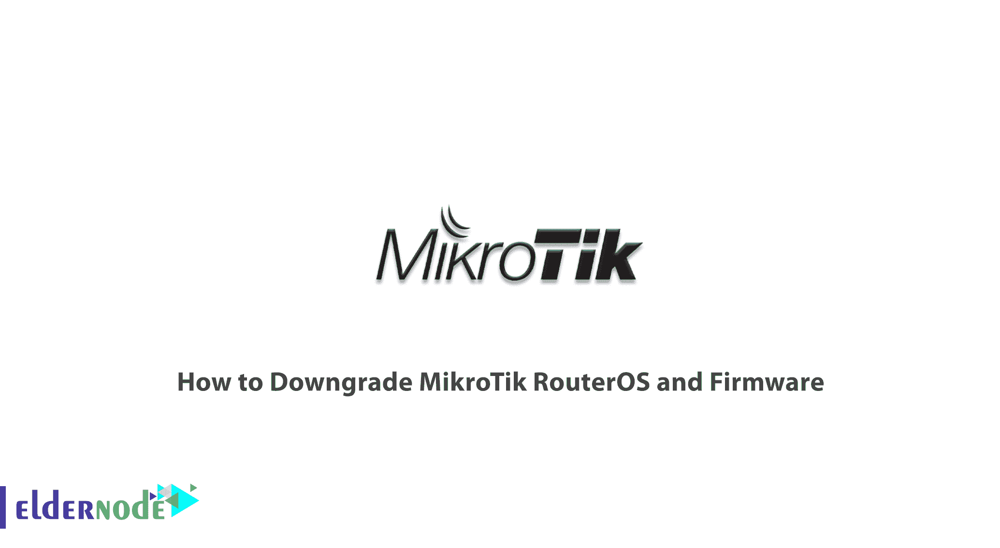
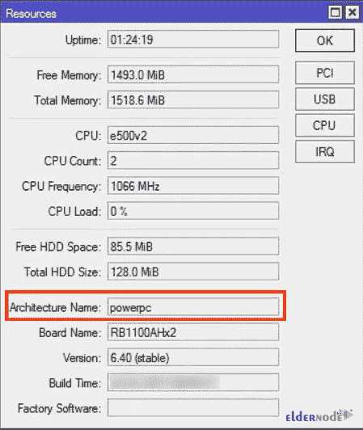
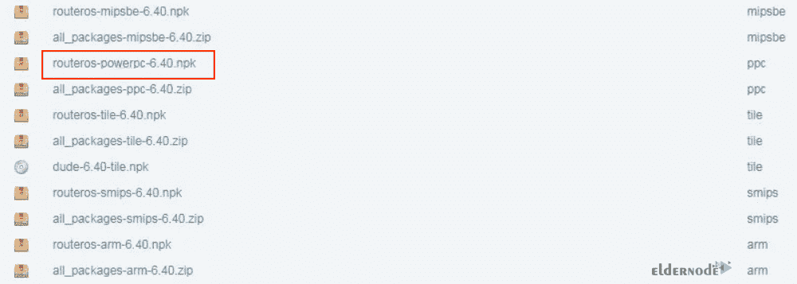
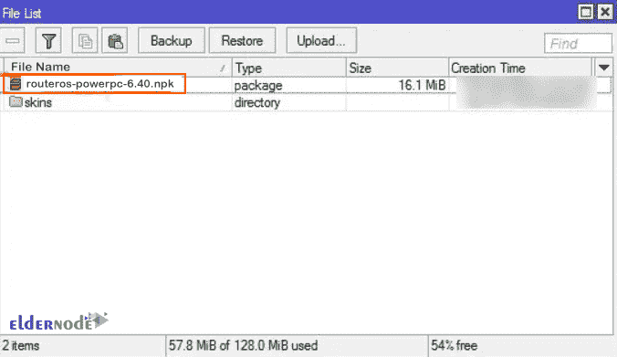
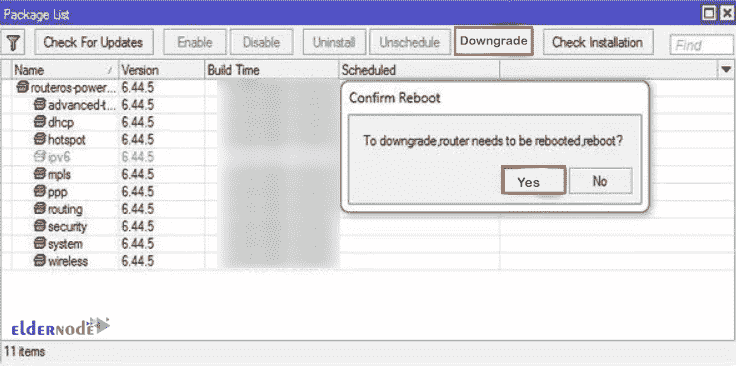
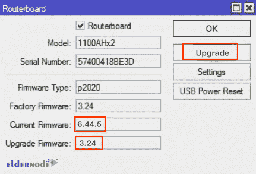

# 如何降级 MikroTik RouterOS 和固件- Eldernode 博客

> 原文：<https://blog.eldernode.com/downgrade-mikrotik-routeros-and-firmware/>

今天，所有的网络专家都有点熟悉 MikroTik。该公司自成立以来一直努力提高知识和技术，现已成为网络和 IT 界的巨头之一。在这篇文章中，我们将教你如何降级 [MikroTik](https://eldernode.com/mikrotik-vps-server/) RouterOS 和固件。

## **教程降级 MikroTik RouterOS 和固件**

### **什么是 MikroTik RouterOS？**

MikroTik RouterOS 是 [MikroTik](https://blog.eldernode.com/tag/mikrotik/) 路由器板硬件的操作系统，可以安装在所有计算机上，并作为具有所需功能的路由器工作。RouterOS 是一个基于 Linux 内核的独立操作系统，除了安装在个人计算机上之外，它还以软件和硬件包的形式到达消费者手中。创建该操作系统的目的是与安装在 PC 上的著名 Cisco IOS 操作系统竞争，并提供独特的功能，如路由、防火墙、VPN、监控、Qos、热点、负载平衡和其他有用的服务，为管理员管理网络提供巨大帮助。开发这种操作系统的因素之一是它在小型、中型和大型网络中提供服务的稳定性。

### **mikro tik RouterOS 特性**

*   **稳定性**
*   **开机高速**
*   **无需登录任何服务即可自动操作**
*   **安装速度快**
*   **图形操作系统带来的高配置速度**
*   **导入和导出其设置**
*   **能够实施和使用其他服务，如热点、服务器 VPN、服务器 DHCP 等**
*   **能够将其用作网络中的防火墙**
*   **存在多样且强大的带宽控制算法**

## ****介绍固件****

**固件是一种软件程序，通常存储在硬件设备的闪存 ROM 中，提供如何操作设备的指令。固件负责启动系统时的系统行为。固件提供了设备如何与其他计算机组件和硬件交互的指令。1967 年，固件被用于编辑 CPU 上的数据，其中嵌入了微码来执行计算机指令。随着时间的推移，固件已经扩展。因此它们对其行为负责，因为计算机系统被打开，并且安装在其硬件上的该固件使得用户使他的命令能够被设备和硬件理解。**

## ****如何下载 MikroTik RouterOS****

**首先你需要找到 MikroTik RouterOS 建筑名。为此，从你的 Winbox 进入**系统**，然后选择**资源**菜单项。然后，您将看到以下窗口:**

****

**您可以在资源窗口中看到 MikroTik RouterOS 体系结构的名称。**

**找到 MikroTik RouterOS 架构名称后，现在是时候从 MikroTik 下载档案中下载您想要的 RouterOS 版本了。**

**要下载 MikroTik，你应该去官方 [Mikrotik 下载页面](https://mikrotik.com/download)，找到所有路由器板架构的 RouterOS 版本列表。**

**现在选择你想要的版本，点击与你的建筑名称相匹配的 NPK 文件。**

**注意，下载的文件格式是**routeros-architecture _ name-routeros _ version . NPK**。**

**等待下载完成。**

****

**在这一步中，您需要将下载的文件上传到 MikroTik 根目录。为此，进入 **Winbox** 并点击**文件**菜单项。然后，您可以看到文件列表窗口。**

**最后，只需将下载的文件拖放到这个文件列表窗口中。您已成功将文件上传到 MikroTik 根目录。**

****

## ****如何降级 MikroTik RouterOS 和固件****

**在本节中，我们将提供降级命令。要做到这一点，你应该去 **Winbox** 选择**系统**。然后点击**套餐**菜单项。现在你可以看到包列表窗口。**

**在打开的窗口中，找到**降级**按钮并点击它。**

**那么你应该重启你的系统。所以点击**是**。**

**系统重启后，你会看到你的路由器被降级了。**

****

**现在是时候降级 MikroTik 固件了。请注意，如果您已经升级了固件，您还应该降级固件。**

**为此，进入 **Winbox** 并选择**系统**。然后点击 **Routerboard** 菜单项。现在你会看到布线板窗口。**

**现在，您应该检查您当前的固件版本，如果您当前的固件版本高于升级固件版本，请点击**升级**。然后点击**是**确认升级。**

**最后，您需要重启 MikroTik 路由器。重启后，你会发现固件已经降级。**

****

## **结论**

**在这篇文章中，我们教你如何降级 MikroTik RouterOS 和固件。如果你对降级 MikroTik RouterOS 和固件有问题，可以在评论里联系我们。我希望这篇教程对你有用。**