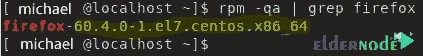

# 如何用 yum - Eldernode 博客降级 Centos 7 上的软件包

> 原文：<https://blog.eldernode.com/downgrade-packages-on-centos-7/>


了解**如何用 yum** 一步步降级 Centos 7 上的包。Linux 中有一个包管理器。软件包管理器是一个用于升级或降级 Linux 的软件包管理系统。REDHAT 和 CentOS 有一个 Yellowdog Updater Modified 或 YUM package manager。假设您安装了最小版本，而不是包含所有命令和许多 Linux 包的 infra 版本。例如，在最小版本中，ifconfig 命令和许多其他常用命令不起作用，控制台也不完整。但是输入 infra 版本的功能给你一起安装就够了。在这篇文章中，我们试图教你如何用 yum 降级 Centos 7 上的软件包。你可以访问 [Eldernode](https://eldernode.com/) 提供的套装来购买 [CentOS VPS](https://eldernode.com/centos-vps/) 服务器。

## 教程用 yum 在 Centos 7 上降级软件包

### 降级套餐要点

**–**脚本无法返回，rpm 脚本无法逆转该过程。

**–**将桌面应用程序从一个版本更新到下一个版本可以修改配置文件，但不能恢复它们。

**–**有些系统进程是完全不可逆的。

**–**如果数据/用户配置没有在单向过程中通过更新进行纠正，则提供降级。

**–**由于 depsolver 不能降级额外的包，所以可以使用 yum-debug-dump 和 yum-debug-restore 等工具。

## 使用 yum 对 Centos 7 上的包进行降级

当更新操作系统内核后出现问题时，需要 CentOS 降级到以前的版本，内核和软件包需要降级到以前的版本才能恢复其稳定性。在 [CentOS](https://blog.eldernode.com/tag/centos/) 中有三种降级包的方法。但是在本文中，我们将教您如何使用 yum 命令来实现这一点。本文使用 Firefox 包来执行步骤和教程。在本次培训的延续中，请与我们在一起。

首先，您需要使用以下命令列出 yum 缓存中的所有 [Firefox](https://blog.eldernode.com/install-firefox-on-rdp-admin/) 包:

```
yum --showduplicates list firefox
```


一旦您列出了 [Firefox](https://blog.eldernode.com/install-root-certificate-in-firefox/) 包，您可以使用以下命令将其降级:

```
sudo yum downgrade firefox
```


yum 命令从最旧的 firefox 包开始下载。下载完成后，您将看到如下图所示的输出。


最后，您可以使用以下命令检查 Firefox 版本的状态:

```
rpm -qa | grep firefox
```



## 结论

在这篇文章中，我们试图教你如何用 yum 在 Centos 7 上降级软件包。次要版本通常不会向操作系统添加任何功能。这些版本仅用于故障排除目的。请注意，这些步骤仅适用于次要版本降级，例如从 7.4 降级到 7.3。也就是说，不可以降级主要版本，比如版本 7 到 6。