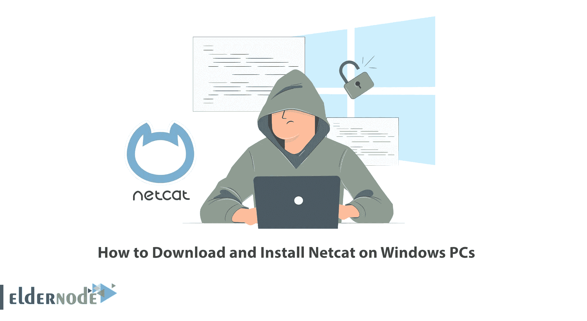
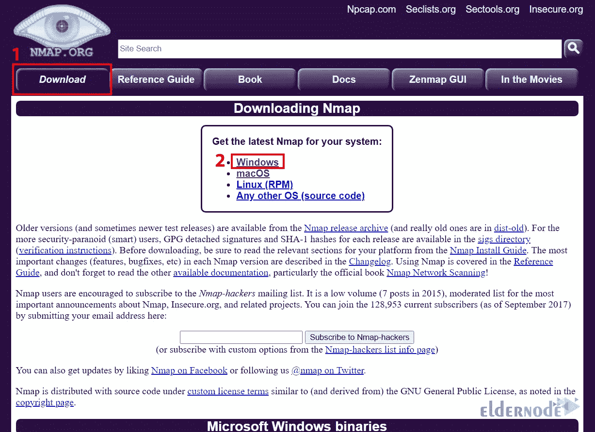
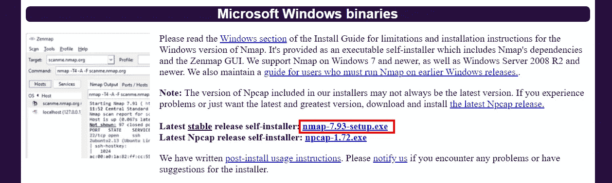
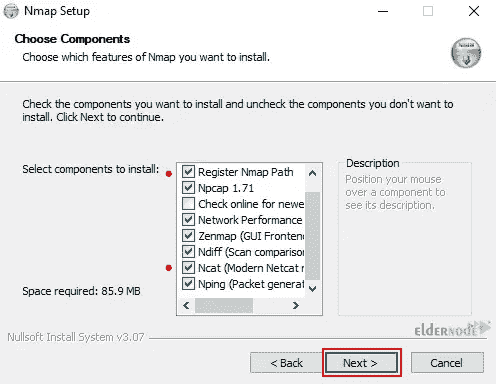
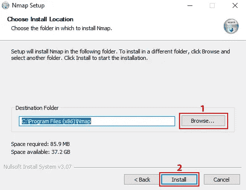

# 如何在 Windows 电脑上下载和安装 Netcat

> 原文：<https://blog.eldernode.com/download-and-install-netcat-on-windows/>



Netcat command 通常被称为网络工具的瑞士军刀，它可以帮助您监控、测试和通过网络连接发送信息。本文将教你如何在 Windows 电脑上下载和安装 Netcat。如果你打算 [Windows VPS](https://eldernode.com/windows-vps/) 服务器，你可以查看我们网站上提供的软件包。

## **Netcat**简介

Netcat 是一个命令行实用程序，它使用 TCP 或 UDP 协议通过网络连接读写数据。它是作为一个安全的后端工具构建的，可用于 Linux、macOS、Windows 和 BSD。您可以使用 Netcat 来调试和监控网络连接、扫描开放的端口、通过网络连接传输数据以及进行安全评估。此实用程序允许您将文件从客户端发送到服务器，并直接与其他程序和脚本一起返回。

### **在 Windows 上下载 Netcat**

在这一步中，您将学习如何在您的 [Windows](https://blog.eldernode.com/tag/windows/) 上下载 Netcat。为此，请遵循以下步骤。

您需要下载 Nmap 附带的 Netcat 包。所以首先导航到 [Nmap 官网](https://nmap.org/download.html)进入**下载>Windows**路径:



现在选择最新的稳定版自安装程序，点击**nmap-7.93-setup.exe**开始下载:



等待下载完成。

## **如何在 Windows PCs 上安装 Netcat**

现在转到**下载**文件夹，右键单击下载的文件。然后点击**以管理员身份运行**。

将出现以下屏幕，允许您选择要安装的组件。您应该选择 Nmap 安装程序附带的所有组件，特别是选择 **Ncat** 和 **Register Nmap Path** 。做出选择后，点击**下一步**:



现在点击**浏览**并选择你的安装位置。做出选择后，点击**安装**:



在此步骤中，打开您的 Windows 终端或 CMD 或 PowerShell，并运行以下命令来检查安装的 Netcat 版本:

```
ncat -v
```

使用下面的命令显示帮助页面:

```
ncat -h
```

如果您想检查 Netcat 是否真的在工作，请打开两个终端窗口，并在第一个窗口上运行以下命令:

```
ncat -l <any-port>
```

并在第二个窗口上运行以下命令:

```
ncat -C localhost <choosen-port>
```

最后，你会看到你可以在窗口之间聊天。

就是这样！

## 结论

在本文中，我们向您介绍了 Netcat，并教您如何在 Windows PCs 上下载和安装它。我希望这篇教程对你有用，并帮助你在 Windows 电脑上安装 Netcat。如果您在下载或安装 Netcat 时遇到任何问题，您可以在评论区联系我们。