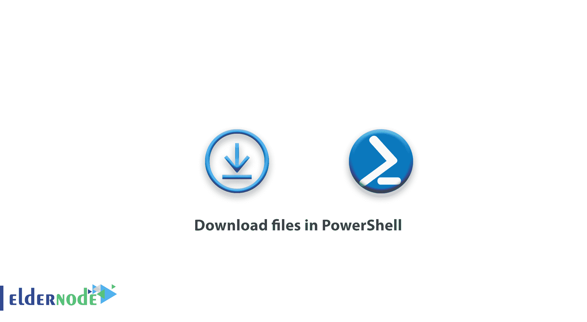

# 如何在 PowerShell 中下载文件-教程 PowerShell

> 原文：<https://blog.eldernode.com/download-files-in-powershell/>



如何在 PowerShell 中下载文件？在 [PowerShell 培训系列](https://eldernode.com/tag/powershell-commands/)的这一部分，我们将教你如何在 PowerShell 中下载文件。 PowerShell 命令行环境允许你做用户在 Windows 图形环境中可以做的所有事情。

在 PowerShell 创建和开发之前，Windows 用户没有通过 CMD 命令行下载文件的能力。因此，要通过命令下载文件，他们必须使用不同的脚本。但是 PowerShell 凭借其强大的功能和模块化功能，允许您轻松下载文件。

我们在本文中教授的命令非常类似于 **Linux** 中的 wget 命令。

[**购买虚拟私服**](https://eldernode.com/vps/)

## 用 PowerShell 下载文件

### 用 Invoke-WebRequest 命令下载文件

Invoke-WebRequest 命令是一个非常完整的命令，可以直接链接下载所有类型的文件。

与其他 PowerShell 命令一样，该命令也有别名，因此易于使用。

可以使用 wget 、 curl 和 iwr 命令**代替[Invoke-WebRequest](https://docs.microsoft.com/en-us/powershell/module/microsoft.powershell.utility/invoke-webrequest?view=powershell-5.1)命令的**。

现在，根据我们向您提供的解释，我们将解释和使用该命令。

#### Invoke-WebRequest 命令结构

```
Invoke-WebRequest -Uri
```

例如，要从一个站点下载一个文件，需要输入以下命令:

```
Invoke-WebRequest -Uri “https://eldernode.com/blog/file.txt”
```

这个命令有许多参数，可以帮助您下载具有不同特性的文件。

在本文中，我们将解释这个命令的一些非常重要的参数。

#### Invoke-WebRequest 命令参数

**Outfile:** 该参数可以将正在下载的文件的名称保存到另一个路径并命名。

**凭证:** 该参数允许我们发送一个用户名和密码来允许访问下载文件。

**禁用 KeepAlive:** 到**下载时启用**或**禁用** KeepAlive 。

**maximum redirection:**一个链接被重定向的次数，下载命令仍然保持并跟随下一个链接。默认情况下，它会拒绝 5 的重定向，如果继续，下载将会停止。

**方式:** 该参数用于选择请求提交方式的类型。支持的方法包括:

默认，删除，获取，头，合并，选项，补丁，贴，贴和痕迹。

**代理:** 使用代理连接互联网，下载文件。

提到的参数只是一些最重要的参数。标记 **可以获得更完整更高级的参数？** 或使用 [得到帮助](https://docs.microsoft.com/en-us/powershell/module/microsoft.powershell.core/get-help) 命令。

现在，在解释并学习了如何使用该命令后，请注意下面的示例以便更好地学习。

#### Invoke-WebRequest 命令的 2 个示例

**例 1:**

```
Invoke-WebRequest -Uri "https://www.eldernode.com/file1.txt" -OutFile "D:\"
```

通过上述命令，从【Eldernode.com】的下载 file1.txt，并存储在 D 驱动器上。

**例二:**

```
Invoke-WebRequest -Uri "https://www.eldernode.com/file1.txt" -OutFile " D:\" -Credential "administrator"
```

在上面的例子中，PowerShell 下载 **file1.txt** ，当它向站点请求用户名时， PowerShell 发送管理员用户名作为**用户名**。
同样，您可以使用 Invoke-WebRequest 命令来**下载**PowerShell 中的文件。

此命令还有其他用途，与其他 PowerShell 命令一样，在与其他命令合并后会提供不同的输出。

例如，输入以下命令将为您列出一个网页中的所有链接:

```
(Invoke-WebRequest -Uri "https://eldernode.com").Links.Href
```

**亦作，见:**

[如何用 PowerShell 设置 Windows 网络](https://eldernode.com/set-up-windows-network-with-powershell/)

**尊敬的用户**，我们希望您能喜欢这个[教程](https://eldernode.com/category/tutorial/)，您可以在评论区提出关于本次培训的问题，或者解决[老年人节点培训](https://eldernode.com/blog/)领域的其他问题，请参考[提问页面](https://eldernode.com/ask)部分，并尽快提出您的问题。腾出时间给其他用户和专家来回答你的问题。

好运。