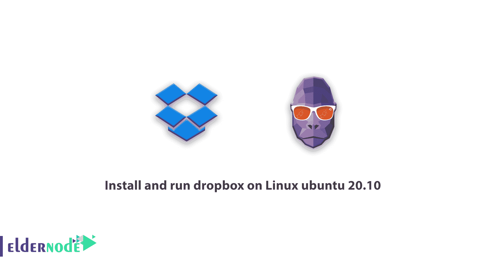
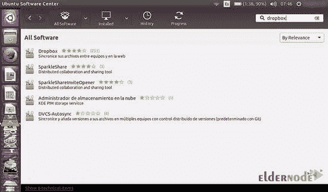
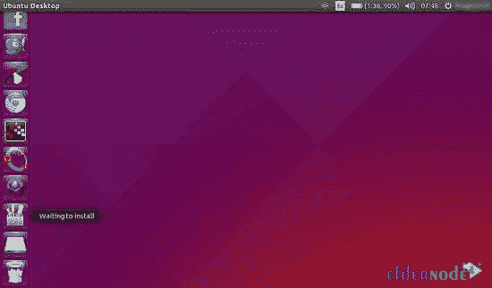
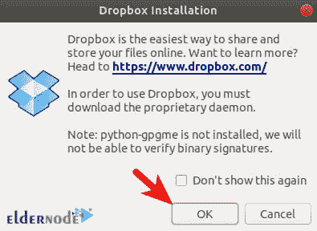
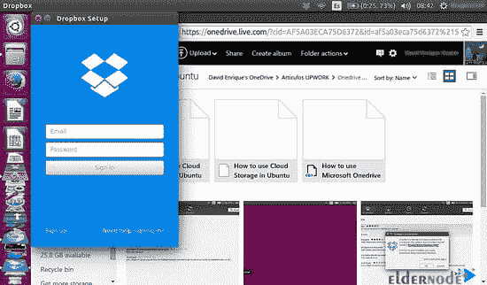
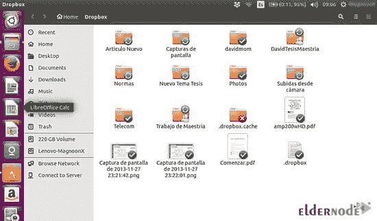

# 教程在 Linux ubuntu 20.10 上安装和运行 Dropbox-elder node 博客

> 原文：<https://blog.eldernode.com/dropbox-on-linux-ubuntu-20-10/>



【更新】Dropbox 是一种在线云存储服务，最重要的用途是在数据备份方面。您可以从任何设备和任何地方访问您的文件和信息。如果你正在寻找一个保护信息的好选择，Dropbox 是这方面最合适的服务之一。Dropbox 在强大的云服务器上为其用户提供服务，你只需要互联网接入就可以从世界任何地方访问你的信息。在本文中，我们将讨论**教程安装，并在 Linux ubuntu 20.10 上运行 Dropbox**。需要注意的是，如果你想购买一台 [Ubuntu VPS](https://eldernode.com/ubuntu-vps/) 服务器，你可以访问 [Eldernode](https://eldernode.com/) 中提供的软件包。

## **如何在 Linux ubuntu 20.10 上安装运行 Dropbox**

如果你正在寻找一个云存储服务，并希望在任何可以上传各种文件的地方访问它，我们建议你下载这个在全球拥有超过 4 亿用户的服务。免费创建一个账户就可以获得 2GB 的空间。如果你邀请你的朋友，你还会得到额外的空间作为礼物。最后，您可以将这个空闲空间升级到 8GB。这项服务可以在 [Windows](https://blog.eldernode.com/tag/windows/) 、Mac、 [Linux](https://blog.eldernode.com/tag/linux/) 等各种操作系统上使用，也可以在 iOS 和 Android 操作系统的手机上使用。

访问 [Dropbox 网站](https://www.dropbox.com/)后，可以根据自己的系统下载需要的平台，通过创建账号来使用。例如，如果您想在您的个人系统上使用它，安装该应用程序后，您将在您的计算机文件夹中看到它，它的功能将完全像您的计算机内存的一部分。

如果提供的空间对你来说不够，你可以每月支付大约 6 英镑获得 100 GB 的额外空间。需要特别注意的重要一点是你的互联网使用情况，它在这方面有非常强大的工具，可以帮助你维持带宽，防止带宽被浪费在下载或上传到 Dropbox 上。这可以防止同步文件时占用所有带宽。

### **Dropbox 功能及应用**

您应该使用在这方面提供的工具，以防止在文件同步(Sync)期间完全占用 Dropbox 带宽。选择性同步是这一领域最有用的工具之一，它可以帮助您从系统上的特定文件夹中只下载您想要的内容。

Dropbox 给你的另一个功能是文件共享。你可以点击你已经保存在 Dropbox 中的文件夹，通过复制它的 URL 并发送给你的朋友，你可以为他们下载文件。您还可以查看您的朋友对您发送的文件夹或文件所做的所有工作，并随时完全停止访问这些链接。

Dropbox 提供的另一个重要功能是这项服务非常通用的网络界面。这个接口将允许你通过你系统中的应用程序在这个服务上做任何事情。Dropbox 提供视频播放器和幻灯片来显示照片。您还可以查看 PDF、DOC、XLS 等格式的文档。而不需要通过网络界面下载。

Dropbox 一直以优质云存储服务著称。近年来，OneDrive 和 Google Drive 等激烈的竞争对手已经出现，它们不仅通过各种方式达到了 Dropbox，而且在某些情况下从这个知名的竞争对手那里抢走了领先地位。

## **Linux Ubuntu 20.10 Dropbox 安装指南**

Dropbox 会将你电脑上的文件夹与虚拟云硬盘同步。在本指南中，我们将向您展示如何在 [Ubuntu](https://blog.eldernode.com/tag/ubuntu/) 20.10 系统上安装 Dropbox。第一步是从 Ubuntu 软件中心安装 Dropbox:

### **如何安装 Dropbox 加载器**

首先，点击软件中心搜索 Dropbox。请记住，由于 dropbox 是专有软件，软件包是通过 Dropbox 网站下载的，因此您不能从命令行安装它。



*



### **教程从官方资源库** 在 Ubuntu 20.10 上安装 Dropbox

首先，你需要在 Dropbox 网站上创建一个账户。

要创建源列表文件，您需要在打开终端窗口后在其中键入并执行以下命令:

```
sudo nano /etc/apt/sources.list.d/dropbox.list
```

然后，您必须向该文件添加以下命令:

```
deb [arch=i386,amd64] http://linux.dropbox.com/ubuntu bionic main
```

现在**在 nano 文本编辑器中保存**文件。 **(Ctrl+O)**

要将 Dropbox GPG 密钥导入 Ubuntu 20.10 系统，您需要运行以下命令:

```
sudo apt-key adv --keyserver keyserver.ubuntu.com --recv-keys 1C61A2656FB57B7E4DE0F4C1FC918B335044912E
```

您可能会遇到以下错误信息:

```
gpg: keyserver receive failed: no keyserver available
```

或者

```
gpg: keyserver receive failed: No data
```

在这种情况下，您应该使用以下命令来修复这些错误:

```
sudo apt-key adv --keyserver pgp.mit.edu --recv-keys 1C61A2656FB57B7E4DE0F4C1FC918B335044912E
```

换句话说，你应该用**pgp.mit.edu**而不是【keyserver.ubuntu.com】T2。

现在，您应该更新本地包索引并安装 Dropbox:

```
sudo apt update 
```

```
sudo apt install python3-gpg dropbox
```

现在你应该启动 **Dropbox GUI 安装程序**:


运行以下命令从终端启动 dropbox:

```
dropbox start -i
```

在打开的窗口中，点击 **ok** 安装守护程序:



### **Ubuntu 20.10 上第一次使用 Dropbox**

安装守护程序后，将显示以下图像:



你需要一个 **Dropbox 账号**。请访问 dropbox 网站，为自己创建一个帐户。一旦您输入了您的帐户详细信息，Dropbox 将开始在您的虚拟硬盘(云)和您的本地文件夹之间进行首次同步。



您现在可以查看已同步的文件。

## 结论

Dropbox 由于其云存储空间，可以帮助您非常轻松地保存或传输文件。使用 Dropbox 的功能，您可以参与团队项目并分享您的想法。由于在不同的 Linux 发行版中使用 dropbox 的重要性，我们试图在本文中教你如何在 Linux ubuntu 20.10 上安装和运行 Dropbox。