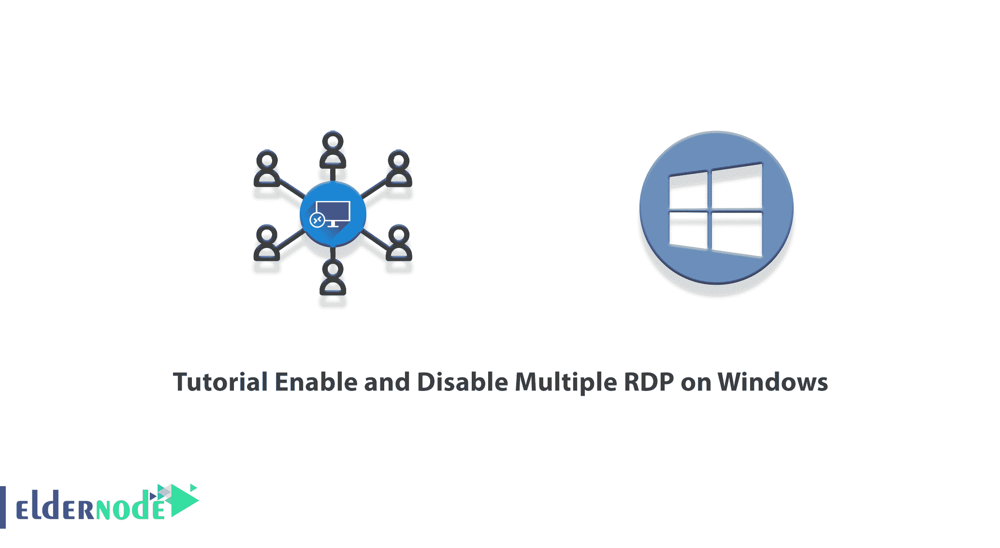
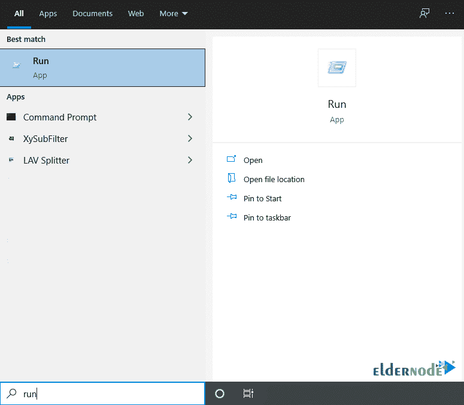
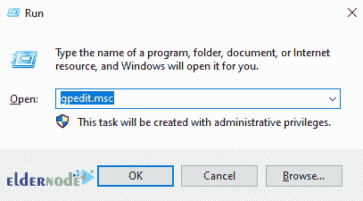
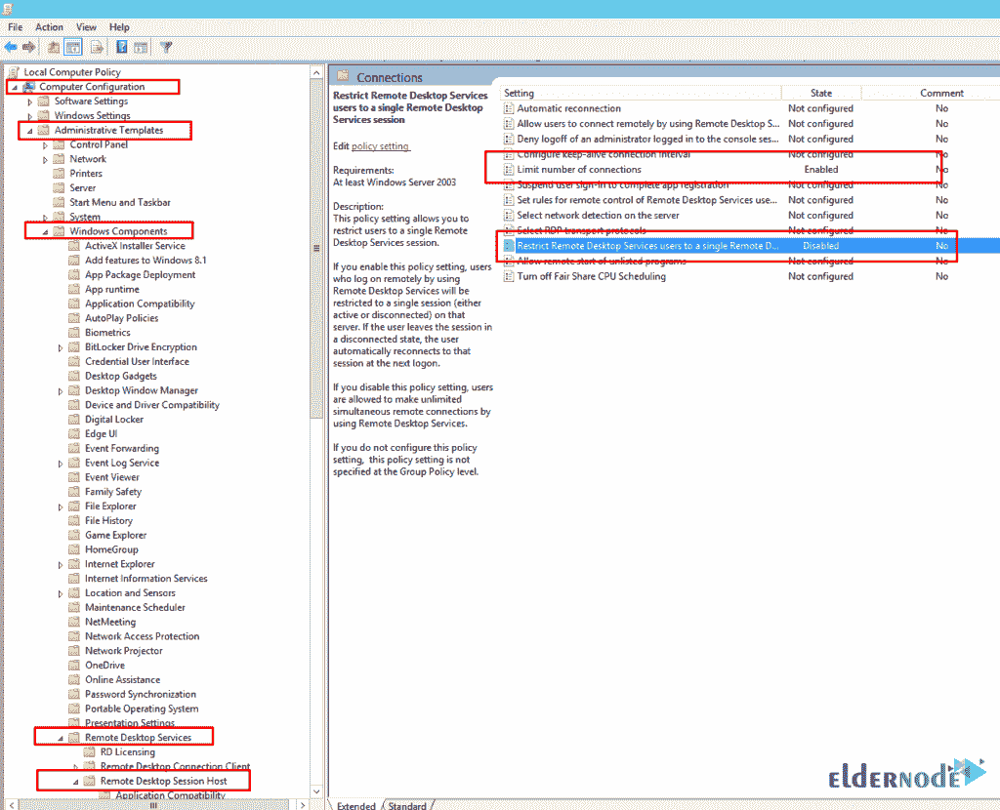
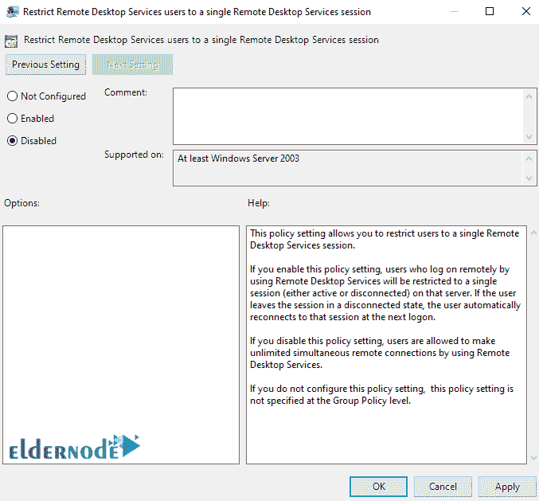
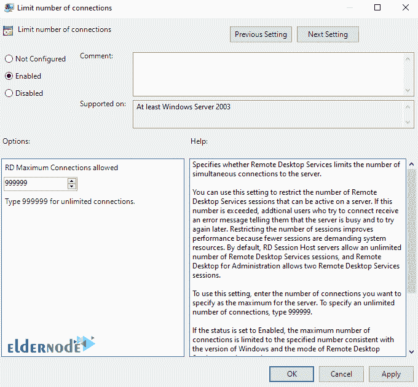

# 教程在 Windows - Eldernode 博客上启用和禁用多个 RDP

> 原文：<https://blog.eldernode.com/enable-and-disable-multiple-rdp-on-windows/>



在 Windows 中，默认设置是只有一个用户可以登录到服务器。因此，如果您需要同时登录到多台服务器，您必须在服务器或 windows 上启用此功能。这就是为什么我们想在本文中教你如何在 Windows 上启用和禁用多 RDP。如果你想买一台 [**Windows VPS**](https://eldernode.com/windows-vps/) 服务器，你可以在 [Eldernode](https://eldernode.com/) 看到可用的软件包。

## **如何在 Windows 上启用和禁用多个 RDP**

在多个用户通过远程桌面同时连接到服务器时，可以远程连接到另一台计算机并控制它。对于 Windows Server 版本，几个人可以使用远程桌面和不同的用户名同时连接到一个系统。

在家庭版本中，如果有人使用远程桌面连接到系统，在系统上工作的用户将被注销。这意味着不止一个人永远不能使用一台计算机。这种限制甚至适用于实际坐在系统后面的用户，当其他用户远程时，作为控制台登录或实际登录系统的用户将从系统中注销，并且不能使用操作系统。

在下一节中，我们将教你如何在[窗口](https://blog.eldernode.com/tag/windows/)上启用多个 RDP。然后我们将展示如何在 Windows 上禁用多个 RDP。请继续关注本文的其余部分。

### **如何在 Windows 上启用多个 RDP**

在本节中，我们想教您如何在 Windows 上启用多个 RDP。要做到这一点，你可以很容易地遵循以下步骤。

第一步，你必须从**开始菜单**搜索部分搜索**运行窗口**并打开它。您也可以通过按下 **Win+R** 组合键来完成此操作。



然后你必须输入 **gpedit.msc** 并点击 **OK** 。



现在你必须遵循如下所示的路径:

```
Computer Configuration >> Administrative Templates >> Windows Components >> Remote Desktop Services >> Remote Desktop Session Host >> Connections
```



在下一步中，如下图所示，您应该将**限制远程桌面服务用户使用单个远程桌面服务会话**设置为**禁用**。



最后，双击限制连接数，并将 RD 最大连接数设置为 **999999** 。通过这样做，您将看到在 Windows 上启用多 RDP 已成功完成。



### **如何在 Windows 上禁用多个 RDP**

在这一节中，我们想教你如何在 Windows 上禁用多个 RDP。该过程与上一节相同，但是为了更加熟悉，我们将再做一次。

第一步，你必须按下 **Win+R** 组合键打开 **Run 窗口**。

然后你必须输入 **gpedit.msc** 并点击 **OK** 。

现在你必须遵循如下所示的路径:

```
Computer Configuration >> Administrative Templates >> Windows Components >> Remote Desktop Services >> Remote Desktop Session Host >> Connections
```

在下一步中，如下图所示，您应该将“将远程桌面服务用户限制到单个远程桌面服务会话”设置为“已启用**”**。

***注意:*** 在选项部分，您可以在允许的 RD 连接部分选择您想要远程连接到服务器的用户数量。

## 结论

使用远程桌面，您可以远程连接到另一台电脑并控制它。对于 Windows Server 版本，多个人可以使用远程桌面和不同的用户名同时连接到一个系统。在本文中，我们试图教你如何在 Windows 上启用和禁用多个 RDP。