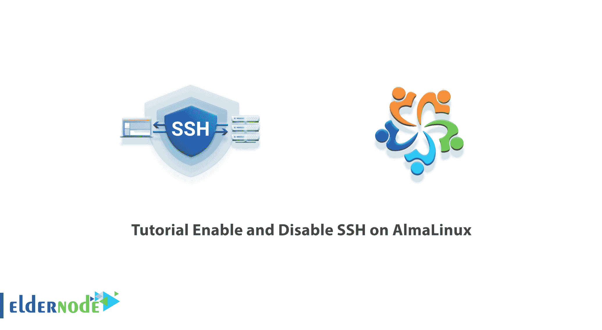

# 教程在 AlmaLinux - Eldernode 博客上启用和禁用 SSH

> 原文：<https://blog.eldernode.com/enable-and-disable-ssh-on-almalinux/>



SSH(安全外壳)协议用于在用户和服务器之间建立安全连接。在该协议中，用户和服务器之间发送的所有内容都使用公钥和对称加密进行加密，只有双方使用共同商定的密钥才能访问原始内容。在本文中，我们将教你如何在 AlmaLinux 上启用和禁用 SSH。如果你想购买一台 [**Linux VPS**](https://eldernode.com/linux-vps/) 服务器，你可以访问 [Eldernode](https://eldernode.com/) 中的软件包。

## **如何在 AlmaLinux 上启用和禁用 SSH**

### **SSH 简介**

为了创建一个 [SSH 连接](https://blog.eldernode.com/ssh-connection-softwares/)，用户的公钥(作为连接发起者)必须被识别为服务器上的授权公钥。因此，当用户向服务器发送创建 SSH 连接的请求时，会首先检查用户的公钥以及与之相关联的私钥的正确性。那么一个连接就产生了。在这种情况下，任何拥有公钥和私钥副本的系统都可以以类似用户的身份连接到服务器。

除此之外，还有其他的交流方式，其中之一就是使用密码。当用户将要连接到服务器时，它由唯一的用户名和密码来标识。该密码可用于连接到服务器，而无需事先交换公钥。如果使用这种方法，就会生成自动的公钥和私钥，并用于加密。这种方法不如前一种方法安全，因为攻击者可以使用 MITM 攻击来访问密码，并使用它来连接到服务器。

SSH 协议是 telnet 等不安全协议的替代协议，在 telnet 中，所有信息都以未加密文本的形式发送和接收。SSH 最主要也是最常见的用途是连接到服务器并执行命令。但是因为 SSH 可以用来创建安全通道，所以它也可以用来使用 SCP 或安全数据传输(SFTP)将文件从一个系统安全地复制到另一个系统。此外，使用创建的隧道，部分流量可以通过服务器并用作 VPN 服务器。

在本文的后续部分，请加入我们，向您展示如何在 [AlmaLinux](https://blog.eldernode.com/install-and-use-almalinux/) 上启用和禁用 SSH。

## **在 AlmaLinux 上启用 SSH**

在前一节中熟悉了 SSH 之后，现在在这一节中，我们将讨论如何在 AlmaLinux 上启用 SSH。为此，只需遵循以下步骤。

第一步是为您的系统安装合适的 OpenSSH 包。请注意，如果您希望您的计算机接受传入的 SSH 连接，您必须安装 OpenSSH-server 软件包。但是如果您想用 ssh 命令启动输出连接，您需要安装 OpenSSH-clients 包。您可以通过运行以下命令来安装这两者:

```
dnf install openssh-server openssh-clients
```

下一步是配置和控制服务。这种配置的原因是 SSH 服务可以通过系统命令来控制。您可以使用以下命令启动或停止 SSH 服务器:

```
systemctl start sshd
```

```
systemctl stop sshd
```

最后，您可以使用下面的命令**启用 SSH** 。这样做将在系统启动时自动生成 SSH:

```
systemctl enable sshd
```

### **在 AlmaLinux 上禁用 SSH**

在上一节中，您学习了如何启用 SSH。在这一节，我们想教你如何**禁用 SSH** 。为此，只需运行以下命令:

```
systemctl disable sshd
```

现在，您可以通过运行以下命令来检查 SSH 服务器的状态:

```
systemctl status sshd
```

***注意:*** 运行以下命令将通过防火墙接受传入的连接:

```
firewall-cmd --zone=public --permanent --add-service=ssh
```

```
firewall-cmd --reload
```

## 结论

如前所述，SSH 协议使用加密技术来发送信息。SSH 协议也可以称为 Telnet 连接的安全版本。SSH 协议目前在大多数操作系统上有两个版本，SSH-1 和 SSH-2。默认情况下，可以通过两个版本进行连接，除非是在服务器端和 SSH 配置文件中进行配置，SSH 配置文件只支持版本 1 或版本 2。在本文中，我们试图教您如何在 AlmaLinux 上启用和禁用 SSH。