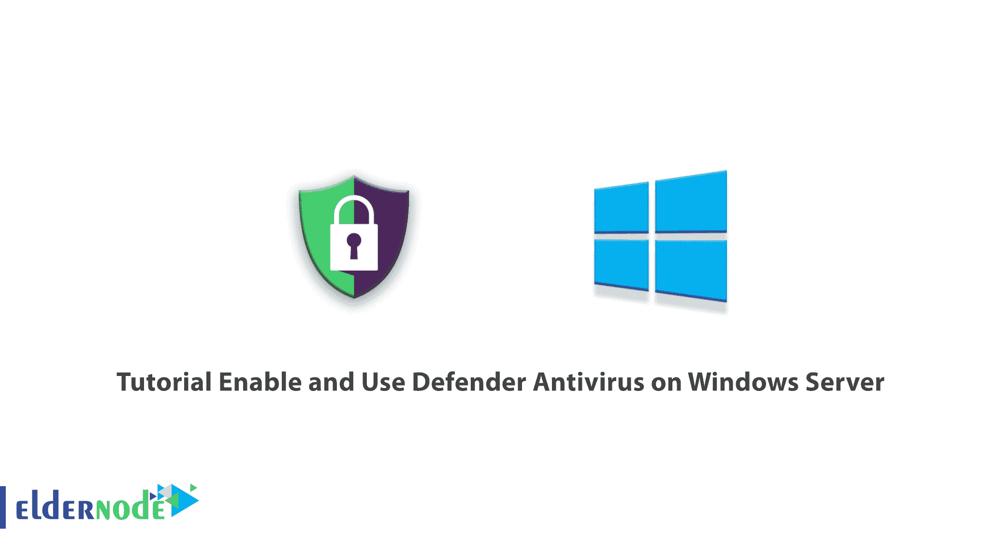

# 教程在 Windows Server 上启用和使用 Defender Antivirus

> 原文：<https://blog.eldernode.com/enable-and-use-defender-antivirus-on-windows/>



由于大多数人长时间在线，敏感文件可能存储在您的设备上，您应该保护自己免受破坏性病毒的侵害。Windows 上有一个名为 Microsoft Defender Antivirus 的程序，旨在对抗病毒并保护您的设备。在这篇文章中，我们将教你如何在 Windows Server 上启用和使用 Defender Antivirus。如果您想购买一台 [**Windows VPS**](https://eldernode.com/windows-vps/) 服务器，您可以访问 [Eldernode](https://eldernode.com/) 中提供的软件包。

## **什么是 Defender 杀毒？**

Defender Antivirus 也称为 Microsoft Defender Antivirus，是一种防病毒保护程序，可防止计算机感染显示不需要的消息的软件，并降低间谍软件安装的性能和安全威胁。 [Windows](https://blog.eldernode.com/tag/windows/) Defender 软件在 Windows 10 中提供，并且不断更新。这个杀毒软件是免费的，你不需要安装任何其他软件来使用它。Defender Antivirus 还能够检测和删除间谍软件。

### **卫士杀毒功能**

*   昂贵的家长控制设置
*   自动备份文件
*   自由的
*   不再需要密码
*   提供跟踪预防
*   密码生成器和密码监视器

## **如何在 Windows 服务器上启用 Defender 杀毒**

### **使用服务器管理器**启用 Defender 杀毒

首先，你应该打开**服务器管理器**，点击**添加角色和功能**。


然后在打开的页面上单击下一步。


在安装类型部分，您需要选择**基于角色或基于功能的安装**，然后点击**下一步**。


在下一步中，选择您的目标服务器并点击**下一步**。


现在，是时候选择要安装在所选服务器上的角色了。


接下来，您应该选择 **Windows Defender 功能**并检查 **Windows Defender** 和**Windows Defender**框的 GUI。最后，单击下一步。


在此步骤中，您需要在选定的服务器上安装角色服务或功能。为此，只需点击**安装**。


然后稍等片刻，等待安装完成。最后，点击**关闭**。


### **使用 Powershell** 启用 Defender 杀毒

首先，你应该打开**开始**菜单，搜索 **Powershell** ，点击右键，选择**以管理员身份运行**。

然后运行以下命令来启用 Defender Antivirus:

```
Install-WindowsFeature -Name Windows-Defender
```

现在安装将开始。等待几分钟来完成它。

最后，键入以下内容:

```
exit
```

就是这样。Defender 防病毒软件已成功启用。


## **如何在 Windows 服务器上使用 Defender 杀毒**

Windows 的默认设置还不错，但我们更喜欢将配置提升到下一个级别，并通过手动配置来提高服务器的安全性。

首先，你应该打开**开始**菜单，搜索 **Windows Defender 设置**并打开。


Windows **实时防护**实时工作，阻止服务器上运行的任何恶意软件活动。启用此选项可能会导致您使用更多的硬件资源。

在**基于云的保护**中，如果检测到任何恶意软件活动，其信息将与微软共享，从其他服务器收集的数据将帮助微软阻止或解决这些潜在威胁。

您可以选择启用或禁用**自动样品选择**选项。启用此选项将允许 Windows 与 Microsoft 共享可疑文件，并扫描它们以减少未来的攻击。


Windows Defender 设置有一个名为 **Exclusions** 的选项，可用于从 Windows Defender 防病毒保护中删除任何程序、文件、进程和文件类型。


在 Defender Antivirus 设置的**主页**选项卡中，您可以安排扫描，也可以借助扫描选项进行自定义。**扫描选项**包括:

*   **快速:**扫描受恶意软件、间谍软件和病毒感染的区域
*   **完全:**扫描系统硬盘上的所有文件和正在运行的程序，查找任何类型的威胁
*   **自定义:**检查指定位置的受感染文件


Defender Antivirus 设置的**更新**选项卡提供所有最新的更新和新的更新相关信息，以及新开发的恶意软件和间谍软件的定期更新。请记住保持 Windows Defender 防病毒软件最新。


Defender Antivirus 设置的**历史**选项卡包含以下事件历史:

*   **隔离项目:【Windows 阻止其运行但尚未删除的项目。**
*   **允许项目:**您手动授权的项目。
*   **所有检测到的项目:**在服务器上检测到的项目。


最后，点击**立即扫描**开始扫描。


仅此而已！

## 结论

在本文中，我们教你如何在 Windows Server 上启用和使用 Defender Antivirus。在某些操作系统设置中，Windows Defender Antivirus 被禁用。您可以在本文的帮助下启用它。如有疑问，可在评论中联系我们。