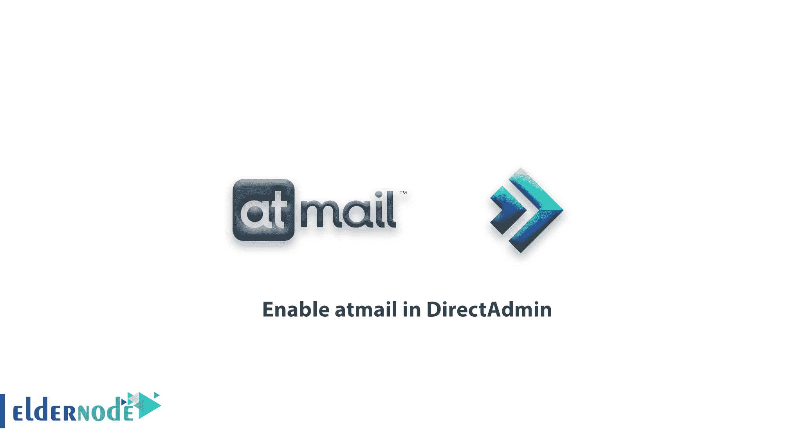

# 如何在 DirectAdmin - Eldernode 博客中启用 atmail

> 原文：<https://blog.eldernode.com/enable-atmail-in-directadmin/>



[更新] atmail 是一家拥有 22 年全球电子邮件专业知识的电子邮件解决方案公司。您可以相信 atmail 能够提供一个安全、稳定且可扩展的电子邮件平台。在本文中，我们试图教你如何在 DirectAdmin 中启用 atmail。需要注意的是，你可以访问 [Eldernode](https://eldernode.com/) 中可用的包来购买 **[DirectAdmin VPS](https://eldernode.com/directadmin-vps-server/)** 服务器。

## **教程在 DirectAdmin** 中启用 atmail

自 1998 年推出第一个商业网络邮件平台以来，atmail vision 一直致力于创造一种高度集成、个性化和安全的电子邮件体验，以改善客户的生活。在本教程中，我们将看看如何在 [DirectAdmin](https://blog.eldernode.com/tag/directadmin/) 中启用 atmail。在下一节中，我们将讨论选择 atmail 的原因。请加入我们。

### **为什么是 atmail？**

1- atmail 帮助您省钱并创造利润。

2- atmail 专注于安全性。

3- atmail 保护你的隐私。

4- atmail 关注用户体验(UX)。

5-让你成长；

6-借助 atmail，您可以保持品牌知名度；

7-你可以信赖可靠性；

8-使用 atmail 定制您的支持。

## **在 DirectAdmin** 中启用 atmail

教程在 DirectAdmin 服务器中启用 [atmail 工具](https://www.atmail.com/):

1)您必须首先使用以下命令转到自定义构建:

```
/usr/local/directadmin/custombuild 
```

2)现在你需要在 nano 编辑器的帮助下修改上面路径中的 **options.conf** 文件:

```
nano options.conf 
```

3)现在在 **options.conf** 文件中，你应该寻找 atmail 选项，它的值等于**号**:

```
atmail=no 
```

4)将 atmail 值更改为**是**:

```
atmail=yes 
```

5)最后，您必须按顺序输入以下命令:

```
./build update 
```

```
./build atmail 
```

Atmail 现在在您的服务器上启用，您可以使用它。

## 结论

在本文中，我们试图教你如何一步一步地在 DirectAdmin 中启用 atmail。如有疑问或问题，可咨询 [Eldernode 社区](https://community.eldernode.com/)提供指导。