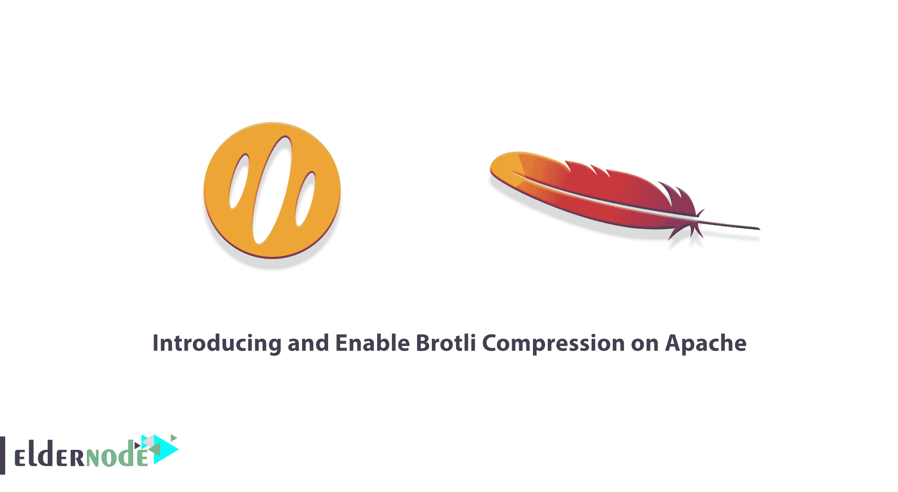

# 在 Apache - Eldernode 博客上介绍和启用 Brotli 压缩

> 原文：<https://blog.eldernode.com/enable-brotli-compression-on-apache/>



图像、字体和其他媒体会占用您网站的大量空间，大大降低下载速度。当大型网站使用大量的博客文章和其他页面时，您可能会发现您的图像和媒体文件夹充满了内容。要记住的一点是，如果这些网站失去控制，它们会很快破坏网站。但是你不必处理大量的下载时间和永远失去访问者。因此，使用压缩算法有助于通过服务器改善图像传输和文件传输，并提高网站速度。在本文中，我们将向您介绍如何在 Apache 上引入和启用 Brotli 压缩。如果你想购买一台 **[VPS](https://eldernode.com/vps/) 托管服务器，你可以访问 [Eldernode](https://eldernode.com/) 中的软件包。**

## **布罗特利压缩简介**

数据压缩是加密文件以减小其大小的过程，它占用服务器上的空间较少，并且可以更快地传输给站点访问者。图像、音频和视频压缩非常常见，但是您可以压缩几乎任何类型的数据，包括代码。有不同的算法。

谷歌一直试图将网络最小化，让它更容易访问。尤其是对于使用移动设备并且不能管理大量数据的人来说。Brotli Compression 是 Google 为了进一步减少网页加载时间而创建的。

在下一节中，我们将讨论 Brotli 压缩的一些应用。然后我们将教您如何在 Apache 上安装和启用 Brotli 压缩。请继续关注本文的其余部分。

### **布罗特利压缩的应用**

Brotli 有一个通用的应用程序，所以它可以压缩任何类型的文件，而不会破坏数据。但是，它不适合 PNG、JPG 和 GIF 等图像文件。这些类型的文件已经被压缩，Brotli 实际上使它们变得更大。你可以试试图像压缩插件。

过去谷歌创造了 Zopfli。这种算法虽然非常强大，能够实现高水平的数据密度，但速度非常慢。虽然解压缩速度很快，不会影响最终用户，但压缩会持续很久。

还有其他应用程序，如 Gzip，长期以来一直是轻量级压缩的黄金标准，但 Brotli 更快。它比 Zopfli 快 20-26%，尽管它使用了同样强大的技术。它还提供了比类似算法更紧凑的压缩。此外，Brotli 得到了广泛的支持，它的使用对每个人都是免费的。

### **在 Apache** 上安装 Brotli 压缩的先决条件

_ 使用 Sudo 特权帐户访问服务器的能力

_ 一个 Apache 服务器

_ 为 web 应用程序创建虚拟主机

## **如何在 Apache 上安装 Brotli 压缩**

在这一节中，我们将教您如何在 Apache 上启用 Brotli 压缩。这样做并不是一件复杂的事情。你可以按照下面的步骤来做。

只需使用以下命令在您的系统上安装 Brotli 包。需要注意的是，对于 Ubuntu T1 和 T2 Debian T3 系统来说，它在默认的存储库中是可用的。

```
sudo apt install brotli -y
```

在下一节中，加入我们来教您如何配置 Brotli。

### **如何用 Apache** 启用 Brotli】

在本节中，我们将教您如何配置 Brotli。注意，Apache 服务器包含默认的 Brotli 模块。因此，您需要使用以下命令在 Apache 中启用 Brotli 模块:

```
sudo a2enmod brotli
```

现在，您需要通过向虚拟主机配置文件添加以下代码来配置 Apache 虚拟主机。这样做将启用 Brotli 压缩:

```
<IfModule mod_brotli.c>  AddOutputFilterByType BROTLI_COMPRESS text/html text/plain text/xml text/css text/javascript application/javascript  </IfModule>
```

完成上述更改后，您现在可以**保存**配置文件并关闭它。应该注意的是，您可以使用以下命令来重新加载 Apache 服务，以应用更改:

```
sudo systemctl restart apache2
```

您可以在所需的浏览器中访问 web 应用程序，并在浏览器控制台中检查 headers 值。为此，只需搜索**内容编码**值。注意，这必须包含 **br** 作为一个值。 **br** 显示网页被 Brotli 压缩。

您还可以在命令行中使用 curl 命令来访问标头值，如下所示:

```
curl -I -H 'Accept-Encoding: br' http://example.com
```

## 结论

启用 Brotli 压缩意味着您的网站文件正在缩小，并更快地移动到访问者的设备。即使是网速很慢或者移动设备带宽有限的人也能轻松下载你的网站。在本文中，在完整介绍 Brotli 压缩之后，我们试图教您如何在 Apache 上启用 Brotli 压缩。