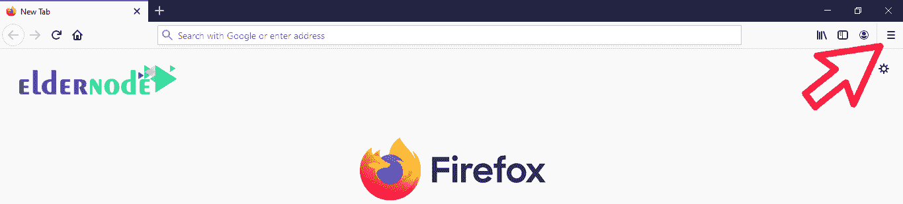
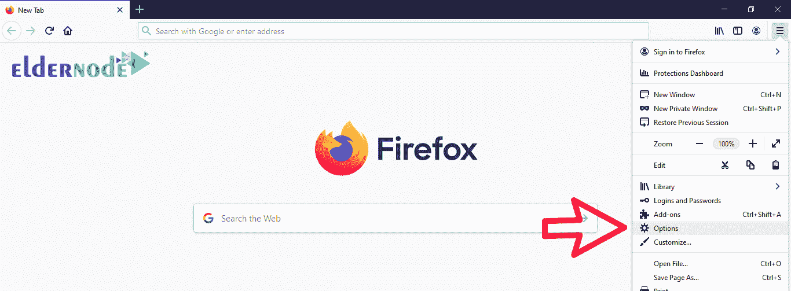
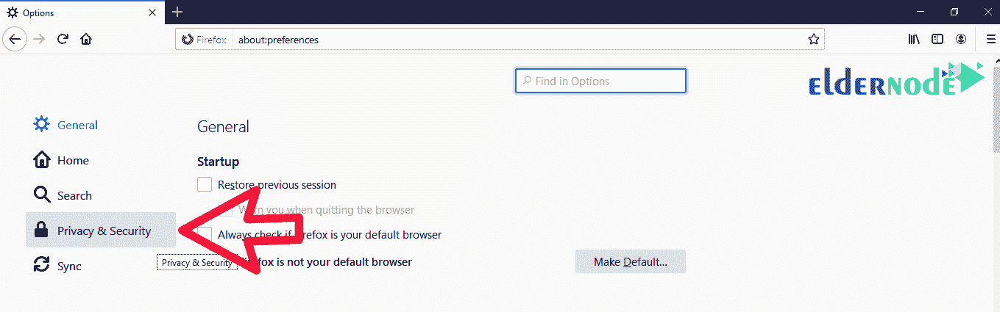
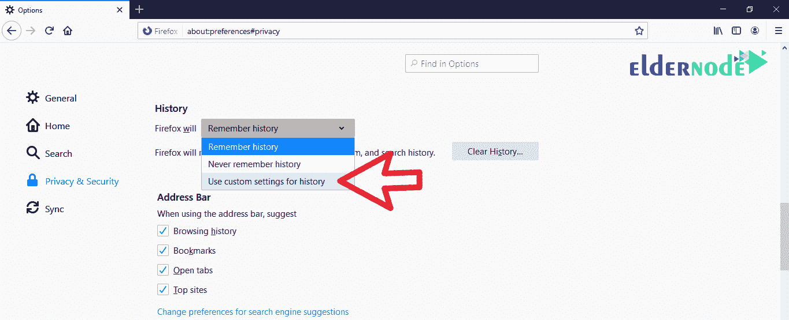

# 如何在 Firefox 中启用 Cookies 教程 ElderNode 博客

> 原文：<https://blog.eldernode.com/enable-cookies-in-firefox/>

如何在 Firefox 中启用 Cookies？你可能遇到过一个网站，建议你**启用**你的 cookie 。但是 cookie 的含义是什么以及如何在 [Firefox](https://www.mozilla.org/en-US/firefox/new/) 中启用 cookie，是本文的主题。

[**在 Eldernode** 的 VPS 托管计划](https://eldernode.com/vps-hosting/)

饼干的概念

### cookie 基本上是一个文本文件，包含您对每个站点的所有设置和自定义。有了 cookie，你就不需要在每次登录特定网站时输入你的用户名和其他自定义设置。

比如，为了更好的理解，我们给你解释一个**网店**。

如果你在访问网上商店时很小心，你会注意到在商店登录你的帐户之前，你将能够选择你想要的产品并装满你的购物车。cookie 的特点是，如果你登出网站，过一会儿再进入同一个网站，你会注意到你的选择的商品 **还没有从购物车中移除**。

是的，这个功能和 cookies 有关。事实上，在您登录后，所有记录的项目，如您的帐户、选择和自定义网站模式都将存储在 cookie 中。在您下次访问该网站后，[网络服务器](https://eldernode.com/tag/web-server/)将首先查看您系统上的 cookie 文件，并打开与您设置的 cookie 相关的网站。

出于安全原因，不同版本的浏览器并不总是启用 cookies。

对于 WordPress 用户来说，有趣的事情是，他们反复遇到禁用 cookies 来登录他们的 WordPress 仪表盘的错误。这个错误的来源是 cookie 的激活，你可以一劳永逸的解决掉。

下一个主题是在 Firefox 中启用 cookies，如果需要的话，你可以用它来**启用**或**禁用**。

在 Firefox 中启用 cookies

### **1。** 先打开你的 [火狐](https://www.mozilla.org/en-US/firefox/new/) 。

**2。** 点击页面右上角**的菜单。**

**3。从该菜单的** 进入选项部分。

**注:** 该选项可能在不同版本的火狐( [Mac OS](https://download.mozilla.org/?product=firefox-56.0.1-SSL&os=osx&lang=en-US) )中显示为首选项。

**4。在打开的**页面中，点击隐私&安全选项。

**5。** 设置火狐将选项设为使用自定义设置为历史如下图**启用 cookie**。

从网站接受 Cookie 选项将**允许**浏览器存储 Cookie。

选择此选项将在未经您允许的情况下保存 cookies 。为了排除一些网站，使用异常选项获得火狐**许可**制作 cookies。

还有一个名为接受第三方 cookie的选项，通过它你可以让火狐访问设置第三方 cookie。最佳设置是在总是选项上。

**亦作，见:**

[如何清除浏览器缓存](https://eldernode.com/clear-the-browser-cache/)

**尊敬的用户**，我们希望您能喜欢这个[教程](https://eldernode.com/category/tutorial/)，您可以在评论区提出关于本次培训的问题，或者解决[老年人节点培训](https://eldernode.com/blog/)领域的其他问题，请参考[提问页面](https://eldernode.com/ask)部分，并尽快提出您的问题。腾出时间给其他用户和专家来回答你的问题。

好运。

Goodluck.