# 如何在专用服务器上启用 Mikrotik 许可证- Eldernode

> 原文：<https://blog.eldernode.com/enable-mikrotik-licenses-on-dedicated-server/>

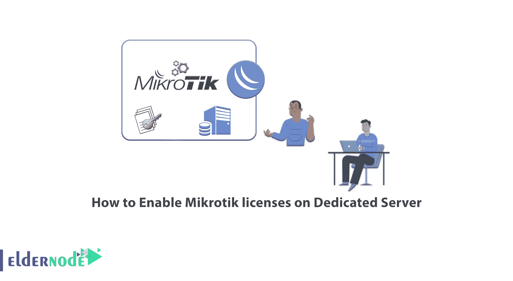

计算机网络需要路由器、交换机、无线设备等设备进行内部和外部通信。大型品牌和公司生产和销售这种硬件。这些公司和硬件产品制造商之一是 Mikrotik，它最初生产基于 Linux 的操作系统。Mikrotik 拥有其现成产品的许可证。在本文中，我们将教你如何购买 Mikrotik 许可证，以及如何在专用服务器上启用 Mikrotik 许可证。如果你想买一个 [**专用服务器**](https://eldernode.com/dedicated-server/) ，可以查看 [Eldernode](https://eldernode.com/) 网站上提供的套餐。

## **教程在专用服务器上启用 Mikrotik 许可证**

### **什么是 Mikrotik 执照？**

许可证基于路由器的硬件规格或其他路由器功能的使用，例如支持大量用户管理器客户端或使用不同类型隧道的客户端的能力。如果你想在电脑或虚拟机上安装 [Mikrotik](https://blog.eldernode.com/tag/mikrotik/) ，你应该购买 Mikrotik 许可证或使用破解版本的 Mikrotik。要使用 Mikrotik 操作系统的功能，您需要在 Mikrotik 帐户服务器中获取许可证密钥，以便使用同一产品的软件和硬件。

Mikrotik 操作系统有多个许可级别。每个许可证级别都比以前的级别拥有更多的功能，例如管理更多用户的能力、连接的能力等。在试用模式下安装 RouterOS 后，您有 24 小时的时间注册一级(免费演示)或购买 3、4、5、6 级中的一个并输入有效代码。Level 3 仅适用于常规 Mikrotik 无线对讲机(客户端或 CPE ),不适用于 x86 电脑。

### **在专用服务器上启用 Mikrotik 许可证的先决条件**

–登录或注册您的 Mikrotik 帐户

–购买 Mikrotik 许可证

–Winbox

### **如何在专用服务器上购买 Mikrotik 许可证**

先上 [Mikrotik 官网](http://www.mikrotik-routeros.net/buy.aspx)。选择你想要的水平，并点击它。

**注意:**选择许可级别时要小心，因为不可能对其进行更改和升级。

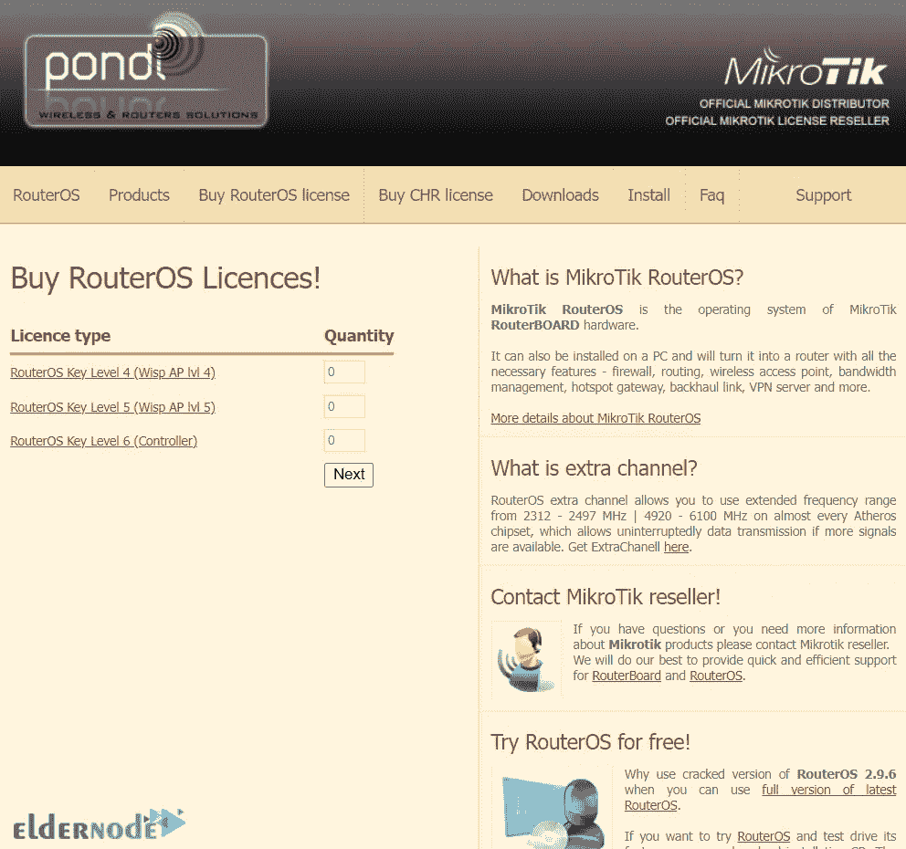

我选择 6 级。现在点击**购买许可证**:

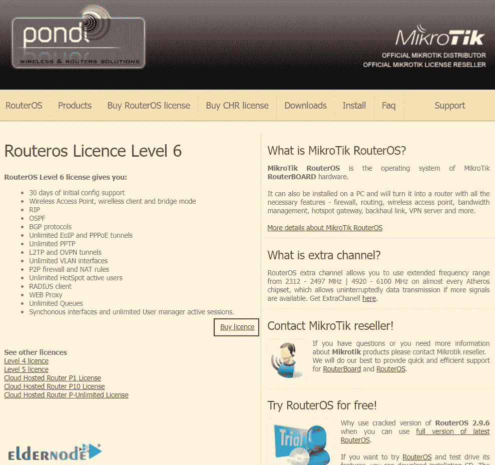

在**数量**部分，注意您选择的等级，然后点击**下一步**:

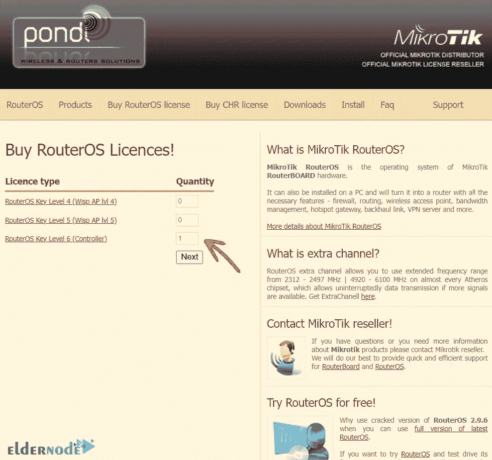

在这一步，你需要输入你的 **SoftID** ，从 **PC** 和 **RouterBoard** 两种平台中选择你的**平台类型**。然后点击**购买**。SoftID 是安装 RouterOS 后给您的 ID:

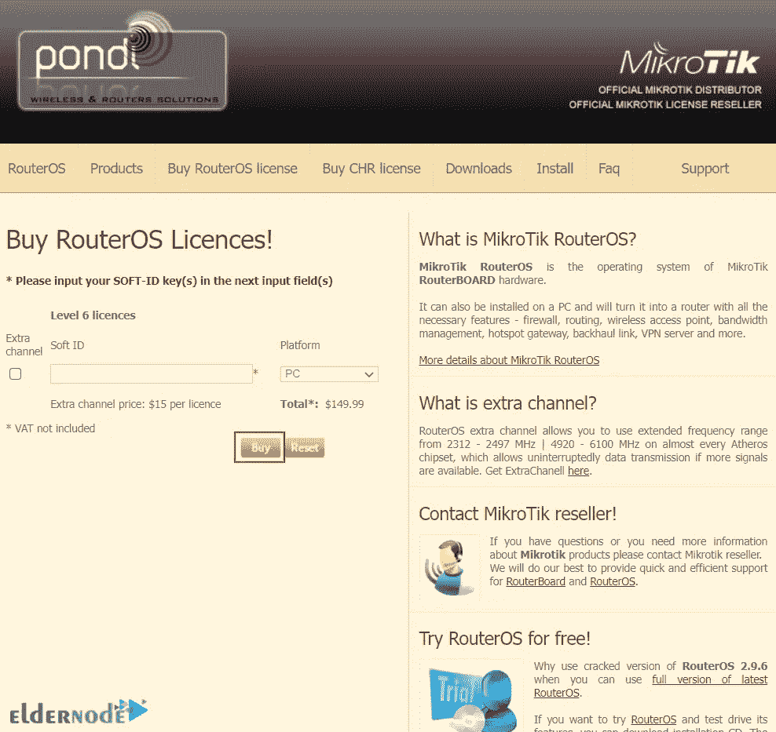

然后，您应该在银行页面上输入所需的详细信息和信息。完成该过程后，您将在电子邮件中收到您的新密钥，它也会出现在您帐户的**使用密钥**部分。

就是这样！

## **在专用服务器上启用 Mikrotik 许可证**

首先，你应该打开你的 Winbox。如果没有 Winbox，可以从 [Mikrotik 官网](https://mikrotik.com/software)下载。为此，点击**进入下载页面！**。

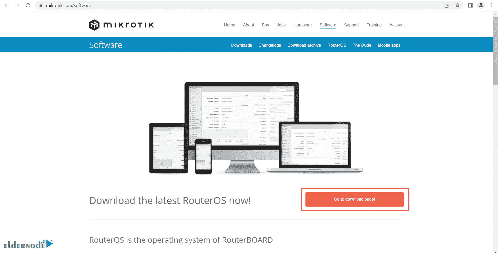

然后点击您想要的**版本**开始下载:

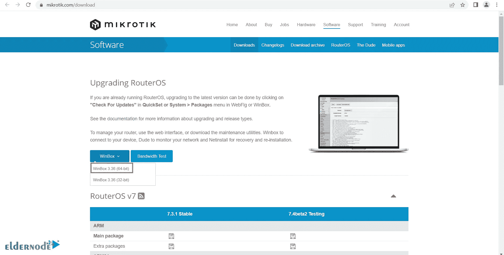

下载后运行 Winbox 并打开。

现在输入你的 **IP** 和**密码**，点击**连接**:

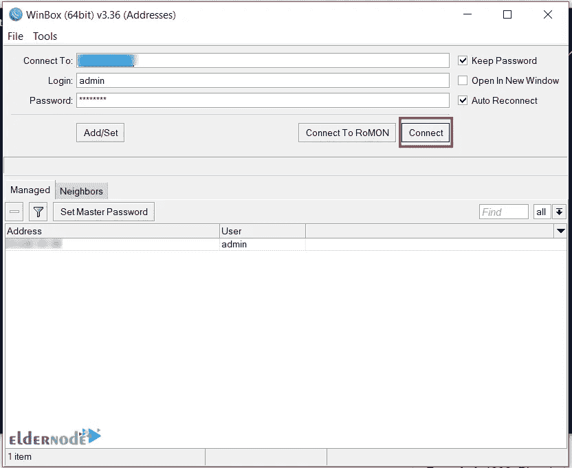

接下来在工具栏上找到**系统**并点击它。在打开的菜单中，点击**执照**:

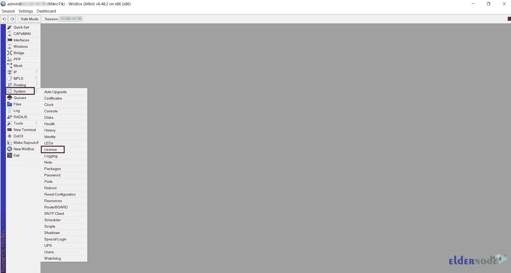

然后你会看到下面的页面。我们在上一步中解释了如何购买许可证密钥，现在只需点击**粘贴密钥**:

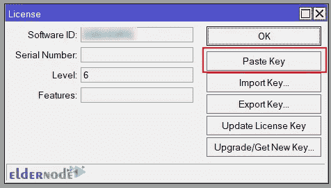

然后，您将被要求**重启**路由器，以使密钥更改生效。在这种情况下，点击**是**，重启路由器:

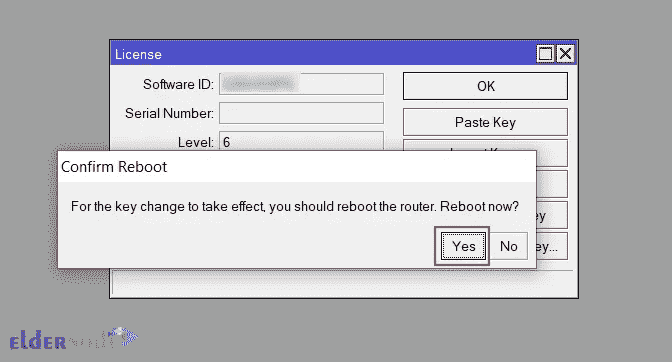

就是这样！您已在专用服务器上启用 Mikrotik 许可证。

## 结论

Mikrotik 在其现成产品如路由器上有许可证，如果你想在电脑或虚拟机上安装 Mikrotik，你需要购买 Mikrotik 许可证或使用破解版本的 Mikrotik。在本文中，我们教你如何购买 Mikrotik 许可证，以及如何在专用服务器上启用它。我希望这篇文章对你有用。有问题可以在评论里问我们。