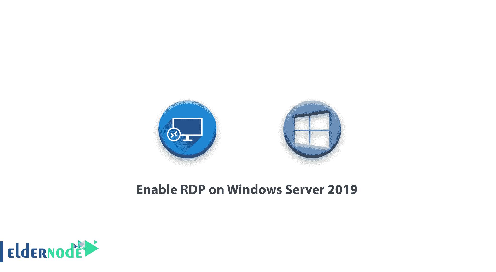
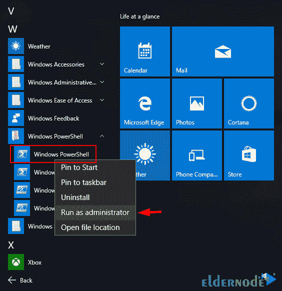
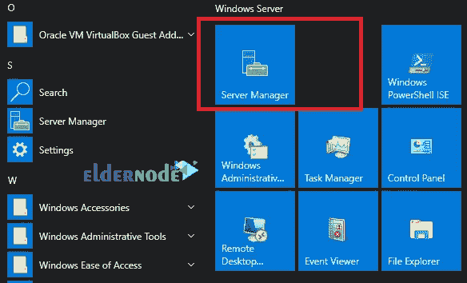
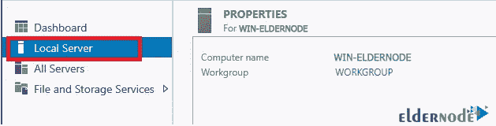
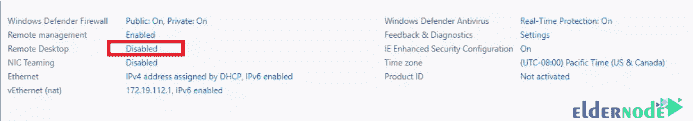
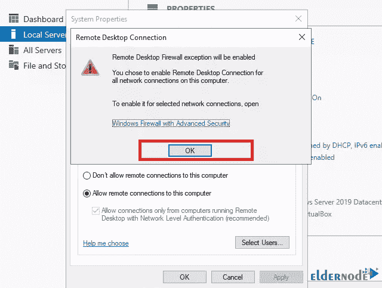
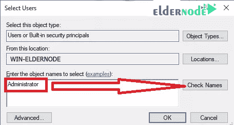
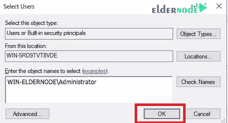

# 教程在 Windows Server 2019 上启用 RDP-elder node

> 原文：<https://blog.eldernode.com/enable-rdp-on-windows-server-2019/>



本文将向您展示在 Windows Server 2019 上启用 RDP 的教程。远程桌面服务是指计算机通过互联网或内部网络平台进行连接和远程控制的能力。远程桌面服务或 RDP 是微软拥有的一个协议，默认情况下，从 Windows XP 开始，所有的 Windows 都可以使用该软件。使用远程桌面在连接到装有 Windows 操作系统的服务器时非常有用。

从 eldernode.com 在线购买 **[管理员 RDP 服务器](https://eldernode.com/admin-rdp-server/)** 。

可以从 PowerShell 或通过服务器控制台界面在 Windows Server 2019 上启用远程桌面协议服务。在 Windows Server 2019 上启用 RDP 服务在 PowerShell 上比 GUI 程序更快。

## a)使用 PowerShell 启用 RDP 服务

**1。** 首先，以管理员权限运行 PowerShell。



**2。** 打开 PowerShell 后，键入并执行以下命令。

```
Set-ItemProperty -Path 'HKLM:\System\CurrentControlSet\Control\Terminal Server' -name "fDenyTSConnections" -value 0 
```

**3。** 因为 Windows 防火墙不允许远程桌面连接，所以应该配置防火墙允许 RDP 远程连接。

```
Enable-NetFirewallRule -DisplayGroup "Remote Desktop" 
```

**4。** 禁用 RDP，运行:

```
Set-ItemProperty -Path 'HKLM:\System\CurrentControlSet\Control\Terminal Server' -name "fDenyTSConnections" -value 1 
```

## b)从服务器管理器 GUI 启用 RDP 服务

**1。**T3 你必须先从**开始菜单**打开服务器管理器。



**2。T3 打开服务器管理器后，点击左栏的本地服务器。**



**3。T3 点击禁用前面的**远程桌面**选项。**



**4。在打开的窗口中点击允许远程连接到这台电脑，点击确定。**



**5。T3 现在选择选择用户选项同意远程桌面防火墙例外警告并添加用户允许。**



**6。T3 输入用户名点击查看姓名。确认用户名后，点击确定保存。**



**7。T3 点击确定结束。**

另请参见:

**尊敬的用户**，我们希望您能喜欢这个[教程](https://eldernode.com/category/tutorial/)，您可以在评论区提出关于本次培训的问题，或者想解决[老年人节点培训](https://eldernode.com/blog/)领域的其他问题，请参考[提问页面](https://eldernode.com/ask)部分，并尽快提出您的问题。腾出时间给其他用户和专家来回答你的问题。

在 Windows Server 2019 上启用 RDP。

好运。

Enable RDP on Windows Server 2019.

Goodluck.