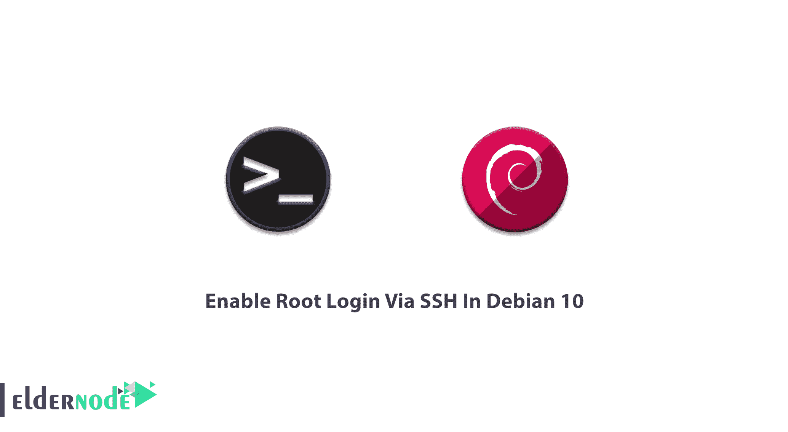

# 在 Debian 10 - Eldernode 博客中通过 SSH 启用 Root 登录

> 原文：<https://blog.eldernode.com/enable-root-login-via-ssh-in-debian/>



安全 Shel 允许您处理您的网络服务，以控制任何不安全的情况。在 Linux 和 Unix 之类的操作系统上，root 用户充当超级用户，可以做许多普通用户做不到的事情。要远程连接到您的系统并执行管理任务，您需要以 root 用户身份登录。在本文中，您将了解如何在 Debian 10 中通过 SSH 启用 Root 登录。如果你准备购买你自己的 [Linux VPS](https://eldernode.com/linux-vps/) ，访问 [Eldernode](https://eldernode.com/) 的可用包来购买最好的。

为了让本教程更好地发挥作用，请考虑以下**先决条件**:

拥有 sudo 权限的非 root 用户。

要进行设置，请按照 Debian 10 的[初始设置进行。](https://blog.eldernode.com/initial-setup-with-debian-10/)

## **教程在 Debian 10 | Debian 9** 中通过 SSH 启用 Root 登录

Debian [Linux](https://blog.eldernode.com/tag/linux/) 不允许作为根用户通过 ssh 协议登录到服务器，并且默认情况下在主 SSH 配置文件中被禁用。因此，当您尝试以 root 用户身份登录时，会收到一条错误消息(由于安全原因)。错误消息是“权限被拒绝，请重试”。请阅读本文，回顾一下通过 ssh 启用 root 登录的过程。

### **以 root 身份登录**

当您使用 root 帐户登录时，您是具有管理权限的特殊用户。然而，你必须确保你的知识，你运行的命令，因为任何粗心或格式错误的命令将使整个操作系统不可用。这就是为什么安全原因不允许您以 root 身份登录，您需要启用它。在 [Debian](https://blog.eldernode.com/tag/debian/) 上，它最初是作为安全预防措施启用的，这意味着你不能通过 [SSH](https://blog.eldernode.com/enable-root-login-via-ssh-in-ubuntu-20-04/) 作为根用户直接登录。

### **允许 SSH root 登录 Debian**

因为 PermitRootLogin 参数控制 ssh root 权限，所以您必须更改它的值。参数为 */etc/ssh/sshd_config* ，PermitRootLogin 的值为“无密码”。因此，您需要将 PermitRootLogin 设置为 yes，以允许超级用户登录。

### **如何通过 SSH 启用 root 登录**

在下文中，您可以回顾本指南中所需的简单步骤。这样，您可以将禁用的默认模式更改为启用并通过 SSH 登录。

打开 ssh 配置文件，使用您喜欢的文本编辑器。

```
nano /etc/ssh/sshd_config
```

然后，搜索 **PermitRootLogin** ，将其值改为“Yes”。如果该行存在并且用“#”注释掉，则删除“#”。

```
PermitRootLogin yes
```

现在，你可以**保存**更新后的***/etc/ssh/sshd _ config***文件，重启 SSH 服务器。使用下面的命令来完成此操作:

```
systemctl restart sshd
```

也就是说，如果你没有看到任何新的错误，你应该能够通过 SSH 协议使用 root 用户帐户访问你的 Debian 服务器。

## 结论

在本文中，您了解了如何在 Debian 10 中通过 SSH 启用 Root 登录。如您所知，默认情况下，SSH root 登录在 Debian 中是禁用的，因为它不建议通过 SSH 使用 root 密码。因此，您可以作为普通 Linux 用户 ssh 到服务器，然后使用 su [命令](https://blog.eldernode.com/most-used-commands-in-ssh-and-linux/)作为 root 用户登录。如果你有兴趣阅读更多，可以找到我们关于[在 Linux 上安装 SSH 服务器并允许 root 用户登录](https://blog.eldernode.com/install-ssh-server-on-linux-and-allow-root-user-login/)的相关文章。