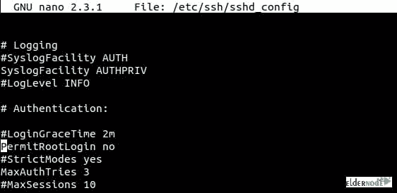

# 在 Ubuntu 20.04 - Eldernode 中通过 SSH 启用 Root 登录

> 原文：<https://blog.eldernode.com/enable-root-login-via-ssh-in-ubuntu-20-04/>


在本教程中，您将学习在 Ubuntu 20.04 中通过 SSH 启用 root 登录。我们将向您展示如何为 Root 用户设置密码以及如何启用它。由于安全 shell 可以帮助您在面对不安全的网络时处理网络服务，所以了解它是合乎逻辑的。请和我们一起验证客户端和服务器的安全连接。但是如果你还没有自己的虚拟私人服务器，请联系我们成为虚拟私人服务器的拥有者。如果你想购买一台 [Linux VPS](https://eldernode.com/linux-vps/) 服务器，你可以访问 [Eldernode](https://eldernode.com/) 中的软件包。

为了让本教程更好地发挥作用，请考虑以下**先决条件**:

一个拥有 sudo 权限
的非 root 用户来设置，按照我们在 Ubuntu 20.04 LTS 上设置的 [初始服务器。](https://eldernode.com/initial-server-set-up-on-ubuntu-20-04-lts/)

## 在 Ubuntu 20.04 中通过 SSH 启用 Root 登录

默认情况下，Ubuntu 上的 SSH 配置为禁止 root 用户登录。这最初是作为一种安全预防措施启用的，这意味着您不能通过 SSH 作为 root 用户直接登录。然而，您通常可以通过使用 sudo 命令来避开 root ssh 登录的需求。

### 设置 Root 密码

登录到 Ubuntu 20.04 后，现在输入以下命令重置/设置 root 密码。

```
sudo passwd root
```

键入命令后，也许 [Ubuntu](https://en.wikipedia.org/wiki/Ubuntu_version_history) 20.04 会检查你的密码用户名。首先，输入您的用户名密码，当您看到要求输入新密码的提示时，为 root 输入新密码并确认。

您成功地更改了 root 密码，现在您需要在 /etc/ssh/ssh_config 上更改一些配置以允许 root 登录。

### 配置 SSH 配置以允许 root 登录

使用以下命令编辑 /etc/ssh/sshd_config 文件。

```
nano /etc/ssh/sshd_config
```



如您所见， PermitRootLogin 被设置为 No，这意味着通过 SSH 的 root 登录已经被禁用。因此，要启用 root 登录，请将否更改为是。找到 **PermitRootLogin** ，删除**无**或**无密码**，键入 **是** 。

例如:

变化前

```
PermitRootLogin without-password
```

编辑后

```
PermitRootLogin yes
```

编辑完 SSH 配置文件后，按**Ctrl+x**和 **两次回车** 按钮保存并退出。

重新启动 SSH 服务，以便在 SSH_config 文件上加载新配置。

```
sudo systemctl restart sshd
```

运筹学

```
sudo service sshd restart
```

现在，您可以通过 Root 用户检查 SSH。

## 结论

至此，您已经了解了如何在 Ubuntu 中通过 SSH 启用 Root 登录。从现在起，您将能够远程连接到您的系统并执行管理任务。所以，用 root 用户通过 ssh 登录 Ubuntu 20.04，好好享受吧。如果您有兴趣阅读更多关于 SSH 的文章，可以看看[在 Linux 上安装 SSH 服务器并允许 root 用户登录](https://blog.eldernode.com/install-ssh-server-on-linux-and-allow-root-user-login/)。