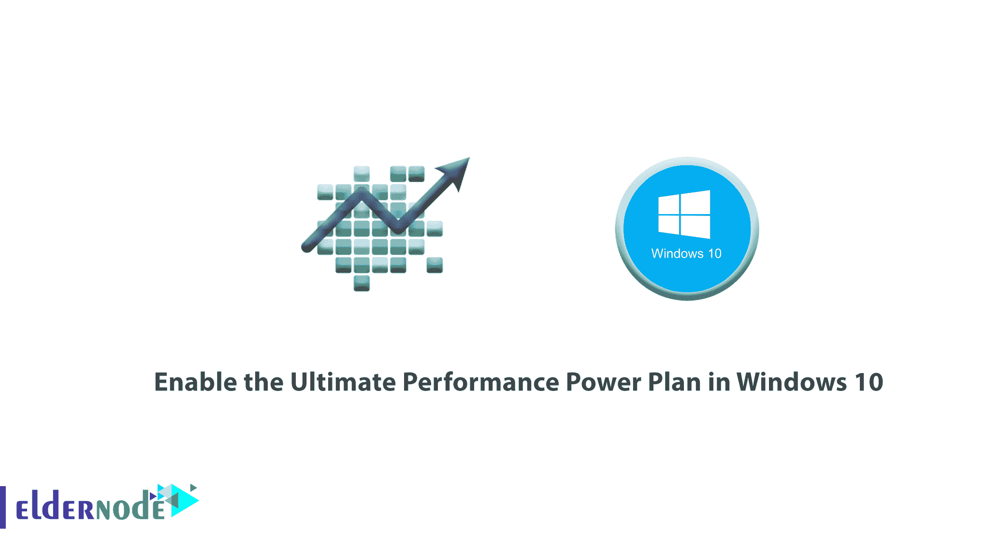
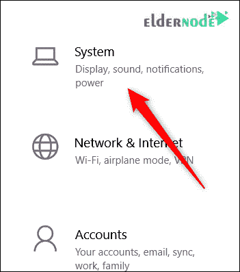
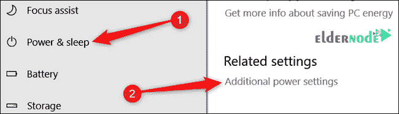
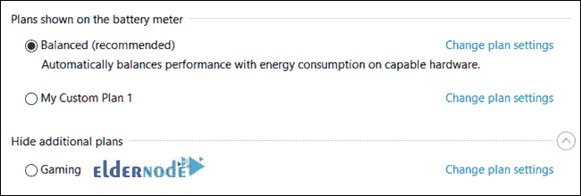
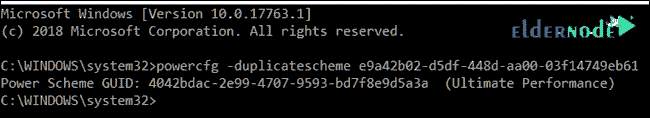
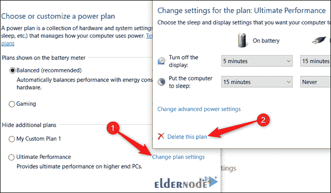

# 如何在 Windows 10 - Eldernode 中启用终极性能电源计划

> 原文：<https://blog.eldernode.com/enable-ultimate-performance-power-plan/>



如何在 [Windows 10](https://eldernode.com/tag/windows-10/) 中启用终极性能电源计划？当电子设备消耗更多的能量时，它们总是比以前表现得更好。这个**例子**并不是说一个设备的功耗越高，它的性能就越好。把这想象成一个超频功能，除了它没有超频风险而且你对你的电脑电子产品的寿命感到舒服。

在本文中，我们将教你如何在 Windows 10 中启用终极性能电源计划。

[***在 Eldernode***](https://eldernode.com/windows-vps/) 购买 Windows 虚拟专用服务器

### 终极性能电源计划

终极高性能电源计划旨在通过优化高性能电源计划为**高功率系统**(想想工作站和服务器)提供额外的推动力。它旨在减少或消除与细粒度电源管理技术相关的微延迟。

一个微延迟就是当你的操作系统意识到一个硬件需要更多的能量时和它提供能量时之间的微小延迟。虽然这可能只是几分之一秒，但它可以产生影响。

终极性能计划消除了对硬件的轮询以查看它是否需要更多电力，并让硬件消耗它需要的所有电力。此外，任何节能功能都被禁用，以进一步提高性能。

因此，默认情况下，使用电池电源的机器没有这个选项，因为它会消耗更多的电力，更快地耗尽电池。

终极性能计划 **在硬件不断进入和退出空闲状态的系统上提高** 速度。但是当你运行一个游戏时，你所有的硬件已经一起工作来填充你周围的环境。

唯一真正的改善可能出现在初始启动时，你可能只会看到每秒几帧的提升。然而，如果你正在运行视频编辑或 3D 设计软件，这些软件偶尔会给你的硬件带来沉重的负担，你可能会看到更多的改进。

**注意:** 启用此计划将增加您的系统消耗的电量，因此如果您计划在您的笔记本电脑上使用此配置文件，请确保您一直都在使用电源。

### 实现终极性能电源计划

**1。**T3 点击 Windows+I 打开设置 app 然后点击系统类别。



**2。在系统页面上点击** 左侧的电源&睡眠标签页。

**3。然后在右边的** ，点击相关设置部分下的附加电源设置链接。



**4。在弹出的** 窗口中，点击显示附加计划，然后点击终极性能选项。


**注意:** 如果您使用的是笔记本电脑，此选项可能不会出现在本部分下。



### 如果看不到最终绩效计划，该怎么办

在一些系统上(大多数在笔记本电脑上，但也有一些在台式机上)，你可能在你的设置应用中看不到终极性能计划。如果没有，可以用快捷的[命令提示符](https://eldernode.com/tag/command-prompt/)或者 [PowerShell 命令](http://eldernode.com/tag/powershell-commands/)来添加。

对于任何一个 shell，该命令都是相同的，所以使用您想要的命令。

你需要用管理权限打开 [命令提示符](https://en.wikipedia.org/wiki/Cmd.exe) 或 [PowerShell](https://docs.microsoft.com/en-us/powershell/scripting/overview) 。

**对于命令提示**，点击开始，在搜索框中输入 cmd ，**右键**命令提示结果，选择以管理员身份运行。

**对于 PowerShell** ，点击 Windows+X ，选择 Windows PowerShell(管理)选项。

在提示符下，键入(或复制并粘贴)以下命令，然后按 Enter 键:

```
powercfg -duplicatescheme e9a42b02-d5df-448d-aa00-03f14749eb61
```



**注意:** 如果您已经打开了电源选项窗口，您可能需要关闭并重新打开它才能看到计划出现，但它应该在那里。

**注意:** 如果不想再看到该计划，可以从设置 app 中移除。**先**，换一个不同的方案。如果您尝试删除当前正在使用的计划，可能会遇到错误。

接下来，点击计划右侧的更改计划设置链接，然后点击删除该计划。



终极绩效计划只有在特定情况下才真正有用，但它能带来改变。

**亦作，见:**

[如何在 Windows 10 中添加文件启动](https://eldernode.com/add-files-to-startup/)

**尊敬的用户**，我们希望您能喜欢这个[教程](https://eldernode.com/category/tutorial/)，您可以在评论区提出关于本次培训的问题，或者解决[老年人节点培训](https://eldernode.com/blog/)领域的其他问题，请参考[提问页面](https://eldernode.com/ask)部分，并尽快提出您的问题。腾出时间给其他用户和专家来回答你的问题。

好运。