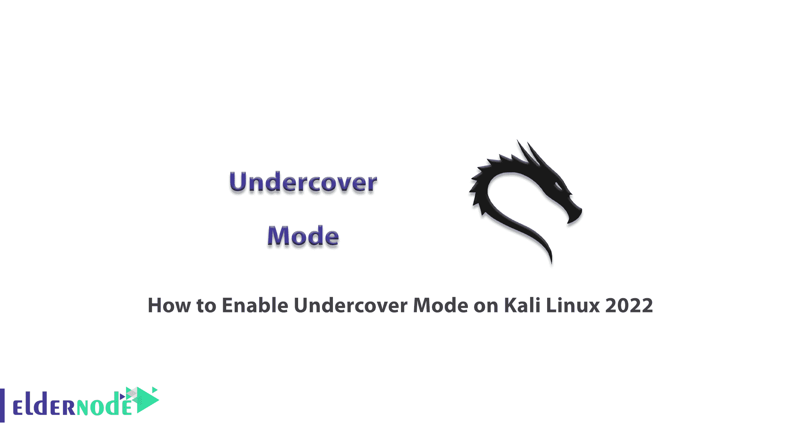

# 如何在 Kali Linux 2022 - Eldernode 博客上启用卧底模式

> 原文：<https://blog.eldernode.com/enable-undercover-mode-on-kali-linux/>



Kali Linux 是一个流行的 Linux 发行版，因为它的安全工具而吸引了黑客和网络安全专家的注意。这些工具可以安装在所有的 Linux 发行版上，但是 Kali Linux 的好处是默认情况下它有软件。在本文中，我们将教你如何在 Kali Linux 2022 上启用卧底模式。另外，如果你想购买一个 [**Linux VPS**](https://eldernode.com/linux-vps/) 主机，你可以访问 [Eldernode](https://eldernode.com/) 中可用的软件包。

## **教程一步步在 Kali Linux 上启用卧底模式**

### **卡莉 Linux 简介**

Kali Linux 是一个开源的、基于 Debian 的 Linux 发行版，为渗透测试而设计。Kali Linux 于 2013 年发布，实际上是一个重写的操作系统版本 BackTrack。Kali Linux 是由一家名为进攻性安全的信息安全公司开发的。Kali Linux 是一个流行的操作系统，它最初并不是为了成为一个操作系统，它的核心是为了共享代码进行编程而设计的。

### **卡莉 Linux 特性:**

*   开源
*   多语言支持
*   可定制的
*   自由的
*   GPG 签名包和存储库
*   包括 600 多种渗透测试工具
*   ARMEL 和 ARMHF 支持
*   广泛的无线设备支持

### **什么是卧底模式？**

卧底模式是一组脚本代码，将 Kali Linux 操作系统中 Xfce 桌面环境的默认外观更改为 Windows 10 桌面环境。进攻性安全创造了一种卧底模式，这样人们在公共场所工作时就不会分心。开发卧底模式的主要目的是使网络安全专业人员能够在公共场所轻松工作。这些脚本将类似 Windows 的主题应用到系统中。

## **在 Kali Linux 2022** 上启用卧底模式

首先，您应该打开终端让它启动并运行。

终端位于 Kali Linux 菜单屏幕顶部菜单的左上角。

一旦终端运行，只需运行以下命令:

```
kali-undercover
```

这将改变一切。你会注意到所有东西看起来都很像 Windows，而且你还会有一个开始菜单。你甚至得到了令人惊讶的背景作为一个视窗标志，这将会给你一个秘密模式。

如果您想回到 Kali regular，只需输入相同的命令:

```
kali-undercover
```

## 结论

在本文中，我们教你如何在 Kali Linux 2022 上启用卧底模式。Kali Linux 中的卧底模式允许你在 Kali Linux 上模拟一个 Windows 10 环境。我希望你喜欢这个教程。如果你有任何问题，可以在评论中联系我们。