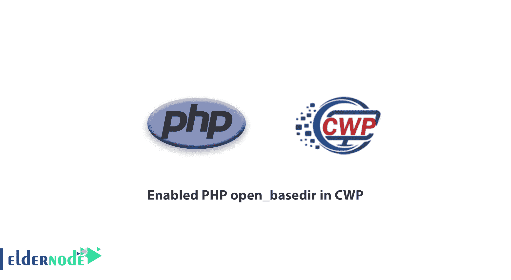

# 如何在 CWP 启用 PHP open _ basedir 教程 CWP

> 原文：<https://blog.eldernode.com/enabled-php-open_basedir-in-cwp/>



教程如何在 [CWP](https://eldernode.com/tag/cwp/) 控制面板中**启用 PHP** open_basedir。

在 CWP 启用 PHP open _ basedir[Linux 服务器](https://eldernode.com/tag/linux-server/)。

我们有两个选择:

1)全局配置，包含文件夹/usr/local/php/php.d/和 php 选择器包含文件夹中的一个配置文件

2)根据用户配置，最安全的选项，因为它将用户限制在他的/home/USERNAME 文件夹中，并且还禁止用户使用自定义 php.ini 文件。

全局配置:

正确做到这一点的最安全的方法是将配置放入包含文件中，以防止用户覆盖它。请注意，如果您将它设置为/usr/local/php/php.ini，那么自定义用户 php.ini 将能够禁用它。请注意，全局配置允许完全/主文件夹访问，而每个用户限制用户访问/主/用户名文件夹，这样更安全。

创建文件和配置的一行命令:

```
echo "open_basedir = /home:/tmp:/var/tmp:/usr/local/lib/php/" >/usr/local/php/php.d/open_basedir.ini 
```

您也可以自己创建一个包含以下内容的文件:

```
open_basedir = /home:/tmp:/var/tmp:/usr/local/lib/php/ 
```

Per User open_basedir:

要启用每用户 open_basedir，您可以在 users /home 文件夹中创建 php.ini 文件。

请注意，该选项还将禁用所有自定义用户的 php.ini 文件，例如:/home/USERNAME/public _ html/PHP . ini 将不会被加载。

您也可以将其放入 public_html 文件夹中。

但是用户可以在每个文件夹中运行自定义的 php.ini 文件，并且可以禁用 open_basedir。

我们希望你喜欢在 cwp 中使用 php。