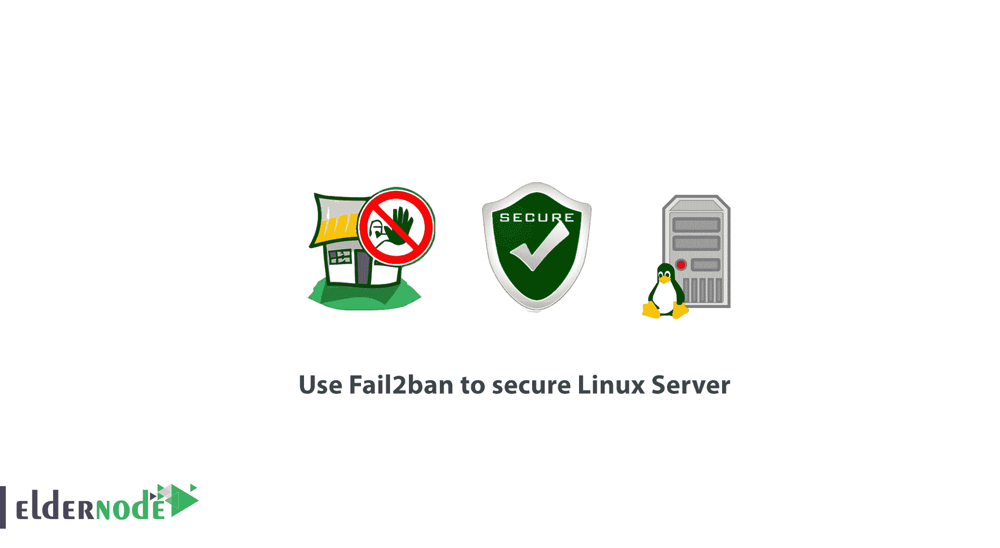

# 如何使用 Fail2ban 保护 Linux 服务器

> 原文：<https://blog.eldernode.com/fail2ban-secure-linux-server/>



为了阅读关于 **[Failban](https://eldernode.com/install-fail2ban-centos-8/)** 的最新教程，你可以通过这篇文章了解更多，并学习**如何使用 Fail2ban 来保护 Linux 服务器。作为一名 Linux 管理员，提高您的服务器安全性应该是您更好地管理它的首要任务之一。重要的是，当您查看服务器日志时，发现暴力登录、网络洪水、漏洞利用和许多其他尝试。**

有了像 **fail2ban、**这样的入侵防御软件，你可以检查你的服务器日志并添加额外的 iptables 规则来阻止有问题的 [IP 地址](https://en.wikipedia.org/wiki/IP_address#:~:text=An%20Internet%20Protocol%20address%20(IP,the%20Internet%20Protocol%20for%20communication.)

#### 要求

由于 Fail2ban 是用 python 编写的，所以唯一的要求就是安装 python:

*   Fail2ban 分支 0.9.x 需要 Python > =2.6 或者 Python > =3.2
*   Fail2ban 分支 0.8.x 需要 Python > =2.4
*   对您系统的超级用户访问权限
*   可选，iptables 或 showewall 和 sendmail

## 如何使用 Fail2ban 保护 Linux 服务器

加入本教程，让我们向您展示如何安装 **fail2ban** 并设置基本配置来保护您的 Linux 系统免受暴力攻击。安装 **fail2ban** 相对容易。

### Linux 系统如何安装 fail 2 ban

我们可以向你保证 **fail2ban** 的安装相对容易。

#### 在 CentOS/RHEL 上安装 fail 2 ban

像往常一样，首先您将更新您的包，启用 **Epel** 存储库，并安装 **fail2ban。**

```
yum update  yum install epel-release  yum install fail2ban
```

#### 在 Debian/Ubuntu 上安装 fail 2 ban

要安装 **fail2ban，**更新您的软件包。

```
apt-get update && apt-get upgrade -y  apt-get install fail2ban
```

如果您喜欢接收通知，可以安装 Sendmail。

```
yum install sendmail                   [On **CentOS/RHEL**]  apt-get install sendmail-bin sendmail  [On **Debian/Ubuntu**]
```

然后，使用以下命令启用 **fail2ban** 和 **sendmail** :

```
systemctl start fail2ban  systemctl enable fail2ban  systemctl start sendmail  systemctl enable sendmail
```

### Linux 系统如何配置 fail 2 ban

默认情况下， **fail2ban** 使用T3。先读取位于 **/etc/fail2ban/** 中的 conf 文件。但是，那些可以被 **覆盖。本地** 文件位于同一个目录下。

**注** :文件，不在 **中。conf** 。这将防止升级 fail2ban 数据包时覆盖更改。

**重要** :为了达到本教程的目的，您必须将现有的 **fail2ban.conf** 文件复制到 **fail2ban.local** 。

CP/etc/fail 2 ban/fail 2 ban . conf/etc/fail 2 ban/fail 2 ban . local

接下来，是时候对 **进行修改了。本地** 文件通过使用你喜欢的文本编辑器。您可以编辑的值有:

*   **日志级别**–这是要记录的细节级别。可能的选项有:
    *   批评的
    *   错误
    *   警告
    *   通知；注意
    *   信息
    *   调试
*   **log target**–将动作记录到一个特定的文件中。默认值为 **/var/log/fail2ban.log** 。但是，您可以将其更改为:
    *   STDOUT–输出任何数据
    *   STDERR–输出任何错误
    *   系统日志–基于消息的日志记录
    *   文件–输出到文件
*   **socket**–放置 socket 文件的目录。
*   **pidfile**–pidfile 的位置。

#### 配置 fail 2 ban

**jail.conf** 是 fail2ban 中最重要的文件之一，它定义了您的监狱，在这里您可以定义应该启用 fail2ban 的服务。亦作。conf 文件可以在升级过程中被修改，因此你应该创建一个 **jail.local** 文件来应用你的修改。

都不是。可以复制**。conf** 文件用下面的命令来做这件事很简单。

```
cp /etc/fail2ban/jail.conf /etc/fail2ban/jail.local 
```

**注 1** :如果您使用的是 **CentOS** 或 **Fedora** ，您需要将 **jail.local** 中的**后端**从**【自动】**更改为**【系统 d】**

**注 2** :如果你用的是 **Ubuntu/Debian** ，没必要做这个修改，即使他们也用 **systemd。**

由于 jail 文件默认情况下会为 **Debian** 和 **Ubuntu** 启用 SSH，但不会在 **CentOS、**上启用 SSH，所以如果您希望启用 SSH，只需更改 **/etc/fail2ban/jail.local** 中的以下行即可。

##### 禁止和重试次数

您可以配置阻止 IP 地址的情况。为此， **fail2ban** 使用 **bantime** ， **findtime，** 和 **maxretry** 。下面我们再来回顾一下这一点:

*   **bantime**–这是一个 IP 地址保持禁止的秒数(默认 **10** 分钟)。
*   **find time**–主机被禁止之前，两次登录尝试之间的时间。(默认 **10** 分钟)。换句话说，如果 fail2ban 被设置为在 **3** 次失败的登录尝试后阻止一个 IP 地址，那么这些 **3** 次尝试必须在 findtime 期间( **10** 分钟)内完成。
*   **maxretry**–在应用禁令之前尝试的次数。(默认 **3** )。

##### 白名单 IP 地址

像往常一样，您需要将某些 IP 地址列入白名单。用您最喜欢的文本编辑器打开 **/etc/fail2ban/jail.local** 并取消注释以下行，以配置这样的 IP 地址。

```
ignoreip = 127.0.0.1/8  ::1
```

接下来，输入您想忽略的 IP 地址。IP 地址应该用空格或逗号分隔。

##### 邮件提醒

如果您需要在事件发生时收到邮件提醒，您需要在 **/etc/fail2ban/jail.local** 中配置以下设置:

*   **destemail**–接收通知的邮件地址。
*   **sender name**–您将在收到消息时看到的发件人。
*   **发件人**–fail 2 ban 将发送邮件的电子邮件地址。

默认 **mta** ( **邮件传输代理**)设置为 **sendmail** 。如果您需要接收邮件通知，请从下面的命令中更改**“action”**设置。

```
Action = %(action_)s 
```

其中之一:

```
action = %(action_mw)s  action = %(action_mwl)s
```

1.  **%(action _ MW)s**——将禁止主机并发送带有 whois 报告的邮件。
2.  **%(action _ mwl)s**–将禁止主机，提供 whois 信息，以及来自日志文件的所有相关信息。

### 附加 Fail2ban 监狱配置

到目前为止，我们已经了解了基本的配置选项。但是如果你需要配置一个监狱，你需要在 **jail.local** 文件中启用它。

```
[jail_to_enable]  . . .  enabled = true
```

看看这个解释，以便更好地参与进来。这里你应该用实际的监狱替换 **jail_to_enable** ，例如**“sshd”**。在 **jail.local** 文件中，将为 ssh 服务预定义以下值:

```
[sshd]    port = ssh  logpath = %(sshd_log)s
```

在这里，您还可以启用过滤器，这将有助于识别日志中的行是否是失败的行。过滤器值实际上是对服务名后跟**的文件的引用。conf** 。比如:**/etc/fail 2 ban/filter . d/sshd . conf**。

```
filter = service 
```

举个例子:

```
filter = sshd 
```

然后，如果需要查看已有的过滤器，就去下面的目录: **/etc/fail2ban/filter.d/** 。

#### 使用 fail 2 ban-客户端

**Fail2ban** 附带一个客户端，可用于查看和更改当前配置。您可以使用以下命令浏览它的手册，因为它提供了许多选项。

```
man fail2ban-client 
```

让我们向您展示一些您可以使用的基本命令。要查看 **fail2ban** 或特定监狱的当前状态，您可以使用:

```
fail2ban-client status 
```

对于个人监狱:

```
fail2ban-client status sshd 
```

**好样的** ！您成功地完成了本教程，并了解到 **Fail2ban** 是一个记录良好的入侵防御系统，它为您的 Linux 系统提供额外的安全性。虽然它需要一些时间来适应它的设置和语法，但是一旦你熟悉了它，你就可以随意改变和扩展它的规则。

亲爱的用户，我们希望本教程如何使用 Fail2ban 来保护 Linux 服务器将对你有所帮助，提出任何问题或查看我们的用户关于这篇文章的谈话，请访问 [提问页面](https://eldernode.com/ask) 。也是为了提高自己的见识，准备了这么多有用的教程给 [Eldernode 培训](https://eldernode.com/blog/) 。

**不要**错过相关文章:

[配置 Linux 服务器安全](https://eldernode.com/installations/configure-linux-server-security/)