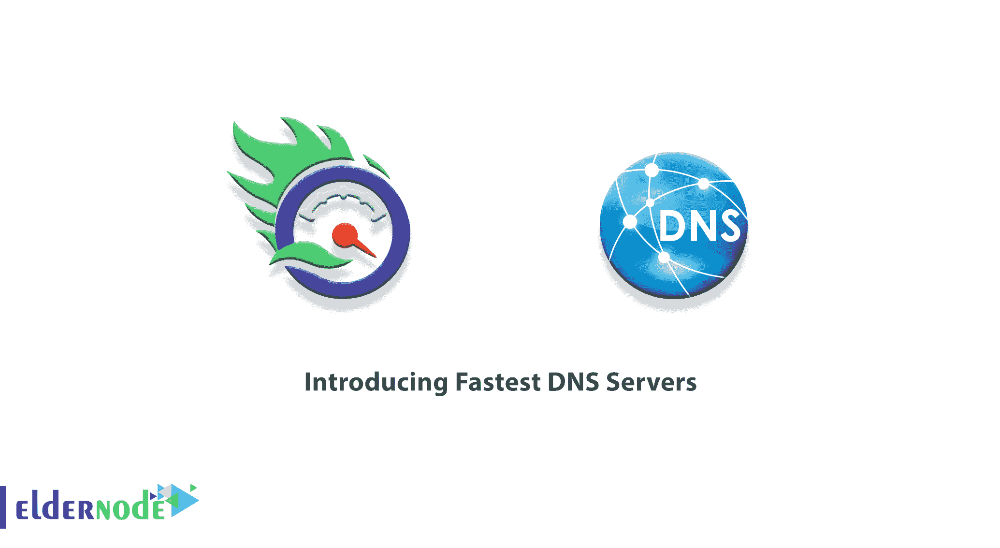

# 介绍最快的 DNS 服务器- Eldernode 博客

> 原文：<https://blog.eldernode.com/fastest-dns-servers/>

加快网页浏览速度的最好方法是使用 DNS。DNS 执行将站点地址转换为 IP 的任务。因此，DNS 服务器越快，浏览网站打开得越快，互联网连接也越快。本文的目的是**介绍最快的 DNS 服务器**。需要注意的是，如果您想购买一台 [VPS 服务器，您可以访问](https://eldernode.com/vps/) [Eldernode](https://eldernode.com/) 中提供的软件包。

## **什么是 DNS 服务器？**

DNS 代表域名系统。简单地说，DNS 就像一个互联网电话簿。就像你获得一个电话号码来访问并给一个人的家打电话一样，DNS 把它变成一个 IP 来访问一个特定的域，比如 Eldernode.com。

幸运的是，许多互联网流程正在自动化。比如 DNS。您的互联网服务提供商(ISP)会在您每次使用互联网时自动为您提供 DNS 服务。所以无论你输入什么 URL，DNS 都会找到它的 IP 地址。

DNS 服务器是在域名系统(DNS)中注册和识别成员资格的任何计算机。事实上，请求是使用 DNS 服务器管理的。在网络上运行的用于特定软件的每个 DNS 服务器都有一个公共 IP 地址和一个网络名称和其他互联网主机地址的数据库。

DNS 服务器是按层次组织和运行的。在这个层次的顶端，互联网有 13 个根服务器，它们以其主要作用、完整的数据库和全面的性能而闻名。这些服务器由知名的独立公司拥有。

DNS 服务器是一种计算机服务器，它有一个公共 IP 地址及其相关主机名的数据库，在大多数情况下，DNS 服务器充当 IP 地址的分析器(解析器)或转换器。互联网和主机领域的 DNS 服务器是将域名转换为 IP 的系统。

### **如何找到最快的 DNS 服务器？**

DNS 速度取决于几个因素。包括位置、到最近服务器的距离、服务器功率和带宽等等。在这里，我们向您介绍两种在线服务，以便您确定最合适的域名。

**1。DNS Jumper:** 测试公共 DNS 服务的免费工具，为你找到最佳选择。只需请求对软件进行测试。然后它会为你列出最快的 DNS。

**2。DNSPerf:** 这个工具测试来自世界各地的不同域名，并将它们的列表放在其网站上。

## **介绍最快的 DNS 服务器**

如前所述， [DNS 服务器](https://blog.eldernode.com/install-and-configure-dns-server-on-windows/)是您和服务器之间的中介。你应该知道，选择一个好的和快速的 DNS 可以提高你的网速，这与你不使用它的情况有很大的不同。所以你应该在你的系统或者调制解调器中使用最好的 DNS 服务器。在本文的后续部分，我们将回顾 5 款高速 DNS 服务器。请加入我们。

### **谷歌公共 DNS**

如你所知，谷歌在网络和互联网上为用户提供了许多服务。这家公司的服务总是比其他公司更好，或者至少更容易让人接受。谷歌有许多基于网络的工具。可以说，最好的公共免费 DNS 之一属于谷歌。由于其高速和安全性，它也吸引了许多用户。

Google DNS 是 ISP 域名系统最有效、最快的替代方案之一。因此，将其列入最佳域名列表是正确的决定。Google DNS 最重要的优势是它为所有用户提供的隐私和安全性。

**主域名系统:**8.8.8.8

**二级域名系统:**8.8.4.4

**大多数网站管理员和设计师认为 [Cloudflare](https://blog.eldernode.com/cloudflare-cdn-and-cdn-features/) 是最好的 cdn 或内容分发网络之一。该公司的域名系统是当今最好的域名系统之一，具有诸如性能、超高速、高安全性和隐私等能力，这使其成为谷歌在这一领域的有力竞争对手。这种 DNS 的另一个优势是有一个私人论坛的问题和答案，并支持用户。此外，由于易于记忆 IP 地址，其 IP 地址的便利性使用户可以使用 Cloudflare。**

**Cloudflare 更侧重于原则(比如提高性能和速度)。隐私也是 Cloudflare 的另一个优势。您可以将您的 [WordPress](https://blog.eldernode.com/tag/wordpress/) 网站连接到 Cloudflare，除了网站速度的好处，您还可以访问一系列免费功能。**

****主域名系统:**1.1.1.1**

****二级域名系统:**1.0.0.1**

****

### ****OpenDNS****

**大多数人都知道思科是一家网络和服务器设备制造商，它在 2005 年建立了一个名为 OpenDNS 的 DNS 服务器，这是最大的公共 DNS 之一。**

**这种 DNS 服务器有免费的好处，如高速，阻止访问钓鱼和假冒网站，有强大的支持，通过电子邮件，有能力阻止一些内容和网站。当然，这个网站有更多的功能，为普通用户谁被锁定，他们必须支付每年 20 美元。**

****主域名系统:**208.67.222.222**

****二级域名系统:**208.67.220.220**

****

### ****魔岛安全 DNS****

**Comodo Group 是一个托管服务团队，除了托管服务，还为用户提供 DNS 服务。它的优势之一是保护用户的安全和隐私，并阻止钓鱼网站。它还可以让您远离间谍软件和恶意内容。当您访问带有恶意软件、间谍软件或弹出窗口的网站时，它甚至会发出警告。**

*****注:*** 如果你想要更多的功能，穹顶之盾服务是这个集合很好的替代，它是付费服务的一部分。**

****主域名系统:**8.26.56.26**

****二级域名系统:**8.20.247.20**

****

### ****quad 9****

**Quad9 是最新的 DNS 服务之一，以最快和最简单的方式提供互联网服务。这个新进入的 DNS 服务器速度比较高。它的优势之一是阻止受感染的网站，但它与其他 DNS 没有太多竞争，其地位和基础设施也无法与其竞争对手相比。**

**关于这个 DNS 没有定性的讨论。在世界排名中，它的得分为 7 分(满分 10 分)，排在 Cloudflare 和 OpenDNS 之后，当然也比 Comodo 处于更好的位置。**

****主域名系统:**9.9.9.9**

****二级域名系统:**49.112.112.112**

****

## **结论**

**每次您连接到互联网时，您的 ISP 都会为您分配一个 DNS 服务器，但是 ISP 提供的 DNS 服务器可能并不总是最佳选择。低速 DNS 服务器会延迟网站的加载，如果您的服务器有时无法访问，您可能根本无法访问任何网站。因此，选择一个快速和高质量的 DNS 服务器会有所帮助。在本文中，我们试图向您介绍 5 种最快的 DNS 服务器。**