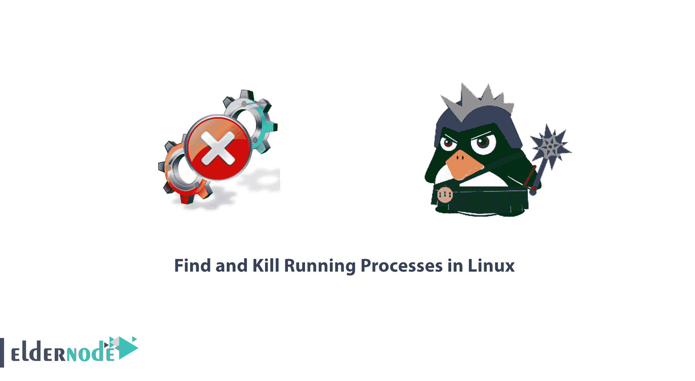

# 如何在 Linux - Eldernode 中找到并终止正在运行的进程

> 原文：<https://blog.eldernode.com/find-kill-running-processes-linux/>



Linux 系统管理员需要知道一些 Linux 命令。在本文中，您将学习如何在 Linux 中找到并终止正在运行的进程。事实上，进程管理是 Linux 中 [系统管理](https://en.wikiversity.org/wiki/System_administration#:~:text=System%20administration%20is%20the%20field,are%20running%20efficiently%20and%20effectively.) 的重要方面之一，它包括使用 kill 命令杀死进程。此外，有时管理员需要处理流程。要使用本指南，请尝试购买并使用 [VPS](https://eldernode.com/linux-vps/) 或 [Linux 虚拟主机](https://eldernode.com/linux-hosting/)。

## 如何在 Linux 中找到并杀死正在运行的进程

加入我们这篇文章，看看如何杀死 Linux 系统上效率较低或不需要的进程。如果您是初学者，请阅读我们的文章[为新手准备的 10 个有用的 Linux 命令行技巧](https://blog.eldernode.com/linux-command-tricks-newbies/)。

### Linux 中的进程是什么？

Linux 系统上的进程可以是正在运行的应用程序或程序。您也可以将进程称为在操作系统中执行的任务。

当进程正在运行时，它会不断地从一种状态转换到另一种状态，进程可以处于以下状态之一:

**正在运行** : 表示流程或者正在执行，或者刚刚被设置为要执行。

**等待**:意味着进程正在等待一个事件或者等待一个系统资源来执行一个任务。

Linux 下有两种等待进程，即**可中断**和**不可中断**。

一个可以被信号中断的等待进程叫做**可中断**，而一个直接等待硬件条件并且在任何条件下都不能被中断的等待进程叫做**不可中断**。

**停止:**表示过程已经停止，使用信号。

**僵尸:**表示进程突然停止，已经死亡。

当终止进程时， **kill** 命令用于向一个指定的进程或一组进程发送一个指定的信号。默认信号是**项的**信号。

记住 **kill** 命令可以是许多现代 shells 中的内置函数，也可以是位于 **/bin/kill** 的外部函数。

### 在 Linux 中查找进程 PID

在 Linux 中，系统上的每个进程都有一个 **PID** (进程标识号)，可以用来终止进程。

使用 **pidof** 命令可以识别任何进程的 **PID** ，如下所示:

```
pidof firefox
```

```
pidof chrome
```

```
pidof gimp-2.8 
```

### 杀死 Linux 中的进程

找到进程 PID 后，现在让我们看看如何终止进程。在第一个例子中，我将获取进程的 PID，然后向它发送一个信号。

我想杀死 **gimp** 进程，所以我会这样做:

```
pidof gimp-2.8
```

```
kill 9378
```

要验证进程是否已经被终止，运行 **pidof** 命令，您将无法查看 **PID** 。

```
pidof gimp-2.8
```

您还可以通过使用信号名称或编号向进程发送命名信号，如下所示:

```
pidof vlc
```

```
kill -SIGTERM 9541
```

```
pidof vlc 
```

使用信号号终止进程:

```
pidof banshee
```

```
kill -9 9647
```

```
pidof banshee 
```

### 删除 Linux 中的多个进程 PID

要终止多个进程，将**PID**传递给 kill 命令，如下所示:

```
pidof gimp-2.8
```

```
pidof vlc
```

```
pidof banshee
```

```
kill -9 9734 9747 9762
```

## 结论

在本文中，您已经学习了如何在 Linux 中找到并终止正在运行的进程。在 Linux 中有许多其他的杀死进程的方法，这几个例子只是给你一个杀死进程的概述。Linux 命令主题就像一个海洋，如果你潜入其中，它是无穷无尽的。找[更多文章](https://eldernode.com/linux-server-monitoring-commands/)学习 [Linux 命令](https://eldernode.com/command-tips-linux/)成为专家。