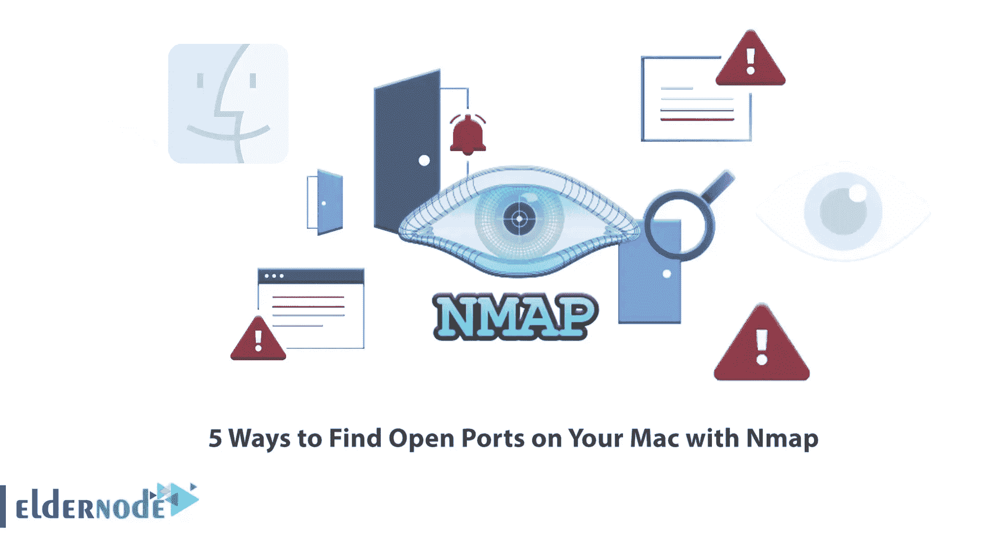
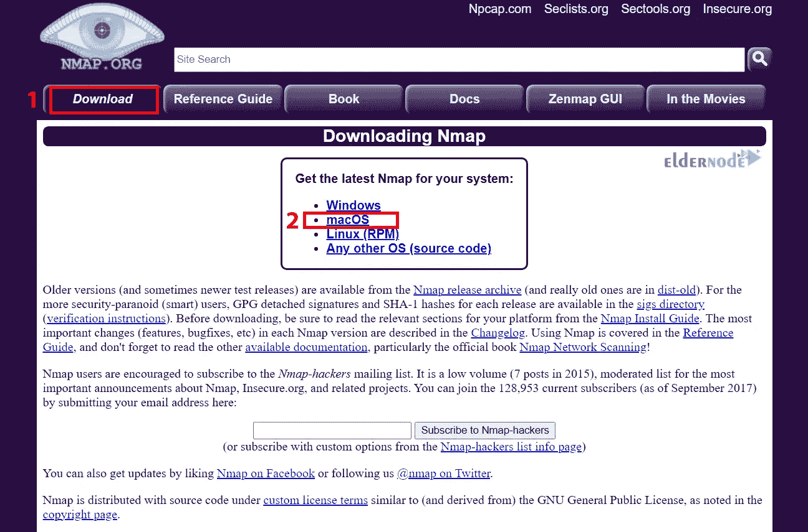
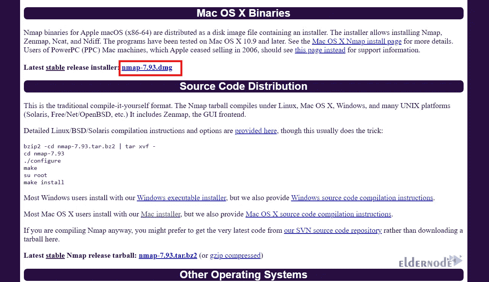
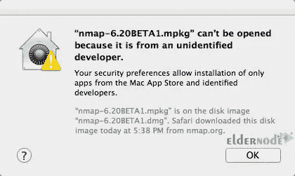
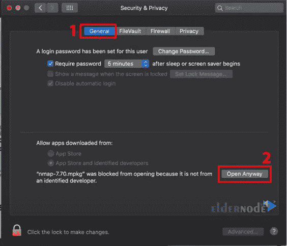

# 使用 Nmap 查找 Mac 上开放端口的 5 种方法

> 原文：<https://blog.eldernode.com/find-open-ports-on-your-mac-with-nmap/>



网络管理中最大的问题之一是找到系统上开放的端口。如果您不关闭连接到网络的设备的所有操作系统的开放端口，您将始终面临被攻击的风险。您需要做的是创建一个开放端口列表。一旦你有了这个列表，你就可以开始关闭不必要的端口。这篇文章将解释用 Nmap 在你的 Mac 上找到开放端口的 5 种方法。如果你打算购买，你可以选择 Eldernode 网站提供的经济实惠的 [Windows VPS](https://eldernode.com/windows-vps/) 服务器套装。

## **如何用 Nmap 在 Mac 上找到开放端口**

Nmap(网络映射器)是一款开源软件，用于网络映射和处理安全问题。此外，它是端口扫描的最佳工具。软件端口是任何系统的一部分，用于与其他系统通信和交换信息，因此应定期检查这些端口。网络管理员使用 Nmap 来识别系统上运行的设备，监控可用主机及其提供的服务，找到开放的端口，并识别安全风险。

### **1-安装 Nmap**

找到开放端口的第一步是在 Mac 上安装 Nmap。为此，进入 [Nmap 官网](https://nmap.org/)，选择**下载>MAC OS**:



单击下面显示的链接开始下载:



您可能会得到以下错误:



只需进入**安全&隐私> >通用**路径，点击**无论如何都要打开**:



在打开的窗口中，点击**继续**并输入您的密码。最后，点击**安装软件**。

让我们进入下一步。

### **2-使用 Nmap 扫描**

在这一步中，我们将使用 [Nmap 工具](https://blog.eldernode.com/introduction-nmap-tool-and-check-its-applications/)开始扫描。Nmap 是最强大的可用网络工具之一，用于返回开放端口列表。使用以下命令启动 Nmap:

```
nmap IP-Address
```

您只需指定一个 IP 地址或 IP 地址范围作为目标，然后运行 Nmap。您可以使用以下命令来完成此操作:

```
nmap scanme.nmap.org
```

您应该使用斜杠扫描一系列 IP 地址上的开放端口。

### **3-使用 Ncat 扫描**

Ncat 是一个调试和联网工具，用于从命令行读取、写入、重定向和加密网络上的数据。它是为 Nmap 项目编写的，是对古老的 Netcat 的一个大大改进的实现。您可以使用它来打开端口、将 shell 关联到端口、建立 TCP/UDP 连接等等。要使用 Ncat 进行扫描，只需运行以下命令:

```
nc [options] [hostname] [port]
```

### **4-使用 Ndiff** 扫描

Ndiff 是用于比较 Nmap 执行的扫描结果的工具。事实上，它通过获取两个 Nmap XML 输出文件并打印它们之间的差异来检测主机中的变化，从而比较两个 Nmap 扫描结果。人们可以使用 Ndiff 实用程序检测网络中的任何变化。如果您有两个文件 scan1.xml 和 scan2.xml，您可以使用以下命令比较它们，并查看这两个文件之间的变化:

```
ndiff [options] [scan.xml1] [scan.xml2]
```

### **5-扫描使用 Nping**

Nping 是一个用于网络数据包创建、响应分析和响应时间测量的开源工具。您可以使用 Nping 作为简单的 ping 工具来识别活动主机，并作为原始数据包生成器来进行网络堆栈压力测试、ARP 中毒、拒绝服务攻击、路由跟踪等。它可以为多种协议生成网络数据包，让用户完全控制协议头。要使用 Nping 扫描端口，您可以使用以下命令:

```
nping [options] [targets]
```

## 结论

Nmap 可用于列出本地机器上开放的端口，以及检测远程操作系统。在本文中，我们解释了使用 Nmap 在 Mac 上查找开放端口的 5 种方法。我希望这篇教程对你有用，并帮助你在你的 Mac 上用 Nmap 找到开放的端口。如果您有任何问题或建议，可以在评论区联系我们。