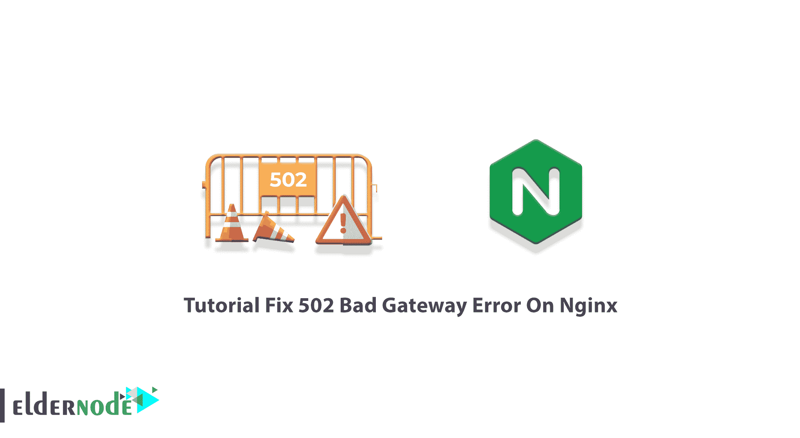
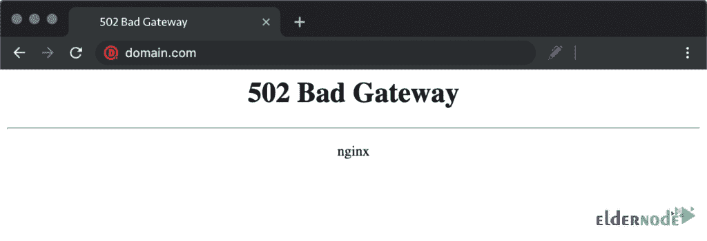

# 教程修复 Nginx - Eldernode 博客上的 502 坏网关错误

> 原文：<https://blog.eldernode.com/fix-502-bad-gateway-error-on-nginx/>

502 坏网关错误是最常见的 HTTP 状态代码之一，就像来自服务器的短消息。当你访问一个网站时，浏览器向网络服务器发送一个请求，请求发送回请求资源。一旦遇到 502 错误，就意味着服务器收到了来自入站服务器的无效响应。根据浏览器、操作系统和 web 服务器的类型，502 坏网关错误可能会以不同的名称出现。本文呈现**教程修复 Nginx** 上的 502 坏网关错误。在 [Eldernode](https://eldernode.com/) 的可用包中选择自己需要的，购买自己的 **[Linux VPS](https://eldernode.com/linux-vps/)** 服务器。

## **所有关于 502 坏网关的错误**

通常，以“5”开头的错误消息意味着服务器无法执行请求。如上所述，502 坏网关是网络/服务器的问题。它表示服务器无法从原始服务器获得有效或任何响应。此外，您可能会看到 [500](https://blog.eldernode.com/fix-internal-server-error-500/) ，503，0r 504 错误信息。 [WordPress](https://blog.eldernode.com/tag/wordpress/) 、Gmail、Twitter 和 Cloudflare 的用户可能会经常看到这个错误。502 错误网关是一个一般性错误。所以，你实际上不能知道你的网站的确切问题，它只是作为一个错误的网页给你的访问者，如下所示。

### **502 坏网关错误的主要原因有哪些**

乍一看，当您遇到 502 坏网关错误时，您不知道到底发生了什么或为什么。要解决这个错误，了解主要元凶是个好主意。以下是 502 不良网关响应的一些原因:

1-域名不可解析

2-源服务器关闭

3- DNS 更改

4- PHP-FPM 没有运行

5-服务器故障

6-网站霸主

7-错误的 PHP 编程

5- NGINX 无法与 PHP-FPM 通信

9-浏览器错误

10-防火墙阻止请求

11- PHP-FPM 超时

12-通信错误

最常见的情况是，502 坏网关错误与您作为网站访问者没有任何关系。但是**作为一个开发者**或者网站的**所有者，首先，检查你的 FQDN 是否通过使用你的 DNS 测试工具被正确解析。此外，您的服务器应该可以通过 ping 测试或 traceroute 进行访问。如果一切正常，检查您的防火墙日志，特别是如果您看到不寻常的下降。**

***注意* :** [Cloudflare](https://blog.eldernode.com/cloudflare-cdn-and-cdn-features/) 用户需要禁用它，因为一旦他们达到一定的限制，Cloudflare 就会向您的访问者返回 502 Bad Gateway 错误。

如果您渴望看到以上任何一个错误的更多细节，请查看您的 web 服务器的错误日志文件。因为所有的错误和诊断信息都存储在这个文件中，所以您可以将它作为一个有价值的资源。因此，在 Apache 中通过转到**/var/log/Apache 2/error . log**找到这个文件，在 Nginx 中通过转到 **/var/log/nginx/error.log** 找到这个文件。

## **如何修复 Nginx**T3 上的 502 坏网关错误

在本节中，回顾您需要检查的方法，以便能够**解决 Nginx** 上的 502 Bad Gateway 错误。发生此错误的原因是服务器端的问题、配置错误或客户端的问题。让我们看看在 [Nginx](https://blog.eldernode.com/secure-nginx-encrypt-debian-10/) 上修复 502 坏网关错误的步骤。

### **刷新页面**

如果是你的幸运日，只需等待一两分钟后点击**刷新按钮**就可以解决。有时候最好的方法是最简单的！那么，你为什么不试试呢？如果错误是暂时的，这将是解决方案。你知道快捷方式，如果不知道，在使用 windows 时按 **F5** 或 **CTRL+F5** 。还有，如果你是 Mac 用户，按 **Command+R** 。甚至你可以**清空你的浏览器缓存**然后再次刷新。它没有改变吗？不要担心，深入下面的解决方案。

### **使用新浏览器**

要确保 502 错误不是由与浏览器相关的问题引起的，请尝试不同的浏览器。如果您启动了一个新的浏览器会话，并在不同的浏览器上加载了该站点，但错误没有消失，请转到下一个选项。

### **检查你的 DNS 服务器**

正如您在上面读到的，502 坏网关错误的原因之一可能是 DNS 问题。如果您最近更改了主机服务器或将您的网站移动到不同的 IP 地址，您需要考虑此选项。因此，您可以刷新 DNS 来解决这种情况。DNS 更改完全生效，这可能需要几个小时，直到更改结束，您的网站才会启动并运行。

### **换个装置**

在另一台计算机或移动设备上测试连接是一个简单的解决方案。如果可以的话，也尝试连接到不同的网络，以确定问题是否出在您的机器上。

### **检查错误日志**

如果您最近进行了任何更改或更新，这可能是 502 坏网关错误的原因。由于服务器日志提供了详细信息，请检查您的错误日志以验证服务器的健康状况。

### **检查服务器连接问题**

如果您的服务器因维护或其他原因停机，您的网站也会向访问者提供 502 坏网关错误页面。因此，请等待您的服务器完成维护或修复导致错误的问题。

### **检查插件和主题**

由于错误配置的缓存插件经常会产生 502 坏网关错误，请检查您的插件、主题和扩展。因此，您可以简单地停用所有插件，而不会丢失任何数据。

### **检查防火墙配置**

众所周知，您的防火墙是网站的看门人，保护您的网站免受恶意访问者或分布式拒绝服务(DDoS)攻击。因此，检查并修复有故障的防火墙配置，使其不会成为此错误的原因。

### **检查 CDNs**

**C** 内容 **D** 交付 **N** 网络也是 502 坏网关错误的另一个原因。因此，如果你正在使用第三方 CDN 提供商，尝试暂时禁用你的 [CDN](https://blog.eldernode.com/what-is-cdn-content-delivery-network/) 。

### **查看站点**

如果你仍然面临 502 错误，检查其他人是否有同样的问题可能是一个好主意。所以，使用一个工具来检查你的网站是否宕机。输入您的网址，并检查您的网站的状态。

### **PHP 超时**

如果一个 PHP 进程运行的时间比它应该运行的时间长，您还会看到一个错误 502 bad gateway。由于*max _ execution _ time*(*max _ input _ time*)在你的 web 服务器上的 PHP 配置中，请联系你的 web 主机以了解这些值。

### **联系你的主人**

最后，在这一点上，如果您没有办法消除这个错误，请停止检查任何其他参数，并联系客户支持团队。记得解释你尝试过的上述 11 个故障排除步骤。

如果最近的 11 个步骤都不起作用，这意味着问题不在于你的网站，所以主持人团队能够解决主要问题。

## 结论

在本文中，您了解了如何在 Nginx 上修复 502 Bad Gateway 错误。大多数情况下，检查本指南的第一步后，错误就会消除。但是，如果你真的不能解决它，直到最后，联系网站管理员或您的互联网服务提供商是您的最新解决方案。