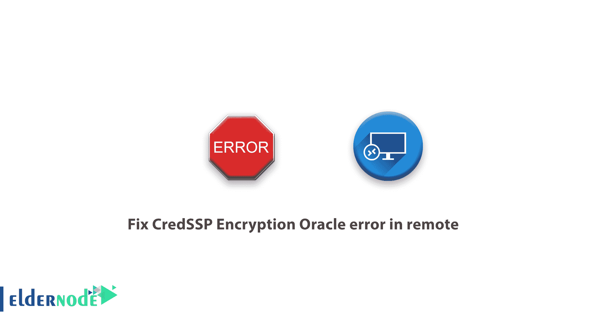

# 修复远程节点中的 CredSSP 加密 Oracle 错误

> 原文：<https://blog.eldernode.com/fix-credssp-encryption-oracle-error-in-remote/>



修复远程中的 CredSSP 加密 Oracle 错误。在更新到 1803 的新版本后， Windows 10 在组策略中定义了一个部分，如果你运行远程服务器，它将密切关注安全问题。如果你有最轻微的安全问题，你将被阻止运行远程一个名为 CredSSP 加密甲骨文的错误。


今天，尽管进行了更新，这条消息仍被视为一条令人讨厌的消息。用户通常不会为 [RDP](https://en.wikipedia.org/wiki/Remote_Desktop_Protocol) 服务使用安全证书，并且总是会遇到这个错误。

在本文中，我们将一步一步地教你如何修复遥控器中的这个错误，以轻松解决这个问题。

要在远程过程中修复此错误，您可以采用两种方法，即:

**1-** 通过组策略修复 CredSSP 加密 Oracle 错误

**2-** 修复 CredSSP 加密 Oracle 错误通过注册表

在本文中，我们将教你如何通过组策略修复这个错误。

加入我们，了解如何通过**组策略**对 CredSSP 加密 Oracle 进行故障排除。

## 通过组策略修复 CredSSP 加密 Oracle 错误

**1-** 首先，使用 WinKey + R 组合键打开 Run 窗口。

**注意:** 您也可以通过在开始菜单中搜索“运行”一词或右键单击开始菜单并选择运行选项来访问此窗口。

**2-** 然后输入短语 gpedit.msc 。


**3-** 进入**组策略**部分后，转到下面一行写的地址。

```
Computer Configuration >> Administrative Templates >> System >> Credentials Delegation >> 
```

**4-** 找到加密 Oracle 补救选项，双击。


**5-** 现在启用该策略并将**保护级别**设置为易受攻击。然后点击应用，最后点击确定。


这将解决你的远程问题。

**注意:** 如果问题依然存在，再次打开运行窗口，在里面输入短语 gpupdate ，然后点击OK；运行命令提示符和您的命令后，重启系统一次，再次运行遥控器。

**尊敬的用户**，我们希望您能喜欢这个[教程](https://eldernode.com/category/tutorial/)，您可以在评论区提出关于本次培训的问题，或者解决[老年人节点培训](https://eldernode.com/blog/)领域的其他问题，请参考[提问页面](https://eldernode.com/ask)部分，并尽快提出您的问题。腾出时间给其他用户和专家来回答你的问题。

好运。