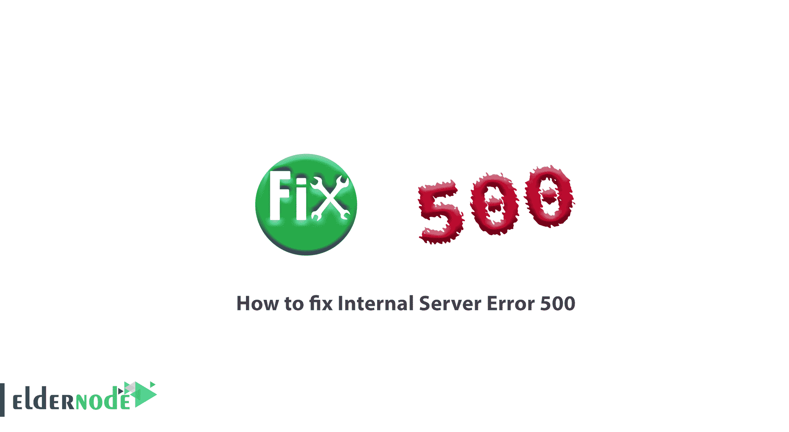
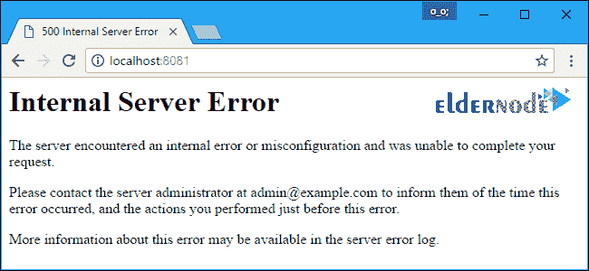
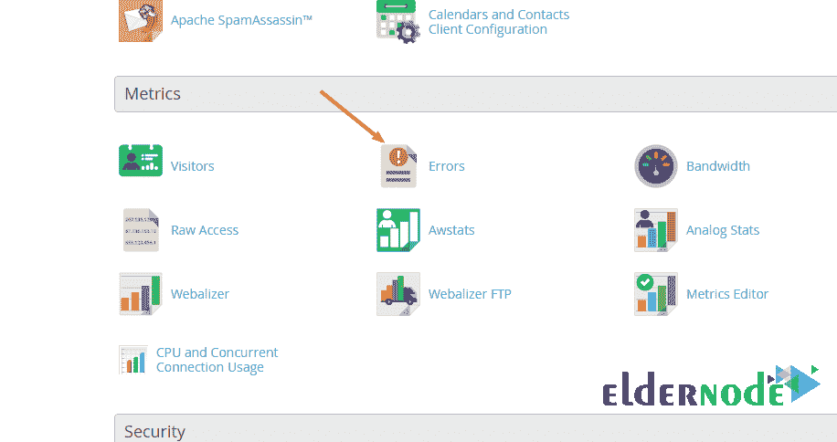

# 如何修复内部服务器错误 500 - Windows VPS 服务器

> 原文：<https://blog.eldernode.com/fix-internal-server-error-500/>



如何修复内部服务器错误 500？**错误 500** ( HTTP 错误 500 )与内部服务器错误相同。这个错误是网站由于各种原因可能遇到的错误之一。

在本文中，由于 WordPress 的超高人气以及用户对这个内容管理系统的更多使用，我们将修复 WordPress 中的 500 错误。

此错误消息出现在不同的情况下，但它们都表示相同的意思。根据您正在访问的网站，您可能会遇到以下消息:

```
500 Internal Server Error    500 Error    HTTP Error 500    500 That’s an error    (Temporary Error (500
```

**总共**、 5xx 个错误是发生在服务器或主机上的错误。因此，我们必须探索服务器，找到必要的解决方案。



按照下面的步骤找到错误 500 的根本原因以及如何修复它。

Recommended Article: [Web Disk on Cpanel](https://blog.eldernode.com/web-disk-on-cpanel/)

### 1)检查错误日志

站点遇到错误的第**步**是检查站点日志错误。通过观察日志错误，您可以更快地发现问题并采取措施修复它。

很多时候，当我们看到内部服务器错误时，这个问题的原因会显示在主机控制面板的错误日志部分。

要控制 CPanel ，点击**指标**部分的错误选项。



在[内容管理系统](https://en.wikipedia.org/wiki/Content_management_system)中，也可以通过它们的配置文件查看错误。

为此，请执行以下步骤:

#### 在 WordPress 中启用错误查看

在**主机控制面板**中，打开 public_html 中的【wp-config.php 文件。

然后将 WP_DEBUG 的**值**改为**真**。


#### 在 Joomla 中启用错误查看

要在configuration.php文件中的 Joomla 站点上启用错误检测，将错误报告值更改如下:

```
public $error_reporting = '1';
```

#### 在 Prestashop 中启用错误查看

要查看预铺错误，您必须 **编辑/home//username//public _ html//config中的文件。**

为此，更改 define 的值(' PS_MODE_DEV '，false)；到定义(' PS_MODE_DEV '，真)；。

**注意:** 查看完错误，**复位**该改变到以前的状态。因为访问者查看网站上的警告和错误是不合适的。

### 2)检查。htaccess 文件

要检查这个文件，您需要更改文件名。**比如**，把原名改成 htaccess_old 。

要确定问题出在这个文件上，例如，将文件重命名为 htaccess_old。

**要做这个**，进入主机和文件管理器部分，进入 public_html 文件夹。

**将**改名为当前的。htaccess 文件改为 htaccess_old 或自定义名称。

创建一个名为的新文件。htaccess 并输入以下代码，然后再次检查站点，没有错误:

```
# BEGIN WordPress    <IfModule mod_rewrite.c>    RewriteEngine On    RewriteBase /    RewriteRule ^index\.php$ - [L]    RewriteCond %{REQUEST_FILENAME} !-f    RewriteCond %{REQUEST_FILENAME} !-d    RewriteRule . /index.php [L]    </IfModule>    # END WordPress
```

如果在这之后你看到网站没有错误，那么问题就解决了。现在您需要逐行添加 htaccess 代码来查看问题来自哪一行。

**亦作，见:**

[htaccess 及其各种应用](https://eldernode.com/htaccess-and-its-applications/)

### 3)禁用插件

无论你是使用 WordPress 、 Joomla 还是任何其他**内容管理系统**，你的内容管理系统上都有一系列插件(或模块)，如果启用，将导致错误 500。

因此，下一个方法是禁用所有的网站插件，以检测错误。

要禁用插件，请执行以下操作:

**a-** 打开你的仪表盘。

**b-** 从插件部分，点击已安装插件。

**c-** 查看完插件列表后，点击每个插件下方的禁用。

**注意:** 如果没有站点管理的访问权限，通过文件管理器将插件文件夹的访问级别更改为零。

### 4)检查数据库设置

在主机上创建的数据库规范必须与 wp-config.php 文件中列出的规范相同。

例如，如果网站是用 WordPress 设计的，数据库名称、数据库用户名和密码必须与主机上创建的数据库名称、数据库用户名和密码相同。

### 5)将模板更改为默认的 WordPress 模板

有时 WordPress 中的错误 500 可能是由于你正在使用的模板造成的。

**为了安全**和最终的解决方案，你可以禁用当前的模板，使用一个默认的 WordPress 模板。

如果你有访问 WordPress 计数器的权限，进入查看>>主题，选择一个默认的 WordPress 模板，然后点击启用按钮。

如果您没有访问 WordPress 计数器的权限，请执行以下操作来禁用当前模板:

**1。T3 进入主机。**

**2。** 在文件管理器，进入public _ html>>WP-content>>主题。

**3。** 选择你正在使用的**模板**文件夹，在**上右击**。

**4。** 选择重命名选项，在打开的窗口中，为模板文件夹选择所需的名称。

**5。** 保存修改。

在这种情况下，模板将被禁用，一个默认的 WordPress 模板将被激活为站点模板。然后你可以检查网站，看看错误 500 是否仍然显示在网站上！

### 6) WordPress 文件损坏

你的 WordPress 内核中的重要文件可能被**损坏**。

**注意:** 修改前一定要备份数据。

然后从[WordPress 官方网站](https://wordpress.org/download/)下载最新版本的 WordPress，并从下载文件中删除 wp-content 文件夹和wp-config.php文件。用主机上的文件夹和文件替换其他现有文件夹和文件。

这不会删除你的数据，只会在 WordPress 内核有问题时修复问题。

**尊敬的用户**，我们希望您能喜欢这个[教程](https://eldernode.com/category/tutorial/)，您可以在评论区提出关于本次培训的问题，或者解决[老年人节点培训](https://eldernode.com/blog/)领域的其他问题，请参考[提问页面](https://eldernode.com/ask)部分，并尽快提出您的问题。腾出时间给其他用户和专家来回答你的问题。

如何修复内部服务器错误 500？

好运。