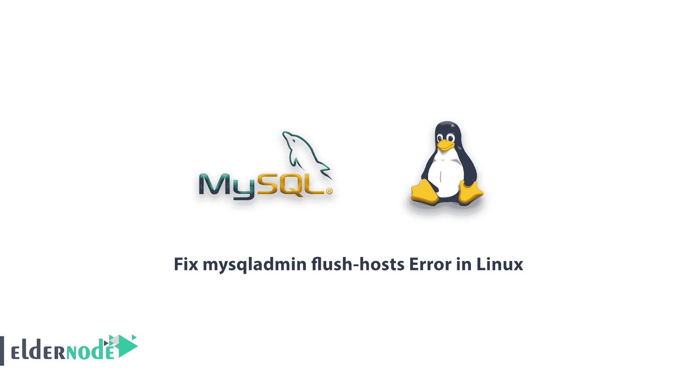

# 如何修复 Linux - Eldernode 博客中的 mysqladmin 刷新主机错误

> 原文：<https://blog.eldernode.com/fix-mysqladmin-flush-hosts-error/>



[更新日期:2020/12/26]此错误可能是由于几次不成功的连接尝试而导致的。在这些情况下，MySQL 系统会出于安全原因(如网络攻击)阻止未经授权的访问。但是有时这些不想要的事情会发生，这个问题需要解决。您可能还需要从 MySQL 中删除主机记录。在本文中，我们试图向您学习如何修复 Linux 中的 mysqladmin flush-hosts 错误。你也可以访问 [Eldernode](https://eldernode.com/) 中可用的包来购买 [Linux VPS](https://eldernode.com/linux-vps/) 服务器。

## **教程修复 Linux 中 mysqladmin 刷新主机错误**

默认情况下，最大连接错误数设置为 100。这意味着 MySQL 在 100 个失败的连接错误后停止用户和主机，并且安全系统被激活，阻止来自该主机的额外通信。您可以通过设置 max_connect_errors 来更改该值。您必须首先确保来自该主机的 TCP/IP 连接没有故障，如果有网络问题，它建议您增加 max_connect_errors 值。

如果您遇到以下错误，您应该按照本文中提到的步骤来修复此错误。

```
Host 'hostname' is blocked because of many connection errors; unblock with '[mysqladmin](https://mariadb.com/kb/en/mysqladmin/) flush-hosts' 
```

在本文的后续部分，请加入我们，了解如何修复 Linux 中的 mysqladmin flush-hosts 错误。

### **修复 Linux 中的 mysqladmin 刷新主机错误**

要解决这个问题，您需要检查“my.cnf”文件中为“max_connect_errors”设置的值。为此，请遵循以下步骤:

使用以下命令输入“my.cnf”文件:

```
nano /etc/my.cnf 
```

然后按如下方式设置“最大连接错误数”:

```
max_connect_errors=1000
```

如果“my.cnf”文件中不存在“max_connect_errors ”,请在文件开头添加以下行并保存它们:

```
[mysqld]   max_connect_errors=1000
```

## 结论

在本文中，我们试图通过检查和更改 max_connect_errors 来帮助您修复 Linux 中的 mysqladmin flush-hosts 错误。如果出现另一个错误，比如内部服务器错误，可以参考文章[如何修复内部服务器错误 500](https://blog.eldernode.com/fix-internal-server-error-500/) 来学习。