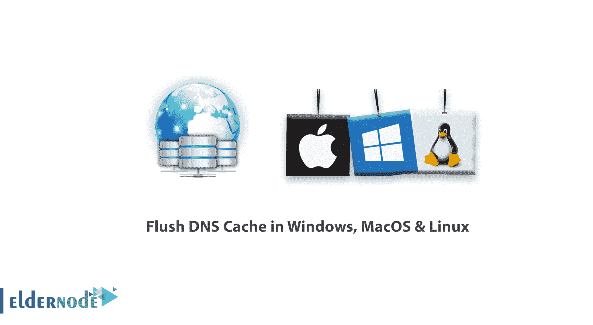
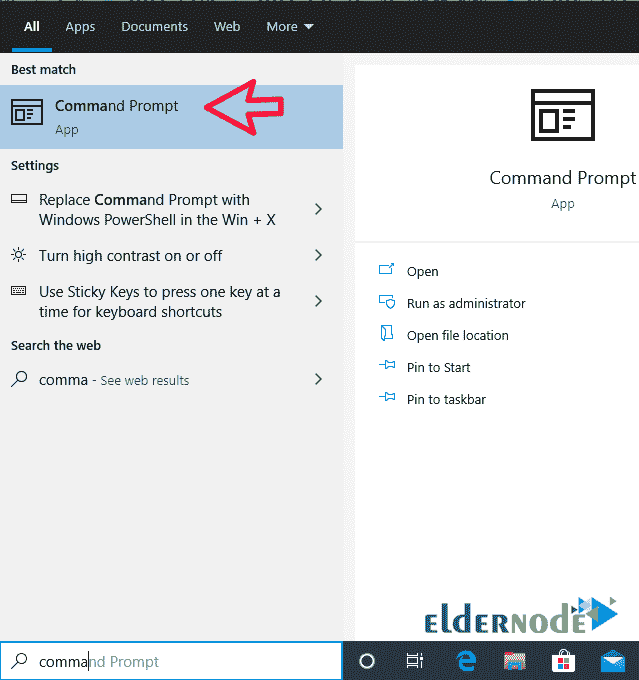
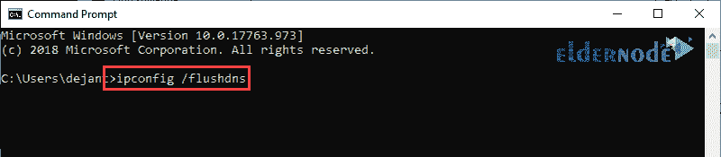
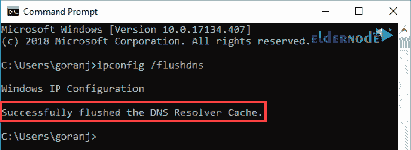
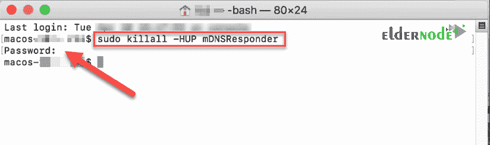

# 如何刷新 Windows、MacOS 和 Linux 中的 DNS 缓存- ElderNode 博客

> 原文：<https://blog.eldernode.com/flush-dns-cache-in-windows-macos-linux/>



如何在 Windows、MacOS 和 Linux 中本地刷新 DNS 缓存。 [DNS](https://www.cloudflare.com/learning/dns/what-is-dns/) ，简单来说就是**将** 域名地址转换为 IP 地址的服务，帮助你的系统与互联网服务器交换信息。例如，当你在浏览器中输入一个[Eldernode.com](https://eldernode.com/)地址时，你的系统会在 **DNS 服务器**上寻找它的 IP 地址，一旦找到，就会为你打开网站。

虽然这些请求会很快得到响应，而且用户不会一眼就注意到，但是只要稍加注意，当站点打开时，你会注意到一个短暂的停顿。在本文中，我们将教你如何清除 Windows、Mac 和 Linux 操作系统上的 DNS 缓存。

如何刷新 Windows、MacOS & Linux 中的 DNS 缓存？

*[**ElderNode VPS 托管套餐**](https://eldernode.com/vps-hosting/)*

## 什么是 DNS 缓存？

您系统上的 DNS 缓存被设计成一旦您的系统从 DNS 请求一个域的 IP 地址，它就将该 IP 地址存储一段时间。通过为下一次保存 IP 地址，您的系统不需要向 DNS 服务器发送请求。总的来说，当你第二次打开一个网站的时候，它会让网站打开的更快一点。

这个 DNS 缓存有时候会给用户带来问题，而且因为存储了 IP 地址，一个站点可能已经更改了 IP 地址。这将阻止您访问该网站。要做到这一点，你需要清除 DNS 缓存，我们将在下面教你。

### 如何清除 Windows 中的 DNS 缓存

该过程对于几乎所有的 Windows 系统都是相同的。对于下面的**示例**，我们将使用 [Windows 10](https://eldernode.com/tag/windows-10/) 。

要刷新 Windows 计算机上的 DNS，请执行以下步骤:

**1。**T3 以**管理员**的身份加载命令提示符。

打开开始菜单，开始输入命令提示符，直到你在结果中看到它。



**2。** 输入 ipconfig / 刷新 dns 当提示符加载后，点击键盘上的**回车**。



**3。** 这个过程应该只需要几秒钟。

完成后，您应该会看到类似于下图的 DNS 解析器缓存确认消息:



您电脑上的 DNS 缓存数据库现已清空。

下次您的机器发送 DNS 查询时，您应该从 DNS 服务器获得正确且更新的 IP 映射。

### 教程清除 Mac 上的 DNS 缓存

根据您运行的版本，在 **OS X** 和 **macOS** 上有一些不同的命令用于刷新 DNS 缓存。

#### 如何刷新 macOS Mojave 上的 DNS

要清除 macOS Mojave 上的 DNS 缓存，请使用终端应用程序:

**1。** 用你喜欢的方法运行终端. app 。

您可以从以下路径启动该应用程序:

应用程序 > > 实用程序或按 Command + Space 启动 Spotlight 并搜索终端。


**2。** 键入sudo kill all-HUP mDNSResponder并在键盘上点击**回车**。

**3。** 输入该账户的**管理员密码**，点击返回。



如果您想在 **DNS 刷新**完成后听到音频 **通知**，请在第一个命令后键入一些文本。例如:

```
sudo killall -HUP mDNSResponder; say dns cleared successfully
```

### 如何刷新 Linux 中的 DNS 缓存

Linux 发行版与 Windows 和 Mac 机略有不同。

每个 Linux 发行版可能使用不同的 DNS 服务。一些发行版，如 **Ubuntu** ，根本没有默认的 DNS 服务。

这取决于您的发行版上有哪种服务，以及默认情况下是否启用它。其中有 **NCSD** ( 名称服务缓存守护进程)、 dnsmasq 、 **BIND** ( Berkely 互联网域名)。

对于每个发行版，您都需要启动一个终端窗口。

在你的键盘上按下 Ctrl+Alt+T 并使用相应的命令为你的 Linux 系统正在运行的服务清除 DNS 缓存。

#### 刷新本地 NCSD DNS 缓存

使用以下命令清除您的 **Linux 机器**上的 NCSD DNS 缓存:

```
sudo /etc/init.d/nscd restart
```

如有必要，输入您的密码。过程**停止**，然后**在几秒钟内开始**NCSD 服务。

#### 刷新本地 dnsmasq DNS 缓存

您可以使用以下命令清除 Linux 机器上的 dnsmasq DNS 缓存:

```
sudo /etc/init.d/dnsmasq restart
```

如果终端要求，再次输入您的密码。当服务**停止**并且**再次开始**时，您将看到响应。

#### 刷新本地绑定 DNS 缓存

如果您对 DNS 服务使用绑定，有几个命令可以用来刷新它的 DNS 缓存。

**注意:** 您可能需要输入您的密码才能完成该过程。

```
sudo /etc/init.d/named restart
```

```
sudo rndc restart
```

```
sudo rndc exec
```

**亦作，见:**

[如何在 Windows Server 2012 R2 版中配置 DNS 转发](https://eldernode.com/dns-forwarding-in-windows-server-2012/)

[教程在 Windows Server 2016 上配置 DNS](https://eldernode.com/configure-dns-on-windows-server-2016/)

[如何在 Windows Server 2016 中将域连接到 DNS](https://eldernode.com/connect-domain-to-dns-in-windows-server/)

**尊敬的用户**，我们希望您能喜欢这个[教程](https://eldernode.com/category/tutorial/)，您可以在评论区提出关于本次培训的问题，或者想解决[老年人节点培训](https://eldernode.com/blog/)领域的其他问题，请参考[提问页面](https://eldernode.com/ask)部分，并尽快提出您的问题。腾出时间给其他用户和专家来回答你的问题。

好运。