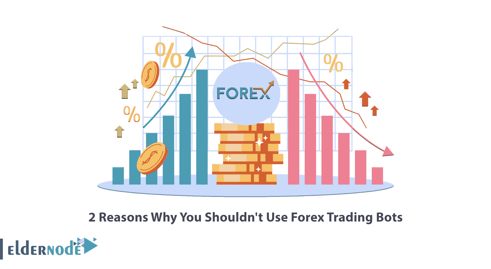

# 不应该使用外汇交易机器人的 2 个理由

> 原文：<https://blog.eldernode.com/forex-trading-bots/>

如今，外汇市场在普通大众中非常受欢迎。金融市场的人们被不同的目标吸引到外汇市场。在这些人中，有些人已经想到开发交易算法，以使交易所脱离传统模式，系统地进行交易。这种想法是外汇市场上交易机器人的第一个开端。在这篇文章中，我们将向你解释为什么你不应该使用外汇交易机器人的 2 个原因。如果您想[购买 Forex VPS](https://eldernode.com/forex-vps/) 服务器，您可以访问 [Eldernode](https://eldernode.com/) 上提供的软件包。

## **为什么不应该使用外汇交易机器人？**

### **什么是外汇交易机器人？**

在我们谈论不使用交易机器人的原因之前，你需要知道什么是外汇机器人？机器人只不过是几行代码，带有自动执行的清晰的[营销](https://blog.eldernode.com/tag/marketing/)进入和退出规则。所有适用于外汇市场的只是一个在货币市场买卖的自动化策略。

现在我们知道什么是外汇机器人，以及它们是如何工作的。但是你能用交易机器人赚钱吗？或者它们是一个骗局？这些自动化策略的性能或结果将取决于之前的策略及其监控；因此，如果他们从一开始就不盈利，那么无论他们多么自动化，他们都将无法盈利。但是如果计划好的策略，结果可能会更好。

## **关于交易机器人的错误信念**

交易机器人具有鼓励金融和资本市场使用它们的优势。机器人可以监控市场，而不会感到疲倦或情绪激动。他们可以确定每天、每小时、每时每刻开始和结束交易的正确时间，并据此采取行动。

世界各地和金融市场都在使用交易机器人。原因是这些机器人有很多优点。但有时这些优势会导致人们对交易机器人产生不正确的心理假设，并得到不利的结果。

对机器人有许多误解，阻止人们从他们购买或制造的机器人中获得期望的输出。在本文的其余部分，我们将提到其中的 5 个错误信念。

### **1。交易机器人很聪明！**

交易机器人是一段代码，它根据为其定义的条件决定开仓和平仓交易。机器人可以基于非常简单的条件做出这些决定。例如，如果他在市场开始交易后半小时进行购买，如果价格上涨，或者他在每次购买后 2 小时结束交易，无论盈亏。这个机器人不聪明！只有在一个简单的条件成立时，才输入买入交易头寸。

### **2。交易机器人有利可图！**

盈利不是交易机器人的固有属性！交易机器人可以盈利，也可以不盈利。交易机器人的盈利能力取决于条件，换句话说，取决于机器人交易的交易策略。如果原则上交易策略没有被设计和测试，实际上这个交易机器人是不可靠的。一个交易机器人，如果不是基于一个正确的交易策略，可以很快(甚至在你睡觉的时候)把你的账户清空或者严重损坏。

### **3。交易机器人继续过去的表现！**

在选择交易机器人时，首先要做的是检查其过去的表现。很多人在看到净利润不错的看涨图后，买一个交易机器人，直接用它在真实账户上交易。事实是，仅仅一项战略在过去的盈利能力并不能成为得出该战略在未来盈利能力结论的合适标准。

### **4。一个交易机器人比人还管用！**

这种说法不一定正确。在许多情况下，交易机器人可以胜过人类。机器人的数学计算比人更快、更准确，除非写错了。与人类不同，交易机器人不会陷入情绪之中。交易机器人不会厌倦全职检查市场，也不会失去重点。这些是正确的。但所有这些都取决于交易机器人的编程是否正确。

一个交易者，如果他看到自己的账户以异常的趋势趋于零，他很可能会停止交易，开始检查自己的表现。但是，如果机器人没有一个机制来监控其性能，它可以继续采取亏损的立场，直到帐户为零。这样的例子很多。如上所述，在大多数情况下，机器人并不智能，不明白自己在做什么。

## **不应该使用外汇交易机器人的理由**

虽然[外汇](https://blog.eldernode.com/install-and-run-mt4-on-forex-vps/)机器人的优势很明显，但是这些机器人也有劣势。在互联网上销售的大多数机器人都是建立在网格和鞅交易系统上的，这些系统显示了非常好的结果和几乎完美的性能曲线，但有一天它们坏掉了。为什么？因为他们采用了激进的风险管理规则。如果你不这么认为，可以免费下载一些，看看一段时间后的效果。在本文的其余部分，我们将讨论为什么你不应该使用外汇交易机器人的两个原因。

### **1)外汇交易 Bot 还是依赖人类的！**

正如我们所说，这些机器人能够完美地执行策略。但是如果策略中有错误，机器人就无法纠正它。所以对人类还是有依赖的。还有，仅仅使用交易机器人是无法在市场上操作的。与技术分析相关的工具的使用中存在的限制使得机器人在某些情况下无效。再次，它归结为人类的智慧和理解。因为在某些情况和市场中，人类的理解必须发挥作用才能得出结论。

另一方面，由于 bot 是固定订单的唯一操作者，并且不具有识别能力，因此它无法在此时做出决定，这可能会导致许多损失。所有这些问题最终导致对外汇机器人的错误信念，这有时会导致交易者不正确地使用这些工具。

### **2。无法理解逻辑**

这些系统中的大多数只在有限的时间内成功。随着市场条件的变化，过去有效的交易规则会变得过时。没有定期重新验证，外汇机器人可以在短时间内变得完全无效。此外，市场是一个动态的氛围。在原则不断变化的时代，外汇机器人无法适应不断变化的条件。在波动性增加或减少的时候，现有的交易规则变得无效，外汇交易变得更加消极和无利可图。

## 结论

市场上可能有数百种外汇交易机器人。制造这些机器人时使用了特殊的技术。这个机器人为交易者提供了一个安全高效的平台。这些机器人有预设的设置，只需简单的点击几下就可以为人们进行交易。对于个人或有经验的交易者来说，机器人的设置将更加灵活。每个机器人可能有不同的交易风格。反正准备 bot，要参考上面文字里提到的项目。在这篇文章中，我们试图解释为什么你不应该使用外汇交易机器人的原因。