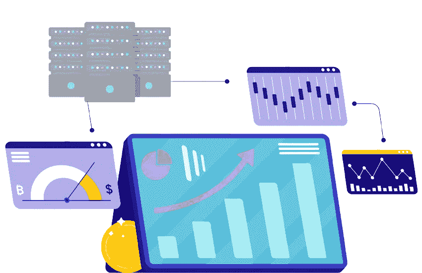
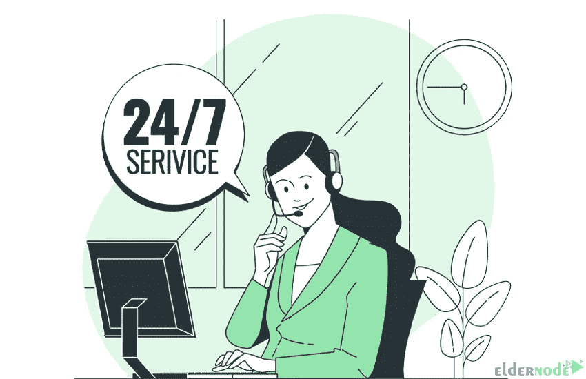

# 为什么 Forex VPS 是您企业的完美解决方案

> 原文：<https://blog.eldernode.com/forex-vps-perfect-solution-for-business/>

虚拟专用服务器(VPS)用于网站。但如今，它在金融市场上也扮演着重要的角色。VPS 使财务应用程序更加安全和高效，并允许用户享受更多隐私、定制功能和专用资源等好处。这样用户使用 Forex VPS 服务的欲望就增加了。这篇文章将解释为什么外汇 VPS 是您的业务的完美解决方案。如果你打算购买自己的 [Forex VPS](https://eldernode.com/forex-vps/) 服务器，你可以查看 [Eldernode](https://eldernode.com/) 网站上提供的软件包。

## **Forex VPS 是您企业的完美解决方案吗？**

外汇市场是一个分散的[市场](https://blog.eldernode.com/tag/marketing/)，银行、金融机构和人们在这里交易国际货币和加密货币。Forex VPS 是一个虚拟私人服务器，用于在外汇市场上下单。与其他金融工具相比，快速外汇市场交易需要更快、更稳定的互联网连接。它允许交易者从世界任何地方全天 24 小时访问他们的交易。VPS 系统非常灵活，交易者可以通过电脑和手机访问他们的服务器。

### **你将拥有无限的空间**

Eldernode 提供带有最新技术和硬件资源的 Forex VPS 服务器。我们在虚拟主机方案中提供的磁盘空间或带宽没有任何限制。我们设置了足够的磁盘空间来满足您的需求，并通过 1 Gbps 端口为 VPS 计划提供无限带宽。一般你会有无限的空间。

### **可以从多个服务器中选择**

如果您从 Eldernode 网站购买外汇 VPS，我们提供不同的地点:新加坡、罗马尼亚、美国、香港、英国、荷兰、澳大利亚、德国、日本、法国、俄罗斯和土耳其。你可以在你想要的地方选择你的 VPS。选择服务器时，确保离数据中心越近，连接速度越快。

### **你将可以定制你的服务器**

外汇交易员可以通过安装与多个平台兼容的软件来定制他们的 VPS 服务器。它允许您在任何类型的计算机上使用 VPS，并且他们将始终有一个工作环境。我们的 VPS 为您提供了租赁外汇 VPS 的机会，作为您交易套餐的一部分。

### **可以从多个操作系统中选择**

我们的网站在选择外汇 VPS 方面提供了 Windows Server 2012 和 Windows Server 2016。您可以从多个操作系统中进行选择。Windows Server 2012 是 Windows Server 操作系统的第六个版本，基于 Windows 8.1。作为 Windows NT 系列操作系统的一部分，Windows Server 的第七个版本是 Windows Server 2016。他们有各种内部服务，高安全性和运行重型软件的能力，以提供更好的服务。

### **您将获得全天候的客户支持**

Eldernode Forex VPS 提供 24/7 支持，无营业时间或周末；这意味着它一年 365 天，一周 7 天，一天 24 小时都是可用的。

你可以一直依靠你的 VPS 进行不间断的交易，你可以一直交易市场，不管一天中的什么时间。全天候支持包括对需要无中断和无故障运行的服务的支持。

我们的网站提供 [Forex VPS](https://eldernode.com/forex-vps/) 服务器，可以成为交易者的最佳选择。

## 结论

VPS 是外汇交易者保护自己免受不必要的入侵并最大化其交易潜力的好方法。在本帖中，我们解释了为什么 Forex VPS 是您企业的完美解决方案。我希望这篇教程能帮助你找到为什么外汇 VPS 是你的业务的最佳解决方案的原因。如果您有任何问题或建议，可以在评论区联系我们。