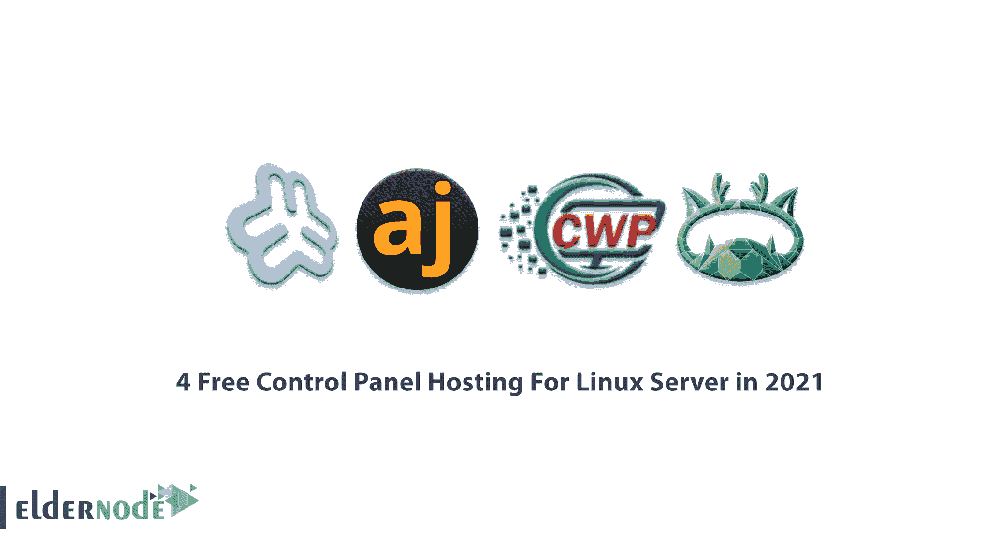

# 4 2021 年 Linux 服务器的免费控制面板托管- Eldernode 博客

> 原文：<https://blog.eldernode.com/free-control-panel-hosting-for-linux/>

当你建立你的网站时，最重要的先决条件之一是选择一个合适的主机和控制面板。虽然有不同类型的主机，每一个有一个特定的网站类型的功能。网站所有者应该根据他们的需求、网站类型和托管功能来寻找合适的选项。根据您的操作系统类型，主机分为两类，包括托管的 [Linux VPS 和托管](https://eldernode.com/linux-vps/)的 [Windows VPS。在这篇文章中，你将了解到 2021 年【Linux 服务器的 **4 免费控制面板托管。加入我们这个指南，成为控制面板托管和 4 个广泛使用的控制面板的利弊专家。最终，你完全熟悉了 **Webmin** 、 **Ajenti** 、 **CWP** 、 **aaPanel** 。还有，请在**](https://eldernode.com/windows-vps/) **[Eldernode](https://eldernode.com/) 的完美套餐中选择自己的 [VPS](https://eldernode.com/vps/) 方案，继续阅读。**

## **Linux 服务器最佳免费托管控制面板**

作为网站所有者，你面临着管理多个网站的敏感而困难的任务。如果你没有使用一个完美和合适的控制面板，这将更加困难。主机控制面板是一个基于 web 的界面，帮助您管理主机服务，如电子邮件帐户、FTP 帐户、文件管理、子域、磁盘空间管理、带宽、备份等。一旦你选择了你喜欢的主机，你就开始使用主机控制面板来管理与主机相关的事务，简化任务，并加快进程。

### 如何选择主机控制面板

当你选择一个主机控制面板时，你应该考虑两个重要的选择。

**控制面板的简单性:**

界面应该简单，让用户不会感到困惑。控制面板应该简化系统管理员的任务，让非技术人员也能轻松完成他们的任务。

**合适的接口:**

为了让你的用户管理他们托管的所有方面，你需要提供一个合适的界面。

## **2021 年 4 款最佳免费控制面板**

因为当你需要选择一个托管控制面板时，你可能会在所有搜索中找到 CPanel 和 DirectAdmin，所以在这篇文章中，我们试图呈现一个更不同的包，并介绍免费的控制面板，如果它们不太为人所知，也是令人满意和有用的。

### 网友

先说 [Webmin](https://www.webmin.com/) 。Webmin 是免费的、开源的、轻量级的、易于安装的。你可以用 Webmin 轻松地**管理**你的 Linux 服务器和 VPS。它为 Linux 操作系统及其服务提供了一个基于 web 的控制面板。一旦您在服务器上安装了 Webmin，您就可以通过 web 浏览器配置和管理您的操作系统。如果你正在使用 Debian 或 CentOS，使用 Webmin 可能是个好主意。不要担心！你可以在 **32** 和 **64** 位操作系统上安装 Webmin。

作为服务器管理员，您可以准备好**设置**帐户，管理用户、服务、DNS 设置、Apache，在 web 上以图形方式编辑您服务器的服务器文件。这样，你**就不需要**在 SSH 终端中输入指令了。由于 Webmin 能够托管有 **Virtualmin 插件**的网站，新网站可以被添加到 Windows 或 Linux VPS 服务器。Virtualmin 给你更多的控制你的操作系统。这很容易做到，但请注意，你需要单独使用用户面板，让您访问网站。如果 Webmin 是您的选择，您**不再需要**手动编辑 Unix 配置文件。因此，您将通过控制台或**远程**管理系统。

**先决条件**

如果你对使用 Webmin 持肯定态度；

准备一个至少 288 MHz/秒的处理器。

正常模式下大约 256MB 内存。

大约 1024MB 用于托管。

硬盘应该在 10GB 左右。

### **Webmin 优势**

1- Apache Web 服务器配置

2-电子邮件服务器配置

3- DNS 服务器配置

4-管理用户和用户组

5-信息备份

6-创建和管理电子邮件

7-上传和管理服务器文件

8-构建和管理数据库

9-创建主域的子域

10-设置的备份

### Webmin 劣势

据报道，Webmin 最大的缺点是不可扩展。如果您选择此控制面板，您应该知道，您将在每台服务器上登录一个 web 界面，而无法从单一入口点处理大量部署。但是，如果您计划使用一个管理工具来扩展到企业级，请查看其他控制面板。

***

如果你有兴趣了解更多关于 Webmin 的知识，可以找到我们的文章[如何在 Webmin-user min](https://blog.eldernode.com/install-wordpress-on-webmin-usermin/)上安装 WordPress。

### Ajenti

如果你正在寻找一个能够与 CPanel 和 Plesk 竞争的服务器管理面板，那么 Ajenti 就在这里。 [Ajenti](https://ajenti.org/) 免费开源，功能强大，轻量级。你不需要为在服务器上的使用付费。但是如果你需要使用它的企业版，你必须付费才能同时支持多台服务器。一旦你安装了 Ajenti，你**不需要**再下载几次 PuTTY。

由于使用远程服务器的增加， [Ajenti](https://blog.eldernode.com/configure-ajenti-on-centos-8/) 提供了一种快速安全的方法来管理远程 Linux 机器，让用户使用诸如 web 终端、文本编辑器、文件管理器等工具工作。正因如此，你可以很容易地**管理**服务器，如桑巴、[鱿鱼](https://blog.eldernode.com/install-squid-proxy-server-on-ubuntu-20-04/)、Munin 等。用它。虽然 Ajenti 非常流利，但也经过了专业的开发。此外，Ajenti **支持** Python、Ruby、PHP 语言，并全面管理相关服务。它**支持** Linux 发行版，如 Debian、Ubuntu、RHEL、CentOS 和 Gentoo。也很容易移植到 Linux 和 BDS。Ajenti 还以其**易于安装**和现有配置而闻名。所以你不应该浪费时间或考虑准备。**自动配置**包括 EXIM4、IMAP、easy DKIM 激活、DMarc 和 SPF。

### 优势

1- Ajenti 接口干净且有据可查。

2-高性能。

3-基于谷歌 AngularJS 的图形用户界面。

4-嵌入式 web 服务器。

5-单页基于 AJAX 的前端。

6-响应式布局。

Twitter 的引导库。

8-通过沙盒实现安全性。

9-模块化 Python API。

基于 10 前端 AngularJS 的框架。

11-库存远程 API。

12- SSL 认证认证支持。

13-全面支持手机和平板电脑。

14- UI 组件集。

15- Websockets 引擎。

16-通知、模式和实时更新。

17-可插拔认证和授权。

### 阿让蒂的缺点

1-ajen ti 的技术支持不是免费的。

2-最新版本没有配置邮件服务器的选项。

3-在对系统进行基本更改后，您必须重置 Ajenti。

4-因为 Ajenti 有基本的功能，所以它没有考虑系统管理员的高级功能，比如用“文档根”创建主机和用不同版本的 PHP 进行管理。

***

***

如果您需要了解更多关于这个安全控制面板的信息，请阅读我们的文章[如何在 CentOS 8](https://blog.eldernode.com/configure-ajenti-on-centos-8/) 上配置 Ajenti。

### CWP

很明显，CentOS 上安装的最多的是 CentOS**W**EB**P**anel。CWP 也是一个免费的虚拟主机控制面板。由于 CWP **支持**最多的服务，它正与类似的工具激烈竞争。如果你正准备建立一个 **VPS** 或[专用服务器](https://eldernode.com/dedicated-server/)，CWP 可能是一个合适的选择，因为它在服务器管理方面有广泛的特性。

在安装过程中，CWP 会默认安装[灯](https://blog.eldernode.com/how-to-install-lamp-on-ubuntu-20-04/)堆栈和[清漆](https://blog.eldernode.com/install-varnish-apache-centos/)缓存系统，并提供电子邮件服务和其他托管需求，您无需任何额外设置即可启动。它**自动安装**所需的包比如 HTTP 服务器、PHP、数据库服务器、邮件服务器等等。当您决定使用 [CWP](https://blog.eldernode.com/install-cwp-on-centos-7/) 时，您**不需要**来运行命令，因为您可以使用基于 web 的工具来管理主机。使用主机管理控制面板时，您**不需要**通过命令做所有事情，您可以使用基于 web 的工具来管理主机。

### CWP 的优势

**网络服务器功能**

1-支持 Nginx 反向代理。

2-通过从源代码编译 Apache 来提高 web 服务器性能。

3-使用 SuExec 和 SuPHP 提高安全性

4-支持 Perl cgi 脚本。

5-安装和支持 Apache TomCat 8 的能力

**PHP 特性**

1-通过从源代码编译来提高系统性能。

2-能够安装 PHP 切换器和 PHP 选择器，并支持所有版本的 PHP。

3-将“ini”分配给每个帐户及其定制功能。

对视频媒体网站的 4- FFMPEG 支持。

5-支持 ioncube、php-imap 等。

**账户管理功能**

1-为每个帐户分配 IP 的能力

2-能够限制每个帐户的运行文件数量。

3-外壳管理访问。

4-使用配额和信息节点管理用户限制。

5-能够限制每个帐户的进程。

**安全特性**

1- CSF 防火墙。

2-专用 SSL 生成器。

3-用 CSF/LDF 保护暴力攻击。

4-一般过程的限制。

5-防御 DOS 和 DDOS 攻击。

**数据库特性**

1-安装和支持 MongoDB。

2-能够添加远程和本地用户。

3-实时监控数据库。

4-安装 phpMyAdmin 来自动管理数据库。

5-能够安装和支持 PostgresSQL 和 phpMyAdmin。

***

CWP 有如此多的其他功能，如果你有兴趣阅读更多，请找到我们的相关文章[如何在 CentOS 7](https://blog.eldernode.com/install-cwp-on-centos-7/) 上安装 CWP。

### 面板

那么，这个指南的第四个工具，你准备好了吗？aaPanel 是一个免费的、强大的、开源的托管控制面板，易于安装。普通用户是 aaPanel 的忠实粉丝，因为它弥补了他们较少的技术知识。

这个控制面板只能通过**一键**安装在所有 Linux 发行版上，如 Debian、Ubuntu、Fedora、Deepin 和 CentOS(建议使用 CentOS)。作为开发者，**加速**你的项目进程会是一个不错的选择。使用 aaPanle 可以让你**管理**网站、数据库、带有可视化文件管理器的 FTP、可视化软件管理器、可视化 CPU、内存、流程监控图、任务调度和 Docker。

这个控制面板与上面的主要区别是你必须提供一个干净的服务器。因为它使用 API 来控制开发者，并提供可部署的 web 环境，而且**支持** Apache 和 Nginx，所以应该还没有安装环境。aaPanle 的另一个特点是，当你登录时，它会提示你选择**灯**或 **LNMP** 。如果你考虑使用免费的 Litespeed，但你并不专业，aaPanle 应该是你的选择。aaPanel 为 Open Litespeed 创建了一个面板。此外，您**不会被迫使用命令行，因为您可以通过**单击**来部署和管理您的主机，从而使用[面板](https://blog.eldernode.com/install-aapanel-on-linux-server/)。**

**先决条件**

你要考虑 512M 以上的内存和 100M 以上的空闲硬盘空间。aPanle 通过基于 web 的 GUI 管理 web 服务器。

### 面板优势

1-可创建和可管理的 FTP

2-可创建和可管理的数据库

3-可创建和可管理的网站

4-可创建和可管理的 Docker

如果你想选择或阅读更多关于 aaPanel 的内容，可以找到我们的相关文章[介绍 aaPanel 托管控制面板](https://blog.eldernode.com/introducing-aapanel-hosting-control-panel/)。

## 结论

在本文中，您了解了 2021 年 Linux Server 的 4 免费控制面板托管。毫无疑问，在你的网络服务器上安装一个商业或免费的控制面板是非常必要的。你可能首先会寻找一个完美但免费的控制面板，为他人甚至个人使用提供托管服务。如果你喜欢从一个免费的控制面板开始，你已经学会了如何根据你的需要和你的网站类型来选择其中的一个。介绍的 4 个控制面板是有用的，有很多优点，当然，你不会支付任何额外的费用。